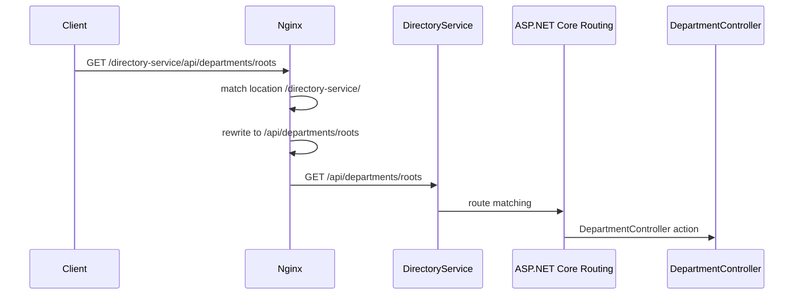

# Модуль I. Путешествие одного запроса

# Глава 1. URL

──────────────────────────────────────────────

**МОДУЛЬ I • Путешествие одного запроса**

**Прогресс до главы:** 0% (0 из 9 глав завершены)

**Маршрут:** URL → DNS → IP → Port → TCP → TLS → HTTP → HTTPS → Full Journey  
**Текущая глава:** URL

**Текущий вопрос:**  
Из каких частей состоит адрес, который вводит пользователь?

──────────────────────────────────────────────

> **Не запоминай технологии. Понимай, какие проблемы они решают.**

---

## Зачем нужна эта глава

Любой backend начинается не с контроллера, не с базы данных и не с `Program.cs`.

Он начинается с адреса, по которому клиент обращается к системе.

Например:

```text
https://company.com/api/files/123
```

На первый взгляд это просто строка в браузере или Postman. Но для backend-разработчика в ней уже зашито несколько важных понятий:

- какой протокол используется;
- к какому серверу нужно обратиться;
- какой port будет использован;
- какой endpoint должен обработать запрос;
- как Nginx или API Gateway поймёт, куда отправить запрос дальше;
- как ASP.NET Core Routing сопоставит путь с controller action или Minimal API endpoint.

Если не понимать структуру URL, дальше будет труднее уверенно объяснять DNS, HTTP, HTTPS, Kestrel, Nginx, Reverse Proxy, Load Balancing, Swagger, CORS, Cookies, JWT и Docker Networking.

---

## Эта глава понадобится позже

- [DNS](./02_DNS.md)
- [HTTP](./07_HTTP.md)
- [HTTPS](./08_HTTPS.md)
- [Kestrel](../02_Entry_Layer/01_Kestrel.md)
- [Nginx](../02_Entry_Layer/02_Nginx.md)
- [Reverse Proxy](../02_Entry_Layer/03_Reverse_Proxy.md)
- [ASP.NET Core Routing](../03_ASPNET_Core/03_Routing.md)
- [Docker Networking](../10_Docker/05_Docker_Networking.md)
- [API Gateway](../02_Entry_Layer/05_API_Gateway.md)

---

## Короткое определение

**URL (Uniform Resource Locator — единый указатель ресурса)** — это адрес ресурса в сети.

Он говорит клиенту:

- по какому protocol обращаться;
- к какому host подключаться;
- какой port использовать;
- какой path внутри приложения запросить;
- какие дополнительные параметры передать.

Для backend-разработчика URL — это не просто строка. Это внешний контракт между клиентом, proxy, web server и приложением.

---

## Из чего состоит URL

Возьмём адрес:

```text
https://company.com:443/api/files/123?download=true#preview
```

Разобьём его на части:

```text
https://company.com:443/api/files/123?download=true#preview
│      │           │   │              │             │
│      │           │   │              │             └── Fragment
│      │           │   │              └──────────────── Query string
│      │           │   └─────────────────────────────── Path
│      │           └─────────────────────────────────── Port
│      └─────────────────────────────────────────────── Host
└────────────────────────────────────────────────────── Scheme / Protocol
```

| Часть | Пример | Что означает |
|---|---|---|
| Scheme / Protocol | `https` | По каким правилам клиент общается с сервером |
| Host | `company.com` | Имя сервера или сервиса |
| Port | `443` | Сетевая точка входа на сервере |
| Path | `/api/files/123` | Путь к ресурсу внутри приложения |
| Query string | `download=true` | Дополнительные параметры после `?` |
| Fragment | `preview` | Якорь после `#`, обычно не отправляется на backend |

---

## Scheme / Protocol

**Scheme / Protocol (схема / протокол — правила, по которым клиент должен обращаться к ресурсу)** — первая часть URL.

Пример:

```text
https
```

Частые варианты:

| Scheme | Где встречается |
|---|---|
| `http` | обычный HTTP без TLS |
| `https` | HTTP поверх TLS |
| `ws` | WebSocket без TLS |
| `wss` | WebSocket поверх TLS |

Для современных backend-систем почти всегда используется `https`.

---

## Host

**Host (имя узла — доменное имя или имя сервиса, к которому обращается клиент)** показывает, куда нужно подключаться.

В URL:

```text
https://company.com/api/files/123
        └────────── host
```

Сетевое соединение устанавливается не с красивым именем, а с IP-адресом. Поэтому перед подключением клиент должен узнать, какой IP соответствует `company.com`.

Этим занимается [DNS](./02_DNS.md).

Пример:

```text
company.com
    ↓ DNS
203.0.113.17
```

Host не обязан быть публичным доменом. В Docker Compose host может быть именем сервиса:

```text
http://postgres:5432
http://redis:6379
http://rabbitmq:5672
http://directory-service:8080
```

---

## Port

**Port (порт — числовая сетевая точка входа приложения)** можно представить как дверь в здании.

IP указывает на машину, а port — на конкретное приложение внутри неё.

Например:

```text
https://company.com:443/api/files/123
                   └── port
```

Если port не указан явно, клиент использует значение по умолчанию для выбранного protocol:

```text
https://company.com/api/files/123  -> 443
http://company.com/api/files/123   -> 80
```

Подробно port разбирается в главе [Port](./04_Port.md).

---

## Path

**Path (путь — часть URL, которая указывает ресурс или endpoint внутри приложения)** особенно важен для backend-разработчика.

```text
https://company.com/api/files/123
                   └──────────── path
```

Path участвует в:

- настройке Nginx `location`;
- rewrite-правилах;
- ASP.NET Core Routing;
- маршрутах controllers;
- Minimal API endpoints;
- Swagger/OpenAPI;
- API versioning.

Пример ASP.NET Core controller:

```csharp
[Route("api/files")]
public class FilesController : ControllerBase
{
    [HttpGet("{id:guid}")]
    public async Task<IActionResult> Get(Guid id)
    {
        ...
    }
}
```

Запрос:

```text
GET /api/files/6f3d2e9a-6a8f-4e7d-92f1-4a3f5b1f0a11
```

может попасть в метод `Get`.

---

## Query string

**Query string (строка запроса — часть URL после символа `?`, которая передаёт дополнительные параметры запроса)** часто используется для фильтрации, сортировки, пагинации и поиска.

Пример:

```text
/api/files?ownerId=123&status=ready
```

Здесь:

```text
ownerId=123
status=ready
```

— параметры строки запроса.

В коммерческих backend-проектах такие параметры часто применяют для:

- фильтрации;
- сортировки;
- пагинации;
- поиска;
- дополнительных опций запроса.

Примеры:

```text
GET /api/departments?parentId=123
GET /api/files?status=ready&page=2&pageSize=50
GET /api/users?role=admin&isActive=true
```

В ASP.NET Core такие параметры можно принимать через model binding:

```csharp
[HttpGet]
public async Task<IActionResult> GetFiles(
    [FromQuery] Guid ownerId,
    [FromQuery] string status,
    CancellationToken cancellationToken)
{
    ...
}
```

---

## Fragment

**Fragment (фрагмент — часть URL после `#`, обычно используемая браузером для перехода к месту на странице)** чаще всего не отправляется на сервер.

Пример:

```text
https://company.com/docs/api#authentication
```

Backend обычно получит только:

```text
/docs/api
```

Часть:

```text
#authentication
```

останется на стороне клиента.

---

## Что происходит с URL в реальной backend-системе

Один и тот же URL могут читать несколько компонентов.

Пример:

```text
GET http://localhost:8080/directory-service/api/departments/roots
```



| Уровень | Что читает |
|---|---|
| Nginx | внешний prefix `/directory-service/` |
| Rewrite | убирает внешний prefix |
| ASP.NET Core Routing | ищет route `/api/departments/roots` |
| Controller | обрабатывает конкретный endpoint |

---

## Типичные ошибки

### Ошибка 1. Думать, что URL — это только path

```text
/api/files/123
```

это path, а не полный URL.

Полный URL содержит как минимум scheme, host и path:

```text
https://company.com/api/files/123
```

---

### Ошибка 2. Путать host и IP

Host может быть доменным именем:

```text
company.com
```

или именем сервиса в Docker:

```text
directory-service
```

Но для сетевого подключения всё равно нужен IP-адрес. Его находят через DNS или внутренний механизм разрешения имён.

---

### Ошибка 3. Ожидать fragment на backend

Если клиент открыл:

```text
https://company.com/docs#auth
```

backend обычно получит только:

```text
/docs
```

---

### Ошибка 4. Не учитывать внешний prefix за reverse proxy

Клиент может отправлять:

```text
/directory-service/api/departments/roots
```

а backend ожидать:

```text
/api/departments/roots
```

Если Nginx не сделает rewrite, backend может вернуть `404`.

---

## Вопросы собеседования

### Junior: Что такое URL?

<details>
<summary>Ответ</summary>

URL — это адрес ресурса в сети. Он содержит protocol/scheme, host, port, path и дополнительные параметры.

Пример:

```text
https://company.com:443/api/files/123?download=true
```

</details>

---

### Middle: Чем path отличается от query string?

<details>
<summary>Ответ</summary>

Path указывает на сам ресурс или endpoint:

```text
/api/files/123
```

Query string передаёт дополнительные параметры после `?`:

```text
?download=true&page=2
```

Обычно path отвечает на вопрос `что запрашиваем`, а query string — `с какими параметрами`.

</details>

---

### Middle: Почему backend может получить другой path, чем отправил клиент?

<details>
<summary>Ответ</summary>

Потому что между клиентом и backend может стоять reverse proxy, например Nginx. Он может убрать внешний prefix и отправить во внутренний сервис уже другой path.

Пример:

```text
/directory-service/api/departments/roots -> /api/departments/roots
```

</details>

---

### Senior: Почему fragment не приходит на backend?

<details>
<summary>Ответ</summary>

Fragment — часть URL после `#`. Она предназначена в основном для клиента, например для перехода к секции страницы. При обычном HTTP-запросе fragment не отправляется серверу.

Если данные нужны backend, их нужно передавать через path, query string, headers или body.

</details>

---

## Ответ для собеседования

URL — это адрес ресурса в сети. Для backend-разработчика важно понимать, что URL состоит не только из path, но и из scheme, host, port, query string и fragment. Scheme определяет protocol, например HTTP или HTTPS. Host указывает имя сервера, которое затем преобразуется в IP-адрес через DNS. Port определяет сетевую точку входа, а path используется приложением и routing-ом для выбора endpoint-а. В реальных системах URL может дополнительно обрабатываться reverse proxy, например Nginx: внешний path может быть переписан перед передачей в backend.

---

## Шпаргалка

- URL — полный адрес ресурса.
- Path — только часть URL.
- `https` обычно использует port `443`.
- `http` обычно использует port `80`.
- Host должен быть преобразован в IP-адрес.
- Query string — параметры после `?`.
- Fragment после `#` обычно не отправляется на backend.
- Reverse proxy может изменить path перед передачей запроса в backend.

---

## Прогресс модуля

**Модуль I:** `Путешествие одного запроса`  
**Прогресс после главы:** 11% (1 из 9 глав завершена).
