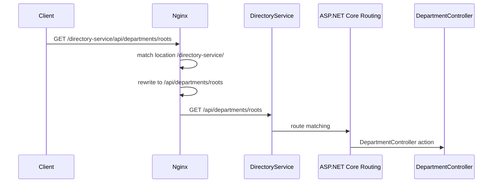

# Модуль I. Путешествие одного запроса

# Глава 1. URL

**Модуль I:** `Путешествие одного запроса`  
**Прогресс модуля:** 1 из 9 глав — 11%.

> **Не запоминай технологии. Понимай, какие проблемы они решают.**

---

## Зачем нужна эта глава

Любой backend начинается не с контроллера, не с базы данных и не с `Program.cs`.

Он начинается с адреса, по которому клиент обращается к системе.

Например:

```text
https://company.com/api/files/123
```

На первый взгляд это просто строка в браузере или в Postman. Но для backend-разработчика в ней уже зашито несколько важных понятий:

- какой протокол используется;
- к какому серверу нужно обратиться;
- какой порт будет использован;
- какой endpoint должен обработать запрос;
- как Nginx или API Gateway поймёт, куда отправить запрос дальше;
- как ASP.NET Core Routing сопоставит путь с контроллером или Minimal API endpoint.

Если не понимать структуру URL, дальше будет трудно уверенно объяснять `Nginx`, `Kestrel`, `Routing`, `Reverse Proxy`, `Load Balancing`, `Swagger`, `CORS`, `Cookies`, `JWT` и даже некоторые проблемы с Docker.

---

## Эта глава понадобится позже

```md
[[DNS]]
[[HTTP]]
[[HTTPS]]
[[Kestrel]]
[[Nginx]]
[[Reverse Proxy]]
[[ASP.NET Core Routing]]
[[Docker Networking]]
[[API Gateway]]
```

---

## Короткое определение

**URL** — это адрес ресурса в сети.

Он говорит клиенту:

- по какому протоколу обращаться;
- к какому host подключаться;
- какой порт использовать;
- какой путь внутри приложения запросить;
- какие параметры передать.

Для backend-разработчика URL — это не просто строка. Это внешний контракт между клиентом, прокси, сервером и приложением.

---

## Простое объяснение

Представь большой бизнес-центр.

У него есть:

- общий адрес здания;
- конкретный вход;
- этаж;
- кабинет;
- иногда ещё пропуск или комментарий для охраны.

URL работает похожим образом.

```text
https://company.com/api/files/123
```

Это можно прочитать так:

```text
Используй защищённый протокол HTTPS.
Иди к серверу company.com.
Внутри приложения найди путь /api/files/123.
```

Браузер, Nginx, Kestrel и ASP.NET Core будут читать разные части этого адреса и принимать по ним разные решения.

---

## Из чего состоит URL

Возьмём адрес:

```text
https://company.com:443/api/files/123?download=true#preview
```

Разобьём его на части:

```text
https://company.com:443/api/files/123?download=true#preview
│      │           │   │              │             │
│      │           │   │              │             └── Fragment
│      │           │   │              └──────────────── Query string
│      │           │   └─────────────────────────────── Path
│      │           └─────────────────────────────────── Port
│      └─────────────────────────────────────────────── Host
└────────────────────────────────────────────────────── Protocol / Scheme
```

Основные части:

| Часть | Пример | Что означает |
|---|---|---|
| Scheme / Protocol | `https` | Какой протокол использовать |
| Host | `company.com` | К какому имени сервера обратиться |
| Port | `443` | К какой сетевой двери подключиться |
| Path | `/api/files/123` | Какой ресурс запросить внутри приложения |
| Query string | `download=true` | Дополнительные параметры запроса |
| Fragment | `preview` | Якорь внутри документа; обычно не отправляется на сервер |

---

## Scheme / Protocol

Первая часть URL:

```text
https
```

Она отвечает на вопрос:

> По каким правилам клиент должен разговаривать с сервером?

Частые варианты:

| Scheme | Где встречается |
|---|---|
| `http` | обычный HTTP без шифрования |
| `https` | HTTP поверх TLS |
| `ws` | WebSocket без TLS |
| `wss` | WebSocket поверх TLS |
| `ftp` | старый протокол передачи файлов |

Для современных backend-систем почти всегда используется `https`.

Это важно не только для безопасности. Некоторые механизмы браузера и платформы завязаны на защищённое соединение:

- secure cookies;
- OAuth/OIDC redirect flows;
- работа с авторизацией в браузере;
- защита токенов и пользовательских данных.

---

## Host

В URL:

```text
https://company.com/api/files/123
        └────────── host
```

Host — это имя сервера.

Но сетевое соединение устанавливается не с именем, а с IP-адресом. Поэтому перед подключением клиент должен узнать, какой IP соответствует `company.com`.

Этим занимается [[DNS]].

Пример:

```text
company.com
    ↓ DNS
203.0.113.17
```

Важно: host — это не обязательно публичный домен.

В Docker Compose host может быть именем сервиса:

```text
http://postgres:5432
http://redis:6379
http://rabbitmq:5672
http://directory-service:8080
```

В этом случае имя резолвится не через публичный DNS, а через DNS внутри Docker-сети.

---

## Port

Порт — это номер сетевого входа на сервере.

Один сервер может принимать разные типы соединений на разных портах.

Примеры:

| Порт | Часто используется для |
|---:|---|
| `80` | HTTP |
| `443` | HTTPS |
| `5432` | PostgreSQL |
| `6379` | Redis |
| `5672` | RabbitMQ AMQP |
| `15672` | RabbitMQ Management UI |
| `8080` | dev/proxy/backend service |

Если порт не указан явно, клиент использует порт по умолчанию для выбранного протокола.

Например:

```text
https://company.com/api/files/123
```

обычно означает:

```text
https://company.com:443/api/files/123
```

А:

```text
http://company.com/api/files/123
```

обычно означает:

```text
http://company.com:80/api/files/123
```

---

## Path

Path — это часть URL, которая описывает ресурс внутри приложения.

```text
https://company.com/api/files/123
                   └──────────── path
```

Для backend-разработчика это одна из самых важных частей URL.

Именно path чаще всего участвует в:

- настройке Nginx `location`;
- `rewrite` правил;
- ASP.NET Core Routing;
- маршрутах контроллеров;
- Minimal API endpoints;
- Swagger/OpenAPI;
- API versioning.

Например, в ASP.NET Core контроллер может иметь route:

```csharp
[Route("api/files")]
public class FilesController : ControllerBase
{
    [HttpGet("{id:guid}")]
    public async Task<IActionResult> Get(Guid id)
    {
        ...
    }
}
```

Тогда запрос:

```text
GET /api/files/6f3d2e9a-6a8f-4e7d-92f1-4a3f5b1f0a11
```

может попасть в метод `Get`.

---

## Query string

Query string начинается после `?`.

Пример:

```text
/api/files?ownerId=123&status=ready
```

Здесь:

```text
ownerId=123
status=ready
```

Это дополнительные параметры запроса.

Их часто используют для:

- фильтрации;
- сортировки;
- пагинации;
- поиска;
- дополнительных опций.

Примеры:

```text
GET /api/departments?parentId=123
GET /api/files?status=ready&page=2&pageSize=50
GET /api/users?role=admin&isActive=true
```

В ASP.NET Core такие параметры можно принимать через query binding:

```csharp
[HttpGet]
public async Task<IActionResult> GetFiles(
    [FromQuery] Guid ownerId,
    [FromQuery] string status,
    CancellationToken cancellationToken)
{
    ...
}
```

---

## Fragment

Fragment начинается после `#`.

Пример:

```text
https://company.com/docs/api#authentication
```

Часть:

```text
#authentication
```

обычно используется браузером для перехода к конкретному месту на странице.

Важный момент:

> Fragment обычно не отправляется на сервер.

То есть backend чаще всего не увидит `#authentication` в HTTP-запросе.

Это частая ловушка, когда разработчик ожидает получить fragment на backend, но он доступен только на стороне клиента.

---

## Что происходит с URL в реальной backend-системе

На практике один и тот же URL могут читать несколько компонентов.

Например:

```text
GET http://localhost:8080/directory-service/api/departments/roots
```

В такой цепочке:



Здесь URL используется на нескольких уровнях:

| Уровень | Что читает |
|---|---|
| Nginx | внешний prefix `/directory-service/` |
| Rewrite | убирает внешний prefix |
| ASP.NET Core Routing | ищет route `/api/departments/roots` |
| Controller | обрабатывает конкретный endpoint |

Именно поэтому важно понимать структуру URL до изучения Nginx и ASP.NET Core Routing.

---

## Практика из проекта

В проектной инфраструктуре используется единая точка входа через Nginx.

Клиент обращается к одному адресу:

```text
http://localhost:8080
```

А дальше Nginx по path-prefix решает, куда отправить запрос:

```text
/auth-service/...      → AuthService
/directory-service/... → DirectoryService
/file-service/...      → FileService
```

Например:

```text
GET http://localhost:8080/directory-service/api/departments/roots
```

Nginx видит prefix:

```text
/directory-service/
```

убирает его и отправляет backend-сервису уже:

```text
GET /api/departments/roots
```

Почему это важно?

Потому что `DirectoryService` внутри себя не обязан знать, что снаружи он доступен через `/directory-service`. Его контроллеры могут продолжать жить с обычными маршрутами:

```csharp
[Route("api/departments")]
public class DepartmentController : ControllerBase
{
    ...
}
```

Внешний URL — это контракт клиента с Nginx.

Внутренний path — это контракт Nginx с backend-сервисом.

---

## Типичные ошибки

### Ошибка 1. Думать, что URL — это просто path

Неверно:

```text
/api/files/123
```

это не полный URL, а только path.

Полный URL содержит как минимум:

```text
scheme + host + path
```

Например:

```text
https://company.com/api/files/123
```

---

### Ошибка 2. Путать host и IP

Host может быть доменным именем:

```text
company.com
```

а может быть именем сервиса в Docker:

```text
directory-service
```

Но для сетевого соединения всё равно нужен IP. Его получат через DNS или локальный механизм разрешения имён.

---

### Ошибка 3. Ожидать fragment на backend

Если клиент открыл:

```text
https://company.com/docs#auth
```

backend обычно получит только:

```text
/docs
```

Часть `#auth` останется на стороне браузера.

---

### Ошибка 4. Не учитывать внешний prefix за reverse proxy

Клиент может отправлять:

```text
/directory-service/api/departments/roots
```

а backend ожидать:

```text
/api/departments/roots
```

Если Nginx не сделает `rewrite`, backend может вернуть `404`.

---

## Когда это особенно важно

Понимание URL критично, когда ты работаешь с:

- Nginx;
- API Gateway;
- Docker Compose;
- Kubernetes Ingress;
- Swagger за reverse proxy;
- OAuth/OIDC redirect URI;
- CORS;
- cookies;
- file download links;
- pre-signed URLs;
- API versioning.

Например, ошибка в redirect URI при OAuth может полностью сломать login flow. Ошибка в path-prefix за Nginx может сломать Swagger. Ошибка в host/port внутри Docker может привести к `502 Bad Gateway`.

---

## Вопросы собеседования

### Junior: Что такое URL?

<details>
<summary>Ответ</summary>

URL — это адрес ресурса в сети. Он содержит информацию о протоколе, host, порте, пути и дополнительных параметрах запроса.

Пример:

```text
https://company.com:443/api/files/123?download=true
```

</details>

---

### Middle: Чем path отличается от query string?

<details>
<summary>Ответ</summary>

Path указывает на сам ресурс или endpoint:

```text
/api/files/123
```

Query string передаёт дополнительные параметры:

```text
?download=true&page=2
```

Обычно path отвечает на вопрос `что запрашиваем`, а query string — `с какими параметрами`.

</details>

---

### Middle: Почему backend может получить другой path, чем отправил клиент?

<details>
<summary>Ответ</summary>

Потому что между клиентом и backend может стоять reverse proxy, например Nginx.

Клиент отправляет:

```text
/directory-service/api/departments/roots
```

Nginx может убрать внешний prefix:

```text
/api/departments/roots
```

И уже этот path отправить в backend. Это часто используется, чтобы клиент видел единый внешний API, а сервисы внутри не знали о внешних prefix-ах.

</details>

---

### Senior: Почему fragment не приходит на backend?

<details>
<summary>Ответ</summary>

Fragment — часть URL после `#`. Она предназначена в основном для клиента, например для перехода к секции страницы.

При обычном HTTP-запросе fragment не отправляется серверу. Поэтому backend не может полагаться на данные после `#`.

Если данные нужны серверу, их нужно передавать через path, query string, headers или body.

</details>

---

## Ответ для собеседования

URL — это адрес ресурса в сети. Для backend-разработчика важно понимать, что URL состоит не только из path, но и из scheme, host, port, query string и иногда fragment. Scheme определяет протокол, например HTTP или HTTPS. Host указывает имя сервера, которое затем разрешается в IP через DNS. Port определяет сетевой вход, а path уже используется приложением и routing-ом для выбора endpoint-а. В реальных системах URL может дополнительно обрабатываться reverse proxy, например Nginx: внешний path может быть переписан перед передачей в backend. Поэтому понимание URL важно для настройки Nginx, Docker, ASP.NET Core Routing, Swagger, CORS и authentication flows.

---

## Шпаргалка

- URL — это полный адрес ресурса.
- Path — это только часть URL.
- `https` обычно использует порт `443`.
- `http` обычно использует порт `80`.
- Host должен быть преобразован в IP через DNS или локальный resolver.
- Query string используется для дополнительных параметров.
- Fragment после `#` обычно не отправляется на backend.
- Reverse proxy может изменить path перед передачей запроса в backend.
- Ошибки в URL часто приводят к `404`, `502`, проблемам со Swagger, CORS и OAuth redirect URI.

---

## Прогресс модуля

**Модуль I:** `Путешествие одного запроса`  
**Прогресс модуля:** 1 из 9 глав — 11%.
