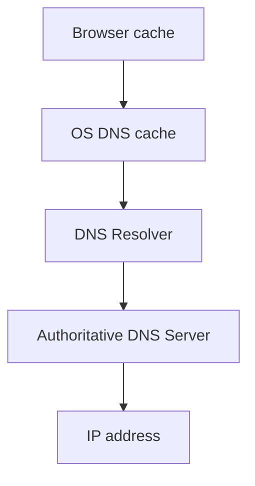

# Модуль I. Путешествие одного запроса

# Глава 2. DNS

──────────────────────────────────────────────

**МОДУЛЬ I • Путешествие одного запроса**

**Прогресс до главы:** 11% (1 из 9 глав завершена)

**Маршрут:** URL → DNS → IP → Port → TCP → TLS → HTTP → HTTPS → Full Journey
**Текущая глава:** DNS

**Текущий вопрос:**  
Как узнать IP-адрес сервера по имени `company.com`?

──────────────────────────────────────────────

> **Не запоминай технологии. Понимай, какие проблемы они решают.**

---

## Исходная ситуация

Пользователь ввёл в браузере:

```text
https://company.com/api/files/123
```

В предыдущей главе мы разобрали, что это URL.

Браузер уже понимает:

```text
Scheme: https
Host:   company.com
Path:   /api/files/123
```

Но есть проблема: браузер пока не знает, где находится `company.com`.

Компьютеры не устанавливают сетевое соединение с красивыми именами. Им нужен IP-адрес.

```text
company.com  ❌ недостаточно
203.0.113.17 ✅ можно подключаться
```

Значит, перед отправкой запроса нужно решить первый технический вопрос:

> Как узнать IP-адрес сервера по его имени?

Для этого используется DNS.

---

## Зачем нужна эта глава

DNS часто воспринимают как тему для сетевых инженеров. Для backend-разработчика это неверная оценка.

DNS встречается в обычной работе чаще, чем кажется:

| Где | Как связан DNS |
|---|---|
| Браузер | `company.com` нужно преобразовать в IP-адрес |
| Docker Compose | контейнеры обращаются друг к другу по service name |
| Nginx | `proxy_pass http://directory-service` требует поиска IP по имени сервиса |
| PostgreSQL | connection string часто содержит hostname, а не IP |
| Redis | сервис подключается к `redis:6379` |
| RabbitMQ | сервис подключается к `rabbitmq:5672` |
| Kubernetes | service discovery построен вокруг DNS-имён сервисов |

Если не понимать DNS, сложно объяснить:

- почему `localhost` внутри контейнера — это не host machine;
- почему `postgres` в Docker Compose работает как адрес;
- почему Nginx может получить `502 Bad Gateway`, если для имени backend-сервиса не найден IP;
- почему после смены IP домена часть клиентов ещё некоторое время ходит на старый адрес;
- почему Kubernetes-сервисы доступны по имени.

---

## Эта глава понадобится позже

- [IP-адрес](./03_IP_Address.md)
- [Port](./04_Port.md)
- [TCP](./05_TCP.md)
- [Nginx](../02_Entry_Layer/02_Nginx.md)
- [Docker Networking](../10_Docker/05_Docker_Networking.md)
- [Kubernetes](../12_Kubernetes/01_Kubernetes_For_Backend.md)
- [PostgreSQL Connection String](../05_Data/02_PostgreSQL.md)
- [Redis](../07_Integrations/11_Redis.md)
- [RabbitMQ](../07_Integrations/03_RabbitMQ.md)

---

## Короткое определение

**DNS (Domain Name System — система доменных имён)** — это распределённая система, которая сопоставляет доменные имена с IP-адресами.

Пример:

```text
company.com
    ↓ DNS
203.0.113.17
```

DNS не обрабатывает HTTP-запросы, не запускает backend и не знает бизнес-логику приложения.

Его задача проще:

> Ответить, какой IP-адрес соответствует заданному имени.

---

## Простое объяснение

Представь бизнес-центр.

Ты знаешь название компании:

```text
Company LLC
```

но не знаешь номер кабинета.

На первом этаже сидит администратор. Ты спрашиваешь:

> Где находится Company LLC?

Он отвечает:

> Кабинет 512.

После этого администратор больше не участвует в разговоре. Он только помог найти адрес.

DNS работает похожим образом:

```text
Где находится company.com?
    ↓
203.0.113.17
```

После этого браузер уже сам пытается установить соединение с найденным IP-адресом.

---

## Что DNS НЕ делает

DNS не делает следующее:

- не принимает HTTP-запрос;
- не выбирает ASP.NET Core controller;
- не проверяет JWT;
- не ходит в PostgreSQL;
- не знает route `/api/files/123`;
- не шифрует соединение;
- не исполняет бизнес-логику приложения.

DNS работает до всего этого.

Пока DNS не вернул IP-адрес, браузер ещё даже не знает, куда устанавливать соединение.

---

## Почему нельзя просто использовать IP

Технически можно написать:

```text
https://203.0.113.17/api/files/123
```

Но в реальных системах почти всегда используют доменное имя:

```text
https://company.com/api/files/123
```

Причины:

1. IP может измениться.
2. Один домен может указывать на разные IP.
3. За доменом может стоять Load Balancer.
4. TLS-сертификаты обычно выпускаются на доменное имя.
5. Человеку проще запомнить имя, чем набор чисел.
6. Внутри инфраструктуры сервисы могут переезжать между машинами, а имя остаётся стабильным.

Доменное имя даёт уровень абстракции: клиент знает стабильное имя, а инфраструктура может менять реальные IP за этим именем.

---

## Как выглядит DNS-запрос упрощённо

Когда браузеру нужен IP для `company.com`, он не обязательно сразу идёт во внешнюю сеть.

Обычно проверяются несколько уровней:



**DNS Resolver (DNS-резолвер — компонент, который ищет IP-адрес по доменному имени)** может быть предоставлен провайдером, публичным DNS-сервисом или внутренней инфраструктурой компании.

Упрощённая цепочка:

1. Браузер проверяет свой cache.
2. Операционная система проверяет свой DNS-cache.
3. Если ответа нет, запрос уходит DNS Resolver.
4. DNS Resolver получает ответ от DNS-серверов.
5. Клиент получает IP-адрес.
6. Ответ может быть сохранён в cache.

Для backend-разработчика главная мысль:

> имя преобразуется в IP-адрес, а ответ может кэшироваться.

---

## DNS cache и TTL

DNS-ответы обычно кэшируются.

Это сделано для скорости. Если бы каждый запрос к `company.com` каждый раз требовал полного DNS-поиска, многие обращения работали бы медленнее.

**TTL (Time To Live — время жизни записи)** — это время, в течение которого DNS-ответ можно считать актуальным и хранить в cache.

Пример:

```text
company.com -> 203.0.113.17
TTL: 300 секунд
```

Это означает:

```text
Следующие 5 минут можно использовать этот IP без нового DNS-запроса.
```

---

## Почему TTL важен для backend

Представим, что компания перенесла API на новый сервер.

Было:

```text
company.com -> 203.0.113.17
```

Стало:

```text
company.com -> 203.0.113.99
```

Но часть клиентов может ещё некоторое время использовать старый IP, потому что у них сохранена старая DNS-запись.

Это объясняет, почему при смене DNS-записей изменения не всегда видны мгновенно.

Часто причина — DNS cache + TTL.

---

## DNS в Docker Compose

В Docker Compose сервисы внутри одной Docker-сети могут обращаться друг к другу по имени сервиса:

```yaml
services:
  postgres:
    image: postgres:16

  redis:
    image: redis:alpine

  directory-service:
    build: ./DirectoryService
```

Внутри этой сети можно использовать имена:

```text
postgres
redis
directory-service
```

Например connection string может выглядеть так:

```text
Host=postgres;Port=5432;Database=app;Username=postgres;Password=password
```

Здесь `postgres` — не публичный домен. Это имя сервиса внутри Docker-сети.

Docker предоставляет внутренний DNS-механизм, который находит актуальный IP контейнера по имени сервиса.

---

## Частая ошибка: localhost внутри контейнера

Разработчик пишет внутри контейнера:

```text
Host=localhost;Port=5432
```

и ожидает, что приложение подключится к PostgreSQL на host machine или к другому контейнеру.

Но внутри контейнера:

```text
localhost = сам контейнер
```

Если `DirectoryService` запущен в контейнере, то `localhost` внутри него указывает на контейнер `DirectoryService`, а не на контейнер `postgres`.

Обычно внутри Docker-сети правильно так:

```text
Host=postgres;Port=5432
```

---

## DNS в Nginx

В контейнерной среде Nginx часто проксирует запросы по именам сервисов.

Пример:

```nginx
location /directory-service/ {
    proxy_pass http://directory-service:8080;
}
```

Здесь для имени `directory-service` должен быть найден IP-адрес внутри Docker-сети.

Если IP по этому имени не найден, Nginx не сможет отправить запрос дальше. Результатом часто будет ошибка обратного прокси, например:

```text
502 Bad Gateway
```

Важно: это может быть не ошибка ASP.NET Core и не ошибка controller. Запрос мог вообще не дойти до приложения.

---

## DNS и Service Discovery

**Service Discovery (обнаружение сервисов — механизм, который помогает одному сервису найти другой сервис в инфраструктуре)** часто опирается на имена.

В больших системах сервисы обычно не знают IP друг друга напрямую.

Они знают имена:

```text
auth-service
directory-service
file-service
postgres
redis
rabbitmq
```

Это удобно, потому что IP может меняться:

```text
контейнер пересоздали -> IP изменился
сервис переехал на другой node -> IP изменился
имя сервиса осталось прежним
```

DNS — один из распространённых механизмов для service discovery.

---

## Практика из проекта

В проектной инфраструктуре Nginx используется как единая точка входа для нескольких backend-сервисов.

Клиент обращается к одному адресу:

```text
http://localhost:8080/directory-service/api/departments/roots
```

А Nginx внутри Docker-сети должен отправить запрос в `DirectoryService`:

```nginx
proxy_pass http://directory-service:8080;
```

Ключевой момент:

```text
directory-service
```

— это имя сервиса внутри Docker-сети, а не внешний домен.

Если для этого имени не найден IP-адрес, запрос не дойдёт до ASP.NET Core pipeline.

---

## Типичные ошибки

### Ошибка 1. Думать, что DNS обрабатывает HTTP

DNS не обрабатывает HTTP-запрос.

Он только помогает найти IP-адрес по имени.

---

### Ошибка 2. Использовать `localhost` внутри контейнера как адрес другого сервиса

Неверно:

```text
Host=localhost;Port=5432
```

если PostgreSQL находится в другом контейнере.

Обычно правильно:

```text
Host=postgres;Port=5432
```

при условии, что сервис `postgres` находится в той же Docker-сети.

---

### Ошибка 3. Ожидать мгновенного обновления DNS после смены IP

DNS-ответы могут кэшироваться.

Если у записи был TTL, часть клиентов может временно использовать старый IP.

---

### Ошибка 4. Не отличать публичный DNS от внутреннего DNS Docker/Kubernetes

`company.com` и `directory-service` — это разные типы имён.

Первое обычно обрабатывается публичной DNS-инфраструктурой.

Второе может работать только внутри Docker-сети или Kubernetes cluster.

---

## Что происходит дальше

Теперь браузер знает IP-адрес сервера.

Например:

```text
company.com -> 203.0.113.17
```

Но HTTP-запрос всё ещё не отправлен.

Пока есть только адрес.

Следующая проблема:

> Что такое IP-адрес и почему без него нельзя подключиться к серверу?

---

## Вопросы собеседования

### Junior: Что такое DNS?

<details>
<summary>Ответ</summary>

DNS — это система доменных имён. Она сопоставляет понятные человеку имена, например `company.com`, с IP-адресами серверов.

Пример:

```text
company.com -> 203.0.113.17
```

</details>

---

### Middle: Почему backend-разработчику важно понимать DNS?

<details>
<summary>Ответ</summary>

Потому что DNS встречается не только в браузере, но и в инфраструктуре backend-приложений: Docker Compose, Kubernetes, Nginx, connection strings, Redis, RabbitMQ и PostgreSQL.

Например, внутри Docker контейнеры часто обращаются друг к другу по имени сервиса. Если для имени сервиса не найден IP-адрес, приложение или обратный прокси не сможет подключиться к нужному сервису.

</details>

---

### Middle: Почему `localhost` внутри контейнера часто работает не так, как ожидают?

<details>
<summary>Ответ</summary>

Потому что `localhost` внутри контейнера указывает на сам контейнер.

Если приложение в контейнере пытается подключиться к `localhost:5432`, оно ищет PostgreSQL внутри этого же контейнера. Если PostgreSQL запущен в другом контейнере, нужно обращаться по имени сервиса, например `postgres:5432`.

</details>

---

### Senior: Почему после изменения DNS-записи часть клиентов может продолжать ходить на старый IP?

<details>
<summary>Ответ</summary>

Потому что DNS-ответы кэшируются. У записи есть TTL — время жизни. Пока сохранённая запись считается актуальной, клиент или промежуточный DNS Resolver может продолжать использовать старый IP.

Поэтому при миграциях инфраструктуры важно учитывать TTL заранее и не ожидать мгновенного переключения всех клиентов.

</details>

---

## Ответ для собеседования

DNS — это система доменных имён, которая сопоставляет человекочитаемые имена с IP-адресами. Backend-разработчику важно понимать DNS, потому что он используется не только для публичных доменов, но и внутри инфраструктуры: Docker Compose, Kubernetes, Nginx, connection strings, Redis, RabbitMQ и PostgreSQL. Например, когда сервис в Docker обращается к `postgres:5432`, имя `postgres` должно быть преобразовано во внутренний IP контейнера. DNS не обрабатывает HTTP-запросы и не заменяет load balancer; он только помогает найти адрес. Также важно учитывать DNS cache и TTL: после изменения DNS-записи часть клиентов может временно продолжать использовать старый IP.

---

## Шпаргалка

- DNS превращает имя в IP-адрес.
- DNS не обрабатывает HTTP.
- До DNS браузер не знает, куда подключаться.
- DNS-ответы могут кэшироваться.
- TTL определяет, как долго DNS-запись может жить в cache.
- В Docker Compose имена сервисов работают через внутренний DNS.
- `localhost` внутри контейнера — это сам контейнер.
- Nginx может использовать DNS, чтобы найти backend-сервис по имени.
- DNS связан с Service Discovery, но не заменяет полноценный Load Balancer.
- При `502 Bad Gateway` проблема может быть на уровне DNS или обратного прокси, а не в ASP.NET Core.

---

## Прогресс модуля

**Модуль I:** `Путешествие одного запроса`  
**Прогресс после главы:** 22% (2 из 9 глав завершены).
