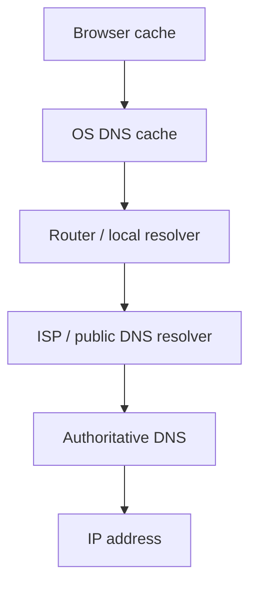

# Модуль I. Путешествие одного запроса

# Глава 2. DNS

──────────────────────────────────────────────

**МОДУЛЬ I • Путешествие одного запроса**

**Прогресс:** 22% (2 / 9)

✓ URL → ◐ DNS → □ TCP → □ TLS → □ HTTP

**Текущий вопрос:**  
Как узнать IP-адрес сервера по имени `company.com`?

──────────────────────────────────────────────

> **Не запоминай технологии. Понимай, какие проблемы они решают.**

---

## Исходная ситуация

Пользователь ввёл в браузере:

```text
https://company.com/api/files/123
```

В предыдущей главе мы разобрали, что это не просто строка, а URL.

Браузер уже понимает:

```text
Scheme: https
Host:   company.com
Path:   /api/files/123
```

Но есть проблема.

Браузер пока не знает, где физически находится `company.com`.

Компьютеры не устанавливают соединение с красивыми именами. Им нужен IP-адрес.

```text
company.com  ❌ недостаточно
203.0.113.17 ✅ можно подключаться
```

Значит, перед отправкой запроса нужно решить первый технический вопрос:

> Как узнать IP-адрес сервера по его имени?

Для этого и нужен DNS.

---

## Зачем нужна эта глава

DNS часто воспринимают как тему для сетевых инженеров.

Это ошибка.

Backend-разработчик сталкивается с DNS постоянно, просто не всегда замечает это.

Например:

| Где | Как связан DNS |
|---|---|
| Браузер | `company.com` нужно превратить в IP |
| Docker Compose | контейнеры обращаются друг к другу по service name |
| Nginx | `proxy_pass http://directory-service` требует разрешения имени |
| PostgreSQL | connection string часто содержит hostname, а не IP |
| Redis | сервис подключается к `redis:6379` |
| RabbitMQ | сервис подключается к `rabbitmq:5672` |
| Kubernetes | service discovery построен вокруг DNS-имён сервисов |

Если не понимать DNS, трудно объяснить:

- почему `localhost` внутри контейнера — это не host machine;
- почему `postgres` в Docker Compose работает как адрес;
- почему Nginx может получить `502 Bad Gateway`, если имя сервиса не резолвится;
- почему после смены IP домена часть клиентов ещё ходит на старый адрес;
- почему Kubernetes-сервисы доступны по имени.

---

## Эта глава понадобится позже

```md
[[Docker Networking]]
[[Nginx]]
[[Reverse Proxy]]
[[Kubernetes]]
[[Service Discovery]]
[[PostgreSQL Connection String]]
[[Redis]]
[[RabbitMQ]]
```

---

## Короткое определение

**DNS (Domain Name System — система доменных имён)** — это распределённая система, которая сопоставляет доменные имена с IP-адресами.

Пример:

```text
company.com
    ↓ DNS
203.0.113.17
```

DNS не обрабатывает HTTP-запросы, не запускает backend и не знает бизнес-логику приложения.

Его задача проще:

> Ответить, куда нужно подключаться по заданному имени.

---

## Простое объяснение

Представь бизнес-центр.

Ты знаешь название компании:

```text
Company LLC
```

Но не знаешь номер кабинета.

На первом этаже сидит администратор.

Ты спрашиваешь:

> Где находится Company LLC?

Он отвечает:

> Кабинет 512.

После этого администратор больше не участвует в разговоре. Он не идёт с тобой в кабинет и не обсуждает твой вопрос с сотрудником компании.

DNS работает так же.

Браузер спрашивает:

```text
Где находится company.com?
```

DNS отвечает:

```text
203.0.113.17
```

После этого браузер уже сам пытается установить соединение с этим IP.

---

## Что DNS НЕ делает

Это важнее, чем кажется.

DNS не делает следующее:

- не принимает HTTP-запрос;
- не выбирает ASP.NET Core controller;
- не проверяет JWT;
- не ходит в PostgreSQL;
- не знает route `/api/files/123`;
- не шифрует соединение;
- не балансирует backend-логику приложения.

DNS работает до всего этого.

Пока DNS не ответил, браузер ещё даже не знает, куда устанавливать соединение.

---

## Почему нельзя просто использовать IP

На первый взгляд можно было бы не усложнять.

Вместо:

```text
https://company.com/api/files/123
```

писать:

```text
https://203.0.113.17/api/files/123
```

Технически это возможно, но в реальных системах почти всегда плохо.

Причины:

1. IP может измениться.
2. Один домен может указывать на разные IP.
3. За доменом может стоять Load Balancer (балансировщик нагрузки).
4. Сертификаты TLS обычно выпускаются на доменное имя, а не на голый IP.
5. Человеку проще запомнить имя, чем набор чисел.
6. Внутри инфраструктуры сервисы могут переезжать между машинами, а имя остаётся тем же.

Доменное имя даёт уровень абстракции.

Клиент знает стабильное имя.

Инфраструктура может менять реальные IP за этим именем.

---

## Как выглядит DNS-запрос упрощённо

Когда браузеру нужен IP для `company.com`, он не обязательно сразу идёт в интернет.

Обычно проверяются несколько уровней:



Упрощённо цепочка такая:

1. Браузер проверяет свой кэш.
2. Операционная система проверяет свой DNS-кэш.
3. Если ответа нет, запрос уходит DNS-resolver-у.
4. Resolver ищет authoritative DNS server.
5. Возвращается IP-адрес.
6. Ответ может быть сохранён в кэше.

Точная цепочка зависит от системы, браузера, сети и настроек DNS.

Для backend-разработчика важно понимать не все детали рекурсивного DNS, а базовую идею:

> имя превращается в IP, а ответ может кэшироваться.

---

## DNS cache и TTL

DNS-ответы обычно кэшируются.

Это сделано для скорости.

Если бы каждый запрос к `company.com` каждый раз требовал полного DNS-поиска, интернет работал бы медленнее.

Поэтому DNS-запись имеет TTL.

**TTL (Time To Live — время жизни записи)** — это время, в течение которого DNS-ответ можно считать актуальным и хранить в кэше.

Пример:

```text
company.com -> 203.0.113.17
TTL: 300 секунд
```

Это означает:

```text
Следующие 5 минут можно использовать этот IP без нового DNS-запроса.
```

---

## Почему TTL важен для backend

Представим, что компания перенесла API на новый сервер.

Было:

```text
company.com -> 203.0.113.17
```

Стало:

```text
company.com -> 203.0.113.99
```

Но часть клиентов может ещё некоторое время использовать старый IP, потому что у них закэширована старая DNS-запись.

Это объясняет, почему при смене DNS-записей изменения не всегда видны мгновенно.

Это не магия и не обязательно ошибка.

Часто это просто DNS cache + TTL.

---

## DNS в Docker Compose

В обычной разработке DNS чаще всего становится заметен через Docker.

Например, в `docker-compose.yml` есть сервисы:

```yaml
services:
  postgres:
    image: postgres:16

  redis:
    image: redis:alpine

  directory-service:
    build: ./DirectoryService
```

Внутри одной Docker-сети сервисы могут обращаться друг к другу по имени:

```text
postgres
redis
directory-service
```

Например connection string может выглядеть так:

```text
Host=postgres;Port=5432;Database=app;Username=postgres;Password=password
```

Здесь `postgres` — это не публичный домен.

Это имя сервиса внутри Docker-сети.

Docker предоставляет внутренний DNS, который умеет сопоставить имя сервиса с IP контейнера.

---

## Частая ошибка: localhost внутри контейнера

Это одна из самых частых ошибок.

Разработчик пишет внутри контейнера:

```text
Host=localhost;Port=5432
```

и ожидает, что приложение подключится к PostgreSQL на host machine или к другому контейнеру.

Но внутри контейнера:

```text
localhost = сам контейнер
```

То есть если `DirectoryService` запущен в контейнере, то `localhost` внутри него указывает на контейнер `DirectoryService`, а не на контейнер `postgres` и не на Windows host.

Правильно внутри Docker-сети обычно так:

```text
Host=postgres;Port=5432
```

или:

```text
http://directory-service:8080
```

---

## DNS в Nginx

В микросервисной или контейнерной среде Nginx часто проксирует запросы по именам сервисов.

Например:

```nginx
location /directory-service/ {
    proxy_pass http://directory-service:8080;
}
```

Здесь `directory-service` должен быть разрешён в IP.

Если Nginx работает внутри Docker-сети, он может использовать Docker DNS.

Если имя не резолвится, Nginx не сможет отправить запрос дальше.

Результатом часто будет ошибка уровня proxy, например:

```text
502 Bad Gateway
```

Важно понимать: это может быть не ошибка ASP.NET Core и не ошибка контроллера.

Запрос мог вообще не дойти до приложения.

---

## DNS и Service Discovery

В больших системах сервисы часто не знают IP друг друга напрямую.

Они знают имена.

Например:

```text
auth-service
directory-service
file-service
postgres
redis
rabbitmq
```

Это удобно, потому что IP может меняться.

Контейнер пересоздали — IP стал другим.

Сервис переехал на другой node — IP стал другим.

Но имя остаётся стабильным.

Именно поэтому DNS тесно связан с Service Discovery (обнаружение сервисов).

Service Discovery отвечает на вопрос:

> Как сервису найти другой сервис в динамической инфраструктуре?

DNS — один из распространённых механизмов для этого.

---

## Практика из проекта

В проектной инфраструктуре Nginx используется как единая точка входа для нескольких backend-сервисов.

Клиент обращается к одному адресу:

```text
http://localhost:8080/directory-service/api/departments/roots
```

А Nginx внутри Docker-сети должен отправить запрос в `DirectoryService`.

Для этого в конфигурации может использоваться имя сервиса:

```nginx
proxy_pass http://directory-service:8080;
```

Ключевой момент:

```text
directory-service
```

— это не внешний домен.

Это имя контейнера/сервиса внутри Docker-сети.

Nginx должен уметь разрешить это имя в IP контейнера.

Если имя не резолвится, запрос не дойдёт до ASP.NET Core pipeline.

Поэтому при диагностике ошибок важно разделять:

```text
DNS / proxy проблема
```

и

```text
ошибка backend-приложения
```

Это разные уровни.

---

## Типичные ошибки

### Ошибка 1. Думать, что DNS обрабатывает HTTP

DNS не обрабатывает HTTP-запрос.

Он только помогает найти IP по имени.

После получения IP дальнейшая работа происходит уже через TCP, TLS, HTTP, Nginx, Kestrel и приложение.

---

### Ошибка 2. Использовать `localhost` внутри контейнера как адрес другого сервиса

Неверно:

```text
Host=localhost;Port=5432
```

если PostgreSQL находится в другом контейнере.

Обычно правильно:

```text
Host=postgres;Port=5432
```

при условии, что сервис `postgres` находится в той же Docker-сети.

---

### Ошибка 3. Ожидать мгновенного обновления DNS после смены IP

DNS-ответы могут кэшироваться.

Если у записи был TTL, часть клиентов может временно использовать старый IP.

---

### Ошибка 4. Не отличать публичный DNS от внутреннего DNS Docker/Kubernetes

`company.com` и `directory-service` — это разные типы имён.

Первое обычно резолвится через публичную DNS-инфраструктуру.

Второе может резолвиться только внутри Docker-сети или Kubernetes cluster.

---

## Когда это особенно важно

DNS становится особенно важен, когда появляются:

- Docker Compose;
- Nginx;
- Kubernetes;
- несколько backend-сервисов;
- read replica;
- managed databases;
- Redis / RabbitMQ в отдельных контейнерах;
- внешние API;
- blue-green deployment;
- миграция инфраструктуры.

Во всех этих случаях стабильное имя часто важнее конкретного IP.

---

## Когда DNS не решает проблему

DNS не заменяет:

- Load Balancer (балансировщик нагрузки) в полном смысле;
- API Gateway;
- health checks приложения;
- retry policy;
- circuit breaker;
- service mesh;
- авторизацию;
- маршрутизацию внутри ASP.NET Core.

DNS может помочь найти адрес.

Но он не гарантирует, что сервис здоров, быстро отвечает и правильно обработает запрос.

---

## Что происходит дальше

Теперь браузер знает IP-адрес сервера.

Например:

```text
company.com -> 203.0.113.17
```

Но HTTP-запрос всё ещё не отправлен.

Пока есть только адрес.

Следующая проблема:

> Как установить соединение с этим сервером?

Для этого нужно понять, что такое IP-адрес и порт, а затем перейти к TCP-соединению.

---

## Вопросы собеседования

### Junior: Что такое DNS?

<details>
<summary>Ответ</summary>

DNS — это система доменных имён. Она сопоставляет понятные человеку имена, например `company.com`, с IP-адресами серверов.

Пример:

```text
company.com -> 203.0.113.17
```

</details>

---

### Middle: Почему backend-разработчику важно понимать DNS?

<details>
<summary>Ответ</summary>

Потому что DNS встречается не только в браузере, но и в инфраструктуре backend-приложений: Docker Compose, Kubernetes, Nginx, connection strings, Redis, RabbitMQ и PostgreSQL.

Например, внутри Docker контейнеры часто обращаются друг к другу по имени сервиса, а не по IP. Если имя не резолвится, приложение или reverse proxy не сможет подключиться к нужному сервису.

</details>

---

### Middle: Почему `localhost` внутри контейнера часто работает не так, как ожидают?

<details>
<summary>Ответ</summary>

Потому что `localhost` внутри контейнера указывает на сам контейнер.

Если приложение в контейнере пытается подключиться к `localhost:5432`, оно ищет PostgreSQL внутри этого же контейнера. Если PostgreSQL запущен в другом контейнере, нужно обращаться по имени сервиса, например `postgres:5432`, при условии что оба контейнера находятся в одной Docker-сети.

</details>

---

### Senior: Почему после изменения DNS-записи часть клиентов может продолжать ходить на старый IP?

<details>
<summary>Ответ</summary>

Потому что DNS-ответы кэшируются. У записи есть TTL — время жизни. Пока кэшированная запись считается актуальной, клиент или промежуточный resolver может продолжать использовать старый IP.

Поэтому при миграциях инфраструктуры важно учитывать TTL заранее, снижать его перед изменениями и не ожидать мгновенного переключения всех клиентов.

</details>

---

### Senior: DNS — это load balancing?

<details>
<summary>Ответ</summary>

DNS может участвовать в распределении трафика, например возвращать разные IP-адреса. Но DNS сам по себе не является полноценной заменой Load Balancer.

Он не всегда знает, здоров ли конкретный backend, не управляет HTTP-маршрутизацией, не делает TLS termination, не применяет rate limiting и не умеет гибко работать с уровнем приложения.

Поэтому DNS может быть частью схемы распределения нагрузки, но для полноценного управления трафиком обычно используют Load Balancer, Reverse Proxy, API Gateway или инфраструктурные решения облака/Kubernetes.

</details>

---

## Ответ для собеседования

DNS — это система доменных имён, которая сопоставляет человекочитаемые имена с IP-адресами. Backend-разработчику важно понимать DNS, потому что он используется не только для публичных доменов, но и внутри инфраструктуры: Docker Compose, Kubernetes, Nginx, connection strings, Redis, RabbitMQ и PostgreSQL. Например, когда сервис в Docker обращается к `postgres:5432`, имя `postgres` должно быть разрешено во внутренний IP контейнера. DNS не обрабатывает HTTP-запросы и не заменяет load balancer; он только помогает найти адрес. Также важно учитывать DNS cache и TTL: после изменения DNS-записи часть клиентов может временно продолжать использовать старый IP.

---

## Шпаргалка

- DNS превращает имя в IP-адрес.
- DNS не обрабатывает HTTP.
- До DNS браузер не знает, куда подключаться.
- DNS-ответы могут кэшироваться.
- TTL определяет, как долго DNS-запись может жить в кэше.
- В Docker Compose имена сервисов работают через внутренний DNS.
- `localhost` внутри контейнера — это сам контейнер.
- Nginx может использовать DNS, чтобы найти backend-сервис по имени.
- DNS связан с Service Discovery, но не заменяет полноценный Load Balancer.
- При `502 Bad Gateway` проблема может быть на уровне DNS/proxy, а не в ASP.NET Core.

---

## Прогресс модуля

**Модуль I:** `Путешествие одного запроса`  
**Прогресс модуля:** 2 из 9 глав — 22%.
