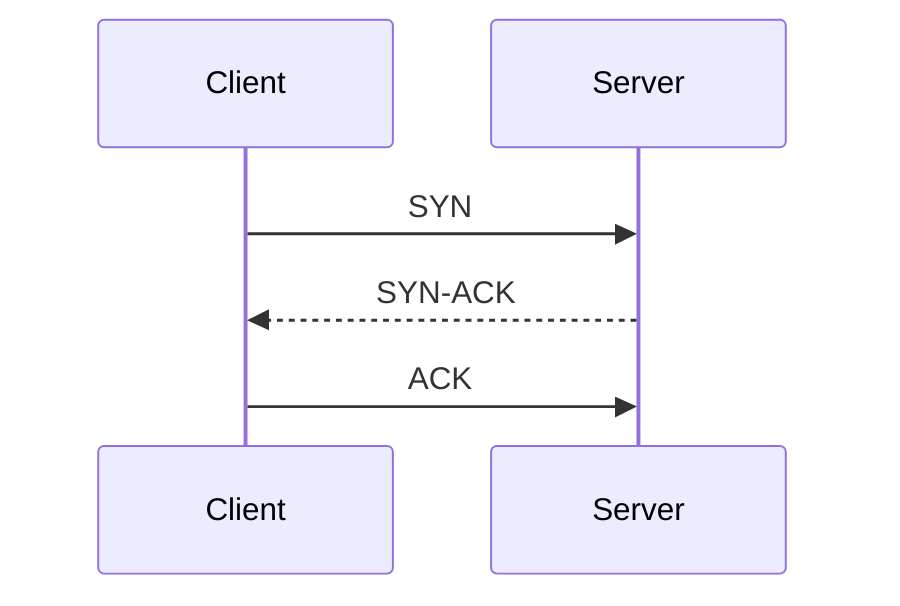
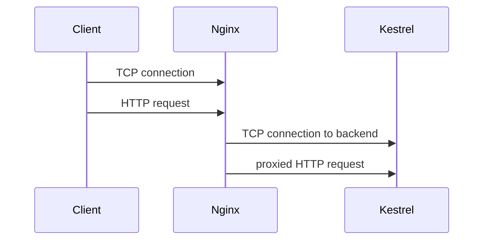

# Модуль I. Путешествие одного запроса

# Глава 5. TCP

──────────────────────────────────────────────

**МОДУЛЬ I • Путешествие одного запроса**

**Прогресс:** 56% (5 / 9)

✓ IP → ✓ Port → ◐ TCP → □ TLS → □ HTTP

**Текущий вопрос:**  
Как установить надёжное соединение между клиентом и сервером?

──────────────────────────────────────────────

> **Не запоминай технологии. Понимай, какие проблемы они решают.**

---

## Исходная ситуация

У браузера уже есть:

```text
Host: company.com
IP:   203.0.113.17
Port: 443
```

То есть браузер знает:

```text
к какой машине подключаться
и в какую сетевую дверь стучаться
```

Но HTTP-запрос ещё не отправлен.

Сначала клиент и сервер должны установить соединение.

Для обычного HTTP/HTTPS это чаще всего делает TCP.

---

## Зачем нужна эта глава

TCP не нужно знать на уровне сетевого инженера, но backend-разработчику важно понимать базовые идеи.

TCP объясняет:

- почему HTTP-запрос не возникает «из воздуха»;
- почему WebSocket держит соединение открытым;
- почему долгие блокирующие операции могут держать соединения;
- почему есть connection timeout;
- почему Kestrel принимает TCP-подключения;
- почему Nginx может не достучаться до backend-сервиса;
- почему клиент может получить connection refused или timeout.

Для .NET backend-разработчика TCP важен прежде всего как транспорт, поверх которого работают HTTP/HTTPS, PostgreSQL, Redis, RabbitMQ и WebSocket.

---

## Эта глава понадобится позже

```md
[[TLS]]
[[HTTP]]
[[HTTPS]]
[[Kestrel]]
[[Nginx]]
[[WebSocket]]
[[PostgreSQL]]
[[Redis]]
[[RabbitMQ]]
```

---

## Короткое определение

**TCP (Transmission Control Protocol — протокол управления передачей)** — это транспортный протокол, который устанавливает соединение между двумя сторонами и обеспечивает надёжную доставку данных.

Упрощённо:

```text
TCP отвечает за соединение и доставку байтов.
HTTP отвечает за смысл этих байтов: request, headers, body, response.
```

---

## Простое объяснение

Представь телефонный звонок.

Перед разговором нужно:

```text
набрать номер
дождаться ответа
убедиться, что собеседник слышит тебя
```

Только потом начинается сам разговор.

TCP похож на установку такого звонка.

HTTP — это уже содержание разговора.

---

## TCP и HTTP — разные уровни

Важно не смешивать:

```text
TCP  = как передавать данные
HTTP = что означают передаваемые данные
```

Пример:

```text
TCP-соединение установлено
        ↓
по нему отправляется HTTP request
        ↓
сервер возвращает HTTP response
```

Если TCP-соединение не установлено, HTTP-запрос не будет отправлен.

---

## Three-Way Handshake

Перед передачей данных TCP устанавливает соединение.

Упрощённо это выглядит так:



Это называют **Three-Way Handshake (трёхстороннее рукопожатие)**.

Смысл:

1. Клиент говорит: хочу соединиться.
2. Сервер отвечает: готов, я тебя слышу.
3. Клиент подтверждает: я тоже получил ответ.

После этого соединение считается установленным, и можно передавать данные.

---

## Что значит «надёжная доставка»

TCP старается обеспечить:

- доставку данных;
- порядок данных;
- повторную отправку потерянных сегментов;
- контроль целостности;
- управление потоком.

Для backend-разработчика достаточно понимать основную мысль:

> TCP делает так, чтобы приложение получало поток байтов в правильном порядке или узнало, что соединение сломалось.

Именно поэтому HTTP может не думать о том, в каком порядке пришли части данных. Это уже задача транспорта.

---

## Что TCP не делает

TCP не знает:

- что такое URL;
- что такое HTTP header;
- что такое JSON;
- что такое JWT;
- что такое controller;
- что такое PostgreSQL query.

TCP работает ниже уровня приложения.

Он передаёт байты.

Смысл этих байтов определяет протокол выше: HTTP, PostgreSQL wire protocol, Redis protocol, AMQP и т.д.

---

## TCP в ASP.NET Core

Когда ASP.NET Core приложение принимает HTTP-запросы, обычно это делает Kestrel.

Kestrel слушает endpoint:

```text
http://0.0.0.0:8080
```

и принимает входящие TCP-подключения.

Упрощённо:

```text
Client
  ↓ TCP connection
Kestrel
  ↓ HTTP parsing
ASP.NET Core pipeline
```

То есть до middleware, routing и controller запрос должен пройти сетевой слой.

---

## TCP и Nginx

Если перед приложением стоит Nginx, цепочка становится такой:



Здесь может быть два разных TCP-соединения:

1. клиент → Nginx;
2. Nginx → Kestrel.

Если второе соединение не установится, пользователь может увидеть ошибку proxy, например `502 Bad Gateway`.

---

## Connection refused и timeout

Две частые ошибки:

### Connection refused

Обычно означает:

```text
по этому IP:port никто не слушает
```

Например Nginx отправляет запрос на:

```text
http://file-service:8080
```

а приложение внутри контейнера слушает порт `5000`.

### Timeout

Обычно означает:

```text
попытка соединиться или дождаться ответа заняла слишком много времени
```

Причины могут быть разные:

- сервис недоступен;
- сеть не пропускает соединение;
- backend завис;
- firewall;
- неправильный host/port;
- перегрузка.

---

## TCP и WebSocket

WebSocket тоже обычно работает поверх TCP.

Отличие от обычного HTTP-запроса в том, что WebSocket держит соединение открытым для двустороннего обмена сообщениями.

Упрощённо:

```text
HTTP request
  ↓ Upgrade
WebSocket connection
  ↓
долгое двустороннее соединение поверх TCP
```

Глубоко разбирать WebSocket будем отдельно.

Сейчас важно понимать: WebSocket — это не «магия рядом с HTTP», а протокол, который тоже опирается на транспортное соединение.

---

## TCP и UDP коротко

На собеседовании могут спросить:

> Чем TCP отличается от UDP?

Коротко:

| TCP | UDP |
|---|---|
| устанавливает соединение | не устанавливает соединение |
| гарантирует порядок данных | не гарантирует порядок |
| повторяет потерянные данные | не повторяет автоматически |
| надёжнее | быстрее и проще |
| HTTP/1.1, HTTP/2, WebSocket | DNS, стриминг, игры, QUIC/HTTP/3 |

Для .NET backend-разработчика важно знать различие, но не уходить глубоко в сетевые алгоритмы.

---

## Практика из проекта

Когда сервисы в Docker общаются через Nginx, за каждым HTTP-запросом всё равно стоит TCP-соединение.

Например:

```text
Client -> localhost:8080 -> Nginx -> directory-service:8080 -> Kestrel
```

Если `directory-service` не запущен, слушает другой порт или имя не резолвится, Nginx не сможет установить TCP-соединение к backend.

В этом случае проблема может быть не в controller, не в MediatR и не в PostgreSQL.

Запрос просто не дошёл до ASP.NET Core.

---

## Типичные ошибки

### Ошибка 1. Думать, что HTTP сам устанавливает соединение

HTTP описывает формат request/response.

Соединение устанавливает транспортный уровень, чаще всего TCP.

---

### Ошибка 2. Диагностировать `502` сразу как ошибку backend-кода

Если Nginx не может подключиться к Kestrel, код controller вообще не выполнялся.

Сначала нужно проверить host, port, Docker network и доступность сервиса.

---

### Ошибка 3. Думать, что WebSocket не связан с TCP

WebSocket обычно работает поверх TCP и держит соединение открытым.

Поэтому большое количество WebSocket-клиентов — это нагрузка на соединения и ресурсы сервера.

---

## Когда не нужно уходить глубже

Для Middle+ .NET backend-разработчика обычно достаточно понимать:

- зачем нужен TCP;
- что HTTP работает поверх TCP;
- что такое handshake на концептуальном уровне;
- что TCP обеспечивает надёжный поток байтов;
- как TCP связан с Kestrel, Nginx, PostgreSQL, Redis и RabbitMQ;
- что означают connection refused и timeout.

Глубокие темы вроде congestion control, TCP window, retransmission timers и TIME_WAIT можно изучать отдельно, но они не должны занимать основную часть подготовки к ASP.NET Core собеседованию.

---

## Что происходит дальше

TCP-соединение установлено.

Теперь клиент и сервер могут обмениваться байтами.

Но если используется HTTPS, данные нельзя отправлять открытым текстом.

Следующая проблема:

> Как защитить соединение от чтения и подмены данных?

Для этого нужен TLS.

---

## Вопросы собеседования

### Junior: Что такое TCP?

<details>
<summary>Ответ</summary>

TCP — это транспортный протокол, который устанавливает соединение между клиентом и сервером и обеспечивает надёжную передачу данных в правильном порядке.

</details>

---

### Middle: Чем TCP отличается от HTTP?

<details>
<summary>Ответ</summary>

TCP отвечает за транспорт: соединение и доставку байтов. HTTP отвечает за прикладной формат общения: request, response, headers, body, status codes.

HTTP обычно работает поверх TCP.

</details>

---

### Middle: Что такое Three-Way Handshake?

<details>
<summary>Ответ</summary>

Это процесс установки TCP-соединения: клиент отправляет SYN, сервер отвечает SYN-ACK, клиент подтверждает ACK. После этого соединение считается установленным и можно передавать данные.

</details>

---

### Senior: Почему Nginx может вернуть `502 Bad Gateway`, если backend-код не падал?

<details>
<summary>Ответ</summary>

Потому что Nginx мог не установить соединение с backend-сервисом. Например, неверный host, неправильный port, сервис не запущен, не слушает нужный endpoint или проблема в Docker network. В таком случае запрос не доходит до ASP.NET Core pipeline и controller вообще не выполняется.

</details>

---

## Ответ для собеседования

TCP — это транспортный протокол, который устанавливает соединение между клиентом и сервером и обеспечивает надёжную доставку байтов в правильном порядке. HTTP работает поверх TCP: TCP отвечает за соединение, а HTTP — за формат request/response. В ASP.NET Core Kestrel принимает входящие TCP-подключения и затем разбирает HTTP. Если перед приложением стоит Nginx, обычно есть соединение клиент → Nginx и отдельное соединение Nginx → Kestrel. Поэтому ошибки вроде connection refused, timeout или `502 Bad Gateway` часто нужно диагностировать на уровне host, port, Docker network и доступности backend-сервиса, а не сразу искать проблему в controller.

---

## Шпаргалка

- TCP устанавливает соединение.
- HTTP обычно работает поверх TCP.
- TCP передаёт байты, HTTP задаёт смысл этих байтов.
- Three-Way Handshake: SYN → SYN-ACK → ACK.
- Kestrel принимает TCP-подключения.
- Nginx может создавать отдельное TCP-соединение к backend.
- `Connection refused` часто означает, что на IP:port никто не слушает.
- `Timeout` означает, что соединение или ответ не пришли вовремя.
- WebSocket обычно тоже работает поверх TCP.
- Для .NET backend важно понимать TCP практически, без глубокого ухода в сетевую инженерию.

---

## Прогресс модуля

**Модуль I:** `Путешествие одного запроса`  
**Прогресс модуля:** 5 из 9 глав — 56%.
