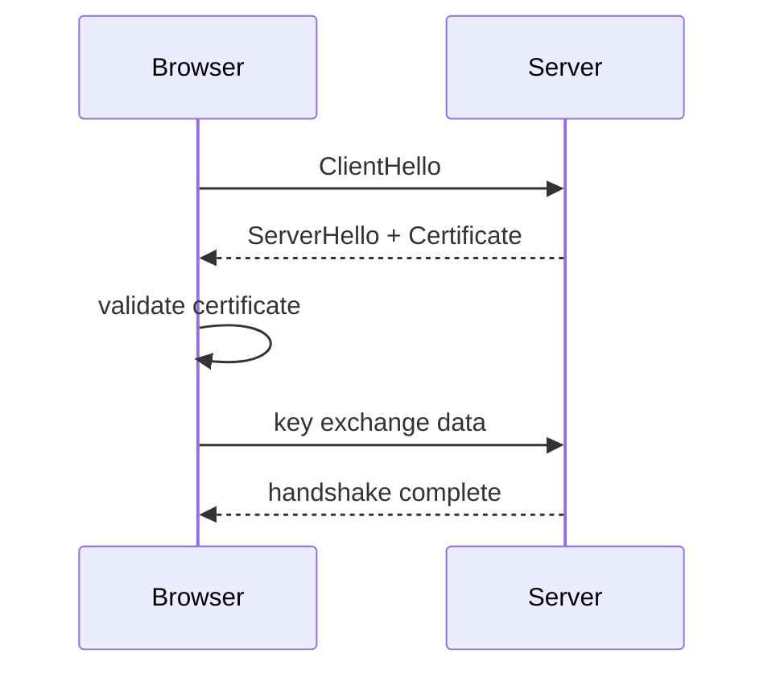

# Модуль I. Путешествие одного запроса

# Глава 6. TLS

──────────────────────────────────────────────

**МОДУЛЬ I • Путешествие одного запроса**

**Прогресс:** 67% (6 / 9)

✓ Port → ✓ TCP → ◐ TLS → □ HTTP → □ HTTPS

**Текущий вопрос:**  
Как защитить соединение от чтения и подмены данных?

──────────────────────────────────────────────

> **Не запоминай технологии. Понимай, какие проблемы они решают.**

---

## Исходная ситуация

У браузера уже есть:

```text
IP:   203.0.113.17
Port: 443
```

TCP-соединение установлено.

Теперь клиент и сервер могут обмениваться байтами.

Но если просто отправить HTTP-запрос поверх TCP, данные будут передаваться открыто.

Для публичного интернета это неприемлемо.

В запросе могут быть:

- cookies;
- access token;
- refresh token;
- персональные данные;
- пароли;
- платежная информация;
- внутренние идентификаторы.

Следующая инженерная проблема:

> Как сделать так, чтобы данные нельзя было прочитать или незаметно подменить по пути?

Для этого используется TLS.

---

## Зачем нужна эта глава

TLS важен для backend-разработчика не только как «замочек в браузере».

Он связан с:

| Где | Почему важно |
|---|---|
| HTTPS | HTTP поверх TLS |
| JWT / Cookies | токены нельзя безопасно передавать по открытому HTTP |
| OAuth / OIDC | redirect flow требует защищённого канала |
| Nginx | часто завершает TLS перед backend |
| Kestrel | может принимать HTTPS напрямую |
| Docker/local dev | часто возникает вопрос с dev certificates |
| Production | сертификаты, expiration, renewal |
| Security | защита от чтения и подмены трафика |

Для Middle+ собеседования важно понимать не криптографию глубоко, а практическую роль TLS в backend-системах.

---

## Эта глава понадобится позже

```md
[[HTTPS]]
[[Nginx]]
[[Kestrel]]
[[Authentication]]
[[Authorization]]
[[JWT]]
[[Cookies]]
[[OAuth 2.0]]
[[OpenID Connect]]
```

---

## Короткое определение

**TLS (Transport Layer Security — безопасность транспортного уровня)** — это протокол, который защищает соединение между клиентом и сервером.

Он обеспечивает:

- шифрование данных;
- проверку подлинности сервера через certificate;
- защиту от незаметной подмены данных.

HTTPS — это HTTP, который работает поверх TLS.

```text
HTTP + TLS = HTTPS
```

---

## Простое объяснение

Представь, что ты отправляешь письмо.

Обычный HTTP похож на открытую открытку:

```text
любой, кто держит её в руках, может прочитать текст
```

HTTPS похож на письмо в запечатанном защищённом конверте:

```text
по пути видно, куда оно идёт,
но содержимое прочитать нельзя
```

TLS — это механизм, который создаёт такой защищённый канал.

---

## Что TLS защищает

TLS защищает данные между двумя точками соединения.

Например:

```text
Browser -> Nginx
```

или:

```text
Browser -> Kestrel
```

Он помогает защититься от:

- чтения трафика третьей стороной;
- незаметной подмены данных;
- подключения к поддельному серверу, если сертификат невалиден.

---

## Что TLS не решает

TLS не заменяет authentication и authorization.

Если соединение защищено, это ещё не значит, что пользователь имеет доступ к ресурсу.

TLS отвечает за безопасный канал.

Authentication отвечает на вопрос:

```text
кто пользователь?
```

Authorization отвечает на вопрос:

```text
что ему разрешено?
```

TLS также не защищает данные после того, как они уже попали на сервер. Для этого нужны другие механизмы: валидация, контроль доступа, безопасное хранение секретов, аудит, защита БД и т.д.

---

## Certificate

Чтобы клиент доверял серверу, сервер предъявляет certificate.

**Certificate (сертификат)** — это цифровой документ, который подтверждает, что сервер действительно владеет доменным именем.

Например:

```text
certificate for company.com
```

Браузер проверяет:

- для какого домена выпущен сертификат;
- не истёк ли срок действия;
- доверяет ли браузер центру сертификации;
- совпадает ли домен в URL с доменом в сертификате.

Если проверка не проходит, браузер покажет предупреждение.

---

## TLS Handshake упрощённо

Перед передачей защищённых данных клиент и сервер договариваются о параметрах соединения.

Упрощённо:



После этого стороны получают общий защищённый канал и могут передавать HTTP-сообщения уже зашифрованно.

Для backend-разработчика не обязательно знать все криптографические детали handshake. Важно понимать смысл:

> до отправки HTTPS-запроса клиент и сервер должны договориться о защищённом канале.

---

## TLS termination

В production часто TLS завершается не в ASP.NET Core приложении, а на Nginx, Load Balancer или API Gateway.

Это называется **TLS termination (завершение TLS)**.

Схема:

```text
Client --HTTPS--> Nginx --HTTP--> Kestrel
```

Снаружи соединение защищено.

Внутри инфраструктуры Nginx может отправлять запрос к backend по HTTP.

Это нормальная практика, если внутренняя сеть контролируется и защищена.

Но в более строгих системах могут шифровать и внутренний трафик:

```text
Client --HTTPS--> Nginx --HTTPS--> Kestrel
```

---

## TLS и ASP.NET Core

ASP.NET Core/Kestrel может сам принимать HTTPS.

В development окружении часто используются dev certificates.

Например:

```bash
dotnet dev-certs https --trust
```

Но в production часто делают иначе:

```text
Internet -> Nginx/Load Balancer -> Kestrel
```

Nginx или Load Balancer принимает HTTPS, работает с certificate, а backend-приложение получает уже проксированный запрос.

В этом случае важно правильно настроить forwarded headers, чтобы приложение понимало исходную схему запроса (`https`), а не думало, что запрос пришёл по обычному `http`.

---

## TLS и Auth

TLS особенно важен для authentication и authorization.

Если передавать токены по обычному HTTP, их можно перехватить.

Например:

```text
Authorization: Bearer <access_token>
```

или cookie:

```text
Set-Cookie: refreshToken=...; Secure; HttpOnly
```

Для secure cookies браузер требует HTTPS.

Поэтому в реальных системах login, refresh token, logout и session management должны работать через защищённый канал.

---

## Практика из проекта

В локальной разработке можно часто видеть HTTP:

```text
http://localhost:8080
```

Это удобно для dev-среды.

Но для production authentication flow должен идти через HTTPS.

Особенно если AuthService выдаёт JWT, refresh tokens, cookies или работает с invite tokens.

Если перед сервисами стоит Nginx, он может стать точкой TLS termination:

```text
Client --HTTPS--> Nginx --HTTP--> AuthService/FileService/DirectoryService
```

Тогда backend-сервисы остаются проще, а управление сертификатами концентрируется на входном слое.

---

## Типичные ошибки

### Ошибка 1. Думать, что HTTPS — это отдельный протокол вместо HTTP

Корректнее:

```text
HTTPS = HTTP over TLS
```

То есть HTTP-сообщения остаются, но передаются через защищённый канал.

---

### Ошибка 2. Думать, что TLS заменяет авторизацию

TLS защищает канал.

Он не решает, имеет ли пользователь право выполнить запрос.

---

### Ошибка 3. Не учитывать TLS termination

Если TLS завершается на Nginx, backend может видеть запрос как `http`, если не настроены forwarded headers.

Это может ломать redirect URL, cookie policy, Swagger и auth flow.

---

### Ошибка 4. Забыть про срок действия сертификата

Сертификаты истекают.

Если renewal не настроен, production может внезапно начать отдавать ошибку сертификата.

---

## Когда не нужно уходить глубже

Для Middle+ .NET backend-разработчика обычно достаточно понимать:

- зачем нужен TLS;
- что HTTPS = HTTP поверх TLS;
- что такое certificate на практическом уровне;
- что такое TLS termination;
- как TLS связан с Nginx, Kestrel, cookies, JWT, OAuth/OIDC;
- почему forwarded headers важны за reverse proxy.

Глубокая криптография, алгоритмы шифрования и детали certificate chain полезны, но не должны занимать основную часть подготовки к backend-собеседованию.

---

## Что происходит дальше

Защищённый канал установлен.

Теперь можно отправлять HTTP-сообщение.

Следующая проблема:

> В каком формате клиент и сервер будут обмениваться запросами и ответами?

Для этого нужен HTTP.

---

## Вопросы собеседования

### Junior: Что такое TLS?

<details>
<summary>Ответ</summary>

TLS — это протокол, который защищает соединение между клиентом и сервером: шифрует данные, помогает проверить подлинность сервера и защищает от незаметной подмены данных.

</details>

---

### Middle: Чем HTTPS отличается от HTTP?

<details>
<summary>Ответ</summary>

HTTPS — это HTTP поверх TLS. Формат HTTP-запросов и ответов остаётся, но они передаются через защищённый канал.

```text
HTTP + TLS = HTTPS
```

</details>

---

### Middle: Что такое TLS termination?

<details>
<summary>Ответ</summary>

TLS termination — это ситуация, когда HTTPS-соединение завершается на Nginx, Load Balancer или API Gateway. Дальше запрос может идти к backend по HTTP или HTTPS, в зависимости от инфраструктуры.

Пример:

```text
Client --HTTPS--> Nginx --HTTP--> Kestrel
```

</details>

---

### Senior: Почему backend за Nginx может неправильно формировать redirect URL после TLS termination?

<details>
<summary>Ответ</summary>

Если TLS завершается на Nginx, то до Kestrel запрос может прийти уже как HTTP. Без корректной настройки forwarded headers приложение может думать, что исходный запрос был `http`, а не `https`. Это может ломать redirect URL, secure cookies, Swagger и authentication flows.

</details>

---

## Ответ для собеседования

TLS — это протокол защиты транспортного соединения. Он шифрует данные, помогает проверить подлинность сервера через сертификат и защищает от незаметной подмены данных. HTTPS — это HTTP поверх TLS. Для .NET backend-разработчика TLS важен в связке с Nginx, Kestrel, cookies, JWT и OAuth/OIDC. В production TLS часто завершается на Nginx или Load Balancer, а дальше запрос проксируется в ASP.NET Core приложение. В таком случае нужно учитывать forwarded headers, иначе backend может неправильно определить исходную схему запроса и сломать redirects, secure cookies или auth flow.

---

## Шпаргалка

- TLS защищает соединение.
- HTTPS = HTTP over TLS.
- Certificate подтверждает подлинность сервера.
- TLS не заменяет authentication и authorization.
- TLS termination часто делают на Nginx/Load Balancer.
- После TLS termination backend может получать HTTP, хотя клиент пришёл по HTTPS.
- Forwarded headers помогают backend понять исходную схему запроса.
- Secure cookies и token flows должны работать через HTTPS.
- Сертификаты имеют срок действия и требуют renewal.

---

## Прогресс модуля

**Модуль I:** `Путешествие одного запроса`  
**Прогресс модуля:** 6 из 9 глав — 67%.
