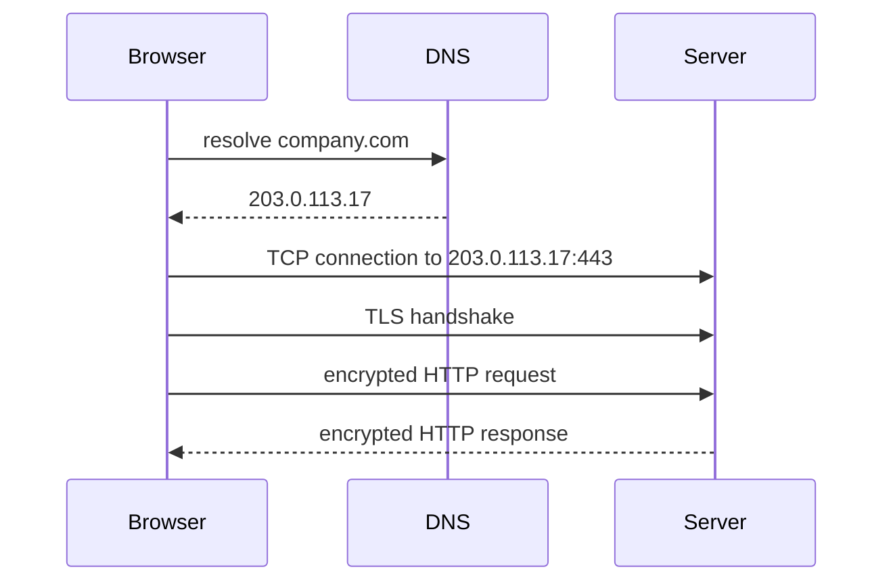

# Модуль I. Путешествие одного запроса

# Глава 8. HTTPS

──────────────────────────────────────────────

**МОДУЛЬ I • Путешествие одного запроса**

**Прогресс:** 89% (8 / 9)

✓ TLS → ✓ HTTP → ◐ HTTPS → □ Full Journey

**Текущий вопрос:**  
Как HTTP-запрос безопасно проходит через интернет?

──────────────────────────────────────────────

> **Не запоминай технологии. Понимай, какие проблемы они решают.**

---

## Исходная ситуация

Мы уже разобрали две отдельные идеи:

```text
HTTP = формат request/response
TLS  = защищённый канал
```

В реальном интернете они чаще всего работают вместе.

Когда пользователь вводит:

```text
https://company.com/api/files/123
```

он использует не просто HTTP.

Он использует HTTP поверх TLS.

Это и есть HTTPS.

---

## Зачем нужна эта глава

HTTPS — обязательная база для современной backend-разработки.

Он связан с:

- login;
- JWT;
- refresh token;
- cookies;
- OAuth 2.0;
- OpenID Connect;
- CORS;
- Nginx;
- Kestrel;
- redirects;
- Swagger за reverse proxy;
- production security.

Если не понимать HTTPS, трудно объяснять, почему токены нельзя передавать по HTTP, зачем нужны secure cookies, почему backend за Nginx может неправильно строить redirect URL и что такое TLS termination.

---

## Эта глава понадобится позже

```md
[[Nginx]]
[[Kestrel]]
[[Forwarded Headers]]
[[Authentication]]
[[JWT]]
[[Refresh Token]]
[[Cookies]]
[[OAuth 2.0]]
[[OpenID Connect]]
```

---

## Короткое определение

**HTTPS (HyperText Transfer Protocol Secure — защищённый HTTP)** — это HTTP, который передаётся через защищённый TLS-канал.

Формула:

```text
HTTP + TLS = HTTPS
```

HTTP определяет структуру запроса и ответа.

TLS защищает передачу этих данных между клиентом и сервером.

---

## Простое объяснение

HTTP — это письмо.

TLS — это защищённый конверт.

HTTPS — это письмо в защищённом конверте.

```text
HTTP:  что написано
TLS:   как защитить передачу
HTTPS: HTTP, переданный безопасно
```

---

## Что происходит при HTTPS-запросе

Упрощённая цепочка:



Важно: HTTP request отправляется после установления защищённого канала.

---

## HTTPS и port 443

По умолчанию HTTPS использует port `443`.

Поэтому URL:

```text
https://company.com/api/files/123
```

обычно означает:

```text
https://company.com:443/api/files/123
```

Если указан другой port, браузер будет использовать его:

```text
https://company.com:8443/api/files/123
```

---

## HTTPS за Nginx

В production часто используется схема:

```text
Client --HTTPS--> Nginx --HTTP--> Kestrel
```

В этом случае:

- клиент видит HTTPS;
- сертификат настроен на Nginx;
- Nginx расшифровывает запрос;
- дальше отправляет запрос в ASP.NET Core приложение.

Это удобно, потому что управление сертификатами сосредоточено на входном слое.

Но появляется важный нюанс.

Backend может получить запрос от Nginx уже как HTTP.

Если приложение не знает, что исходный запрос был HTTPS, могут возникнуть проблемы с:

- redirect URL;
- secure cookies;
- Swagger;
- OAuth/OIDC redirect URI;
- генерацией абсолютных ссылок.

Для этого используются forwarded headers.

---

## Forwarded headers

**Forwarded headers (проброшенные заголовки)** помогают backend-приложению понять исходные параметры запроса до proxy.

Часто встречаются:

```text
X-Forwarded-For
X-Forwarded-Proto
X-Forwarded-Host
```

Например:

```text
X-Forwarded-Proto: https
```

говорит приложению:

```text
клиент снаружи пришёл по HTTPS
```

Даже если Nginx передал запрос в Kestrel по HTTP.

В ASP.NET Core для этого есть Forwarded Headers Middleware.

Подробно эта тема будет в главах про Nginx и ASP.NET Core pipeline.

---

## HTTPS и Auth

Для AuthService HTTPS особенно важен.

Например:

```text
POST /auth/login
POST /auth/refresh
POST /auth/logout
```

В этих запросах могут передаваться:

- логин и пароль;
- access token;
- refresh token;
- invite token;
- cookies;
- session identifiers.

Передавать такие данные по обычному HTTP опасно.

Именно поэтому production authentication flow должен работать через HTTPS.

---

## HTTPS в локальной разработке

В local development можно часто использовать HTTP:

```text
http://localhost:8080
```

Это нормально для некоторых локальных сценариев.

Но важно понимать разницу:

- local dev может быть проще;
- production должен быть защищён;
- некоторые browser features и cookie policies ведут себя иначе без HTTPS.

Если нужно тестировать HTTPS локально, в .NET можно использовать dev certificates:

```bash
dotnet dev-certs https --trust
```

---

## Практика из проекта

В локальной инфраструктуре Nginx может быть доступен через:

```text
http://localhost:8080
```

Это удобно для разработки и тестирования маршрутизации между сервисами.

Но если речь идёт о production-сценариях AuthService, FileService или DirectoryService, внешний входной слой должен работать через HTTPS.

Особенно для AuthService, где есть login, refresh token rotation, session management и invite flow.

В таком сценарии Nginx или другой входной proxy может выполнять TLS termination:

```text
Client --HTTPS--> Nginx --HTTP--> AuthService
```

а backend должен корректно учитывать forwarded headers.

---

## Типичные ошибки

### Ошибка 1. Думать, что HTTPS меняет структуру HTTP

HTTPS не меняет method, path, headers, body и status codes.

Он защищает транспортировку HTTP-сообщений.

---

### Ошибка 2. Передавать токены по HTTP

Access token, refresh token и cookies нельзя безопасно передавать по открытому HTTP в production.

---

### Ошибка 3. Не настраивать forwarded headers за proxy

Если TLS завершается на Nginx, backend может думать, что запрос пришёл по HTTP.

Это может сломать redirect URL и secure cookies.

---

### Ошибка 4. Считать HTTPS достаточной защитой всей системы

HTTPS защищает канал передачи.

Он не заменяет:

- валидацию входных данных;
- authentication;
- authorization;
- безопасное хранение токенов;
- защиту БД;
- audit logging.

---

## Когда не нужно уходить глубже

Для Middle+ ASP.NET Core разработчика важно понимать:

- HTTPS = HTTP over TLS;
- роль certificate;
- port 443;
- TLS termination;
- forwarded headers;
- связь HTTPS с cookies, JWT, OAuth/OIDC;
- типичные ошибки за Nginx.

Глубокая криптография и устройство certificate chain полезны, но не должны быть основной частью этой книги.

---

## Что происходит дальше

Теперь мы собрали почти всю цепочку:

```text
URL -> DNS -> IP -> Port -> TCP -> TLS -> HTTP -> HTTPS
```

Осталось пройти весь путь целиком и увидеть, как эти части складываются в один реальный request.

---

## Вопросы собеседования

### Junior: Что такое HTTPS?

<details>
<summary>Ответ</summary>

HTTPS — это HTTP, который передаётся через защищённый TLS-канал. То есть HTTP задаёт формат request/response, а TLS защищает передачу данных.

</details>

---

### Middle: Почему login и refresh token должны работать через HTTPS?

<details>
<summary>Ответ</summary>

Потому что при login и refresh token flow передаются чувствительные данные: пароль, access token, refresh token, cookies или session identifiers. По обычному HTTP эти данные можно перехватить, поэтому в production нужен HTTPS.

</details>

---

### Middle: Что такое `X-Forwarded-Proto`?

<details>
<summary>Ответ</summary>

`X-Forwarded-Proto` — это header, который proxy может передать backend-приложению, чтобы указать исходную схему запроса. Например, клиент пришёл на Nginx по HTTPS, а Nginx отправил запрос в Kestrel по HTTP. Тогда `X-Forwarded-Proto: https` помогает backend понять, что внешний запрос был защищённым.

</details>

---

### Senior: Почему за Nginx могут ломаться secure cookies или redirect URI?

<details>
<summary>Ответ</summary>

Если TLS завершается на Nginx, backend может получить запрос как HTTP. Без Forwarded Headers Middleware приложение может неправильно определить scheme и host исходного запроса. Из-за этого могут некорректно формироваться redirect URI, secure cookies, Swagger links или OAuth/OIDC callbacks.

</details>

---

## Ответ для собеседования

HTTPS — это HTTP поверх TLS. HTTP определяет структуру request/response, а TLS защищает передачу данных: шифрует соединение, помогает проверить подлинность сервера через сертификат и защищает от подмены. Для ASP.NET Core backend это важно в связке с authentication, cookies, JWT, OAuth/OIDC и reverse proxy. В production TLS часто завершается на Nginx или Load Balancer, а дальше запрос проксируется в Kestrel. В таком случае нужно правильно настроить forwarded headers, чтобы приложение понимало исходный scheme, host и IP клиента.

---

## Шпаргалка

- HTTPS = HTTP over TLS.
- HTTPS обычно использует port `443`.
- TLS защищает передачу данных.
- HTTPS не заменяет authentication и authorization.
- Login, refresh token и cookies должны идти через HTTPS в production.
- TLS termination часто делают на Nginx или Load Balancer.
- После TLS termination backend может получать HTTP.
- `X-Forwarded-Proto` помогает backend понять исходную схему.
- Без forwarded headers могут ломаться redirects, cookies, Swagger и OAuth callbacks.

---

## Прогресс модуля

**Модуль I:** `Путешествие одного запроса`  
**Прогресс модуля:** 8 из 9 глав — 89%.
