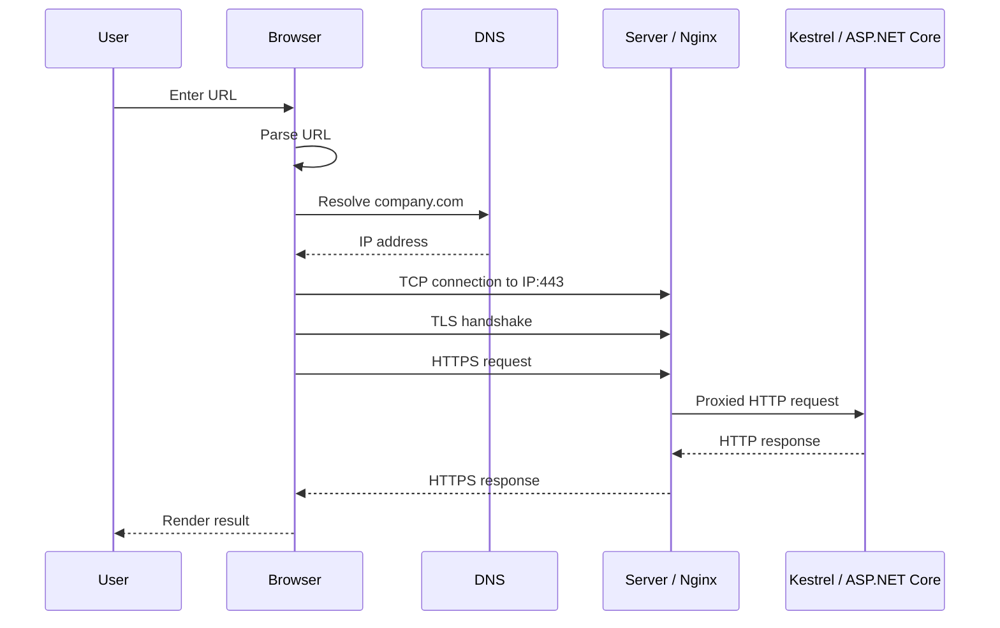

# Модуль I. Путешествие одного запроса

# Глава 9. Полное путешествие запроса

──────────────────────────────────────────────

**МОДУЛЬ I • Путешествие одного запроса**

**Прогресс до главы:** 89% (8 из 9 глав завершены)

**Маршрут:** URL → DNS → IP → Port → TCP → TLS → HTTP → HTTPS → Full Journey
**Текущая глава:** Full Journey

**Текущий вопрос:**  
Как все части складываются в один реальный HTTP-запрос?

──────────────────────────────────────────────

> **Не запоминай технологии. Понимай, какие проблемы они решают.**

---

## Зачем нужна эта глава

В предыдущих главах мы разобрали части по отдельности:

- URL;
- DNS;
- IP-адрес;
- port;
- TCP;
- TLS;
- HTTP;
- HTTPS.

Теперь нужно собрать их в одну цепочку.

Именно эта цепочка помогает уверенно отвечать на вопросы вида:

> Что происходит, когда пользователь вводит URL в браузере и нажимает Enter?

Это один из самых полезных вопросов для backend-собеседований, потому что он проверяет не знание одного термина, а понимание всей системы.

---

## Эта глава понадобится позже

- [Граница Kestrel и ASP.NET Core](../02_ASPNET_Core_Request_Pipeline/01_Kestrel_ASPNET_Core_Boundary.md)
- [Middleware Pipeline](../02_ASPNET_Core_Request_Pipeline/03_Middleware_Pipeline.md)
- [Routing и выбор Endpoint](../02_ASPNET_Core_Request_Pipeline/04_Routing_Endpoint_Selection.md)
- [Authentication внутри Pipeline](../02_ASPNET_Core_Request_Pipeline/05_Authentication_In_Pipeline.md)
- [Authorization внутри Pipeline](../02_ASPNET_Core_Request_Pipeline/06_Authorization_In_Pipeline.md)
- [Выполнение Endpoint](../02_ASPNET_Core_Request_Pipeline/07_Endpoint_Execution.md)
- [Полный ASP.NET Core Request Pipeline](../02_ASPNET_Core_Request_Pipeline/08_Full_ASPNET_Core_Request_Pipeline.md)
- [Nginx](../04_Production_Entry_Layer/02_Nginx.md)
- [Reverse Proxy](../04_Production_Entry_Layer/03_Reverse_Proxy.md)
- [PostgreSQL](../05_Data/02_PostgreSQL.md)

---

## Исходный запрос

Пользователь вводит:

```text
https://company.com/api/files/123
```

Браузер должен пройти несколько этапов до того, как ASP.NET Core controller или Minimal API endpoint вообще получит управление.

---

## Полная цепочка до приложения



Это упрощённая схема, но она достаточно точна для понимания backend-процесса на уровне Middle+.

---

## Шаг 1. Браузер разбирает URL

URL:

```text
https://company.com/api/files/123
```

разбивается на части:

```text
Scheme: https
Host:   company.com
Port:   443 по умолчанию
Path:   /api/files/123
```

На этом этапе HTTP-запрос ещё не отправлен.

Браузер только понял, что ему нужно обратиться к `company.com` по HTTPS.

---

## Шаг 2. DNS ищет IP-адрес

Браузеру нужен IP.

```text
company.com
    ↓ DNS
203.0.113.17
```

Если DNS не сможет вернуть адрес, соединение не начнётся.

ASP.NET Core приложение в этом случае вообще ничего не узнает о запросе.

---

## Шаг 3. Браузер выбирает port

Так как scheme — `https`, используется port `443`, если другой порт не указан явно.

```text
203.0.113.17:443
```

IP говорит, к какой машине идти.

Port говорит, в какую сетевую точку входа подключаться.

---

## Шаг 4. TCP устанавливает соединение

Перед передачей HTTP-сообщения нужно установить транспортное соединение.

Упрощённо:

```text
SYN -> SYN-ACK -> ACK
```

Если соединение не установится, HTTP-запрос не будет отправлен.

Возможные ошибки:

- connection refused;
- timeout;
- network unreachable.

---

## Шаг 5. TLS создаёт защищённый канал

Так как используется HTTPS, после TCP начинается TLS handshake.

Сервер предъявляет certificate.

Браузер проверяет, что сертификат подходит для `company.com`.

После успешного handshake появляется защищённый канал.

---

## Шаг 6. Браузер отправляет HTTP request

Теперь браузер может отправить HTTP request уже внутри защищённого TLS-канала.

Пример:

```http
GET /api/files/123 HTTP/1.1
Host: company.com
Accept: application/json
Authorization: Bearer <token>
```

Это уже прикладной уровень.

Здесь появляются:

- method;
- path;
- headers;
- body;
- cookies;
- authorization header.

---

## Шаг 7. Запрос принимает входной слой

В production перед ASP.NET Core часто стоит Nginx, Load Balancer или API Gateway.

Например:

```text
Client --HTTPS--> Nginx --HTTP--> Kestrel
```

Nginx может:

- завершить TLS;
- проверить host/path;
- применить routing;
- переписать path;
- добавить forwarded headers;
- проксировать запрос в backend.

Если Nginx не сможет подключиться к backend-сервису, приложение не выполнится.

Пользователь может увидеть `502 Bad Gateway`.

---

## Шаг 8. Kestrel принимает запрос

Kestrel — web server внутри ASP.NET Core.

Он принимает сетевое соединение и передаёт HTTP request в ASP.NET Core pipeline.

Упрощённо:

```text
Kestrel
  ↓
HttpContext
  ↓
Middleware pipeline
```

Подробно это будет в Модуле II про ASP.NET Core Request Pipeline.

---

## Шаг 9. ASP.NET Core pipeline обрабатывает request

Дальше запрос проходит через middleware.

Например:

```text
Exception Handling
Logging
Forwarded Headers
Routing
Authentication
Authorization
Endpoint
```

Порядок middleware важен.

Например, authentication должен выполниться до authorization.

Routing должен определить endpoint.

Authorization должен понять, можно ли пользователю выполнить этот endpoint.

---

## Шаг 10. Endpoint вызывает бизнес-логику

Endpoint может быть:

- controller action;
- Minimal API handler;
- GraphQL endpoint;
- health check;
- static file middleware.

Для Web API часто цепочка выглядит так:

```text
Controller
  ↓
MediatR / Application Handler
  ↓
Repository / DbContext
  ↓
PostgreSQL
```

Именно здесь начинается уже прикладная логика.

---

## Шаг 11. Response возвращается обратно

Ответ проходит обратный путь:

```text
Application
  ↓
Kestrel
  ↓
Nginx / Load Balancer
  ↓
TLS
  ↓
Browser
```

HTTP response может выглядеть так:

```http
HTTP/1.1 200 OK
Content-Type: application/json

{
  "id": "123",
  "name": "file.mp4"
}
```

Если произошла ошибка, status code будет другим:

```text
400, 401, 403, 404, 409, 500, 502
```

---

## Где может сломаться запрос

Один и тот же пользовательский запрос может сломаться на разных уровнях.

| Уровень | Пример проблемы | Что увидим |
|---|---|---|
| URL | неверный path | `404` |
| DNS | для домена не найден IP-адрес | browser DNS error |
| IP/Port | никто не слушает порт | connection refused |
| TCP | сеть недоступна | timeout |
| TLS | сертификат невалиден | certificate error |
| Nginx | backend недоступен | `502 Bad Gateway` |
| ASP.NET Core Routing | endpoint не найден | `404` |
| Authentication | нет валидного токена | `401` |
| Authorization | нет прав | `403` |
| Application | ошибка бизнес-логики | `400`, `409`, `500` |
| Database | ошибка запроса/lock/deadlock | зависит от обработки |

Это важно для диагностики.

Не каждая ошибка — это ошибка controller.

Иногда запрос вообще не дошёл до приложения.

---

## Как отвечать на собеседовании

Если спрашивают:

> Что происходит после ввода URL в браузере?

Не нужно уходить в сетевую инженерию на час.

Нужен уверенный структурированный ответ.

Примерный порядок:

1. Браузер разбирает URL.
2. Через DNS получает IP по host.
3. Определяет port по scheme или явному значению.
4. Устанавливает TCP-соединение.
5. Если HTTPS — выполняет TLS handshake.
6. Отправляет HTTP request.
7. Запрос принимает Nginx/Load Balancer или Kestrel.
8. ASP.NET Core создаёт `HttpContext` и прогоняет request через middleware pipeline.
9. Routing выбирает endpoint.
10. Authentication/authorization проверяют пользователя и права.
11. Endpoint выполняет бизнес-логику.
12. Response возвращается обратно клиенту.

---

## Типичные ошибки

### Ошибка 1. Начинать сразу с controller

Controller — это далеко не первый этап.

До него уже прошли DNS, TCP, TLS, HTTP, обратный прокси, Kestrel, middleware и routing.

---

### Ошибка 2. Не отличать ошибки инфраструктуры от ошибок приложения

`502 Bad Gateway` часто означает проблему между обратным прокси и backend, а не ошибку controller.

`401` и `403` — разные ошибки auth-уровня.

DNS error вообще происходит до обращения к серверу.

---

### Ошибка 3. Смешивать HTTP и HTTPS

HTTPS — это не другой формат API.

Это HTTP, передаваемый через TLS.

---

### Ошибка 4. Игнорировать обратный прокси

В production клиент часто не обращается напрямую к Kestrel.

Перед ним может быть Nginx, Load Balancer, API Gateway или Kubernetes Ingress.

---

## Что будет дальше

Мы прошли путь запроса до входа в ASP.NET Core.

Следующий модуль разбирает, что происходит внутри .NET приложения:

```text
Kestrel
  ↓
ASP.NET Core Pipeline
  ↓
Middleware
  ↓
Routing
  ↓
Authentication
  ↓
Authorization
  ↓
Endpoint
```

То есть следующий утверждённый модуль посвящён ASP.NET Core Request Pipeline.

---

## Вопросы собеседования

### Middle: Что происходит после ввода URL в браузере?

<details>
<summary>Ответ</summary>

Браузер разбирает URL, получает IP через DNS, определяет port, устанавливает TCP-соединение, при HTTPS выполняет TLS handshake, затем отправляет HTTP request. Запрос принимает Nginx/Load Balancer или Kestrel, после чего он проходит через ASP.NET Core pipeline: middleware, routing, authentication, authorization и endpoint.

</details>

---

### Middle: Почему ошибка может произойти до controller?

<details>
<summary>Ответ</summary>

Потому что до controller есть несколько уровней: DNS, TCP, TLS, обратный прокси, Kestrel, middleware и routing. Например, если Nginx не может подключиться к backend, controller не выполнится вообще, а пользователь может получить `502 Bad Gateway`.

</details>

---

### Senior: Как структурно диагностировать проблему с недоступным API?

<details>
<summary>Ответ</summary>

Нужно идти по слоям: проверить URL и path, поиск IP-адреса через DNS, доступность IP/port, TCP-соединение, TLS certificate, обратный прокси, доступность backend-сервиса, адрес и порт, которые слушает Kestrel, ASP.NET Core logs, routing, authentication/authorization и только потом application/database ошибки. Такой подход помогает не искать баг в коде, если запрос не дошёл до приложения.

</details>

---

## Ответ для собеседования

Когда пользователь вводит URL, браузер сначала разбирает его на scheme, host, port и path. Затем через DNS получает IP-адрес host-а, определяет порт, устанавливает TCP-соединение и, если используется HTTPS, выполняет TLS handshake. После этого браузер отправляет HTTP request. В production запрос часто сначала попадает в Nginx или Load Balancer, где может завершиться TLS, примениться routing или rewrite, после чего запрос проксируется в Kestrel. Kestrel передаёт request в ASP.NET Core pipeline, где выполняются middleware, routing, authentication, authorization и endpoint. Только после этого вызывается controller или Minimal API handler. Поэтому при диагностике важно понимать, на каком уровне сломался запрос.

---

## Шпаргалка

- URL сначала разбирается браузером.
- DNS превращает host в IP.
- Port выбирает сетевую точку входа.
- TCP устанавливает соединение.
- TLS защищает канал.
- HTTP задаёт формат request/response.
- HTTPS = HTTP over TLS.
- Nginx/Load Balancer часто стоят перед Kestrel.
- Kestrel передаёт request в ASP.NET Core pipeline.
- Controller — не начало пути, а один из поздних этапов.
- Диагностику нужно вести по слоям.

---

## Прогресс модуля

**Модуль I:** `Путешествие одного запроса`  
**Прогресс после главы:** 100% (9 из 9 глав завершены).
