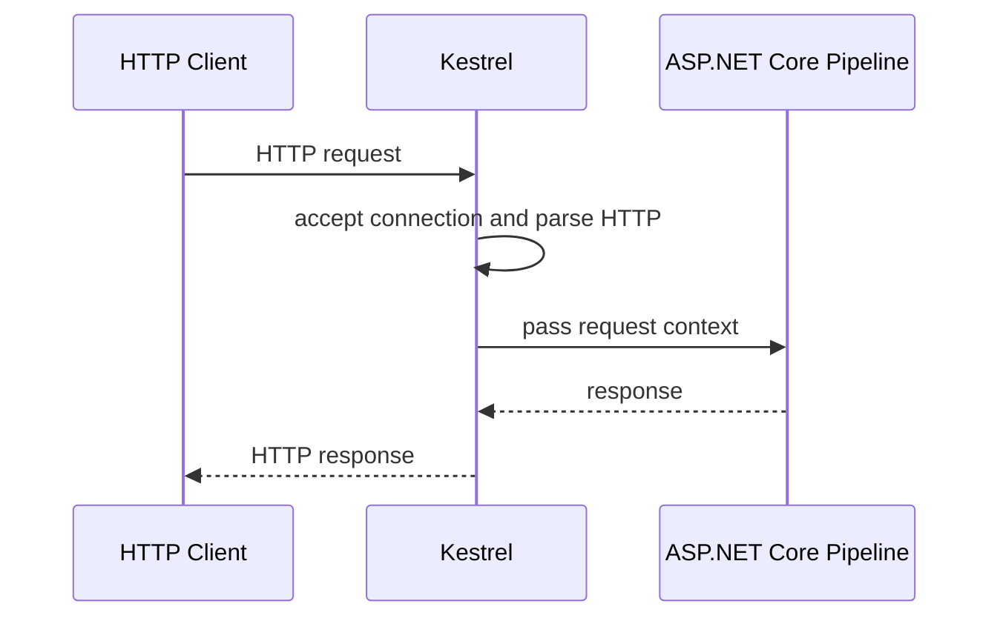

# Модуль II. ASP.NET Core Request Pipeline: от Kestrel до Endpoint

# Глава 1. Граница Kestrel и ASP.NET Core

──────────────────────────────────────────────

**МОДУЛЬ II • ASP.NET Core Request Pipeline**

**Прогресс до главы:** 0% (0 из 8 глав завершены)

**Маршрут:** Kestrel → HttpContext → Middleware → Routing → Authentication → Authorization → Endpoint → Full Pipeline
**Текущая глава:** Kestrel

**Текущий вопрос:**  
Что происходит после того, как Kestrel принял HTTP-запрос?

──────────────────────────────────────────────

> **Не запоминай технологии. Понимай, какие проблемы они решают.**

---

## Исходная ситуация

В [Модуле I](../01_Request_Journey/09_Full_Request_Journey.md) запрос дошёл до .NET-приложения.

До этого уже могли произойти:

- разбор URL;
- DNS;
- выбор IP и port;
- TCP-соединение;
- TLS;
- отправка HTTP request.

Теперь вопрос уже не сетевой:

> Как HTTP-запрос попадает из web server в ASP.NET Core pipeline?

---

## Зачем нужна эта глава

Backend-разработчик часто видит controller action или Minimal API handler и думает, что запрос начинается там.

На самом деле раньше есть граница:

```text
Kestrel
  ↓
ASP.NET Core application pipeline
```

Эта граница помогает понимать:

- почему приложение должно слушать endpoint;
- почему Kestrel не является middleware;
- почему controller ещё не участвует;
- откуда появляется `HttpContext`;
- где заканчивается web server и начинается прикладная обработка.

---

## Эта глава понадобится позже

- [HttpContext](./02_HttpContext.md)
- [Middleware Pipeline](./03_Middleware_Pipeline.md)
- [Routing и выбор Endpoint](./04_Routing_Endpoint_Selection.md)
- [Полный ASP.NET Core Request Pipeline](./08_Full_ASPNET_Core_Request_Pipeline.md)
- Production Entry Layer в будущем Модуле IV

---

## Короткое определение

**Kestrel (web server ASP.NET Core — компонент, который принимает HTTP-запросы и передаёт их в ASP.NET Core pipeline)** находится на границе между сетью и приложением.

Он принимает соединение, разбирает HTTP на уровне web server и передаёт запрос дальше в приложение.

Kestrel не выбирает controller и не выполняет бизнес-логику.

---

## Простая аналогия

Kestrel похож на входную дверь офиса.

Он принимает посетителя и передаёт его внутрь здания.

Но Kestrel не решает, в какой отдел пойдёт посетитель, не проверяет его права и не выполняет работу отдела.

Этим занимается уже внутренняя цепочка обработки ASP.NET Core.

---

## Техническое объяснение

Современное ASP.NET Core приложение обычно запускается так:

```csharp
var builder = WebApplication.CreateBuilder(args);
var app = builder.Build();

app.MapGet("/ping", () => "pong");

app.Run();
```

`WebApplication.Run` запускает приложение и web server.

Упрощённо:

```text
app.Run()
  ↓
Kestrel начинает слушать endpoint
  ↓
приходит HTTP request
  ↓
создаётся контекст запроса
  ↓
запрос передаётся в ASP.NET Core pipeline
```

**Endpoint (точка входа — адрес и обработчик, к которому может быть сопоставлен запрос)** в этой главе пока важен только как конечная цель pipeline. Подробно выбор endpoint разбирается в главе [Routing и выбор Endpoint](./04_Routing_Endpoint_Selection.md).

---

## Что значит приложение слушает endpoint

Фраза:

```text
приложение слушает http://localhost:5000
```

означает, что web server принимает входящие подключения на указанном адресе и порту.

В контейнере часто используют:

```text
http://0.0.0.0:8080
```

или:

```text
ASPNETCORE_URLS=http://+:8080
```

Связь IP и port подробно разобрана в [Модуле I](../01_Request_Journey/04_Port.md). Здесь важно другое: если Kestrel не слушает нужный адрес и порт, request не попадёт в pipeline.

---

## Схема



---

## Практический пример

Нейтральный учебный запрос:

```text
GET /api/files/123
```

На границе Kestrel и ASP.NET Core происходит только вход в приложение:

```text
HTTP request received
  ↓
Kestrel
  ↓
ASP.NET Core pipeline
```

На этом этапе ещё не выбран route, не проверен пользователь и не вызван handler.

---

## Мини-пример

```csharp
var builder = WebApplication.CreateBuilder(args);
var app = builder.Build();

app.MapGet("/api/files/{id}", (string id) =>
{
    return Results.Ok(new { Id = id });
});

app.Run();
```

`app.Run()` запускает приложение. Kestrel принимает запрос, а ASP.NET Core pipeline уже решает, какой endpoint должен его обработать.

---

## Типичные ошибки

Ошибка: считать Kestrel middleware.  
Почему неверно: middleware работает внутри ASP.NET Core pipeline, а Kestrel находится до него как web server.  
Как правильно: Kestrel передаёт запрос в pipeline, но сам не является его middleware-компонентом.

Ошибка: начинать объяснение сразу с controller.  
Почему неверно: до controller есть Kestrel, `HttpContext`, middleware и routing.  
Как правильно: сначала объяснить вход через Kestrel и только потом движение внутри pipeline.

Ошибка: думать, что Kestrel всегда стоит прямо перед интернетом.  
Почему неверно: в production перед ним часто есть отдельный входной слой.  
Как правильно: в этом модуле изучать границу Kestrel и ASP.NET Core, а production-вход оставить для Модуля IV.

---

## Вопросы собеседования

### Junior: Что такое Kestrel?

<details>
<summary>Ответ</summary>

Kestrel — это web server ASP.NET Core. Он принимает HTTP-запросы и передаёт их в ASP.NET Core pipeline.

</details>

---

### Middle: Почему Kestrel не является middleware?

<details>
<summary>Ответ</summary>

Middleware выполняется внутри ASP.NET Core pipeline. Kestrel находится на границе до pipeline: он принимает соединение и передаёт запрос приложению.

</details>

---

### Senior: Что значит, что приложение слушает endpoint?

<details>
<summary>Ответ</summary>

Это значит, что web server принимает подключения на конкретном адресе и порту, например `http://0.0.0.0:8080`. Если приложение слушает не тот endpoint, запрос может не попасть в ASP.NET Core pipeline.

</details>

---

## Ответ для собеседования

Kestrel — это web server ASP.NET Core. Он находится на границе между сетевым уровнем и приложением: принимает HTTP-запрос, разбирает его как web server и передаёт дальше в ASP.NET Core pipeline. Kestrel не является middleware и не выбирает controller. После передачи запроса приложение работает через `HttpContext`, middleware, routing, authentication, authorization и endpoint. Поэтому controller — не начало обработки, а один из возможных поздних этапов.

---

## Шпаргалка

- Kestrel — web server ASP.NET Core.
- Kestrel находится до middleware pipeline.
- `app.Run()` запускает приложение и web server.
- Приложение должно слушать нужный address/port.
- Kestrel не выбирает controller.
- Kestrel не является middleware.
- После Kestrel появляется контекст запроса.
- Production-вход перед Kestrel разбирается в Модуле IV.

---

## Прогресс модуля

**Модуль II:** `ASP.NET Core Request Pipeline`  
**Прогресс после главы:** 13% (1 из 8 глав завершена).
