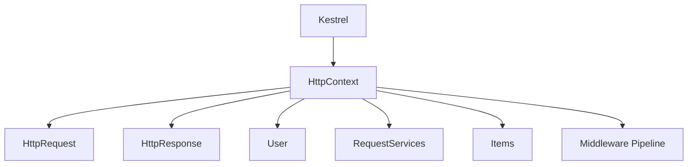

# Модуль II. ASP.NET Core Request Pipeline: от Kestrel до Endpoint

# Глава 2. HttpContext

──────────────────────────────────────────────

**МОДУЛЬ II • ASP.NET Core Request Pipeline**

**Прогресс до главы:** 13% (1 из 8 глав завершена)

**Маршрут:** Kestrel → HttpContext → Middleware → Routing → Authentication → Authorization → Endpoint → Full Pipeline

**Текущая глава:** HttpContext

**Текущий вопрос:**  
Где ASP.NET Core хранит состояние текущего запроса?

──────────────────────────────────────────────

> **Не запоминай технологии. Понимай, какие проблемы они решают.**

---

## Исходная ситуация

[Kestrel](./01_Kestrel_ASPNET_Core_Boundary.md) принял HTTP-запрос и передал его в ASP.NET Core.

Теперь приложению нужен объект, через который все компоненты pipeline будут видеть один и тот же запрос.

Эту роль выполняет `HttpContext`.

---

## Зачем нужна эта глава

Почти всё в ASP.NET Core request pipeline связано с `HttpContext`:

- request;
- response;
- текущий пользователь;
- значения маршрута;
- dependency injection scope;
- cancellation token;
- connection info;
- trace id;
- временные данные запроса.

Если не понимать `HttpContext`, трудно объяснять middleware, routing, authentication, authorization и endpoint execution.

---

## Эта глава понадобится позже

- [Middleware Pipeline](./03_Middleware_Pipeline.md)
- [Routing и выбор Endpoint](./04_Routing_Endpoint_Selection.md)
- [Authentication внутри Pipeline](./05_Authentication_In_Pipeline.md)
- [Authorization внутри Pipeline](./06_Authorization_In_Pipeline.md)
- [Выполнение выбранного Endpoint](./07_Endpoint_Execution.md)

---

## Короткое определение

**HttpContext (контекст HTTP-запроса — объект, который хранит данные текущего запроса и ответа)** передаётся через ASP.NET Core pipeline.

Через него middleware и endpoint получают доступ к `Request`, `Response`, `User`, services, значениям маршрута и другим данным текущего запроса.

`HttpContext` живёт в рамках одного запроса.

---

## Простая аналогия

`HttpContext` похож на папку дела.

Когда запрос проходит через разные отделы, каждый компонент читает или дополняет одну и ту же папку:

- кто пришёл;
- что запросил;
- какие параметры есть;
- какой ответ нужно вернуть;
- какие заметки появились по пути.

После завершения запроса эта папка больше не должна использоваться как глобальное состояние. `HttpContext` не является потокобезопасным (thread-safe — пригодным для параллельного доступа из нескольких потоков без дополнительного контроля).

---

## Техническое объяснение

Основные части `HttpContext`:

| Часть | Для чего нужна |
|---|---|
| `Request` | входящий HTTP request |
| `Response` | HTTP response, который будет отправлен клиенту |
| `User` | текущий `ClaimsPrincipal` |
| `RequestServices` | scoped DI container текущего запроса |
| `Items` | временное хранилище данных запроса |
| `TraceIdentifier` | идентификатор запроса для логов |
| `RequestAborted` | cancellation token запроса |
| `Connection` | информация о соединении |
| значения маршрута (route values) | параметры, извлечённые из шаблона маршрута |
| endpoint | выбранный endpoint после routing |

Пример доступа:

```csharp
app.Use(async (context, next) =>
{
    var path = context.Request.Path;
    var traceId = context.TraceIdentifier;

    context.Items["StartedAt"] = DateTimeOffset.UtcNow;

    await next(context);
});
```

---

## HttpRequest и HttpResponse

**HttpRequest (HTTP-запрос — объект с данными входящего запроса)** содержит HTTP-метод, path, заголовки, query string, cookies и тело запроса.

**HttpResponse (HTTP-ответ — объект, через который приложение формирует ответ клиенту)** содержит код состояния, заголовки и тело ответа.

Пример:

```csharp
app.Run(async context =>
{
    context.Response.StatusCode = StatusCodes.Status200OK;
    context.Response.ContentType = "text/plain";
    await context.Response.WriteAsync("OK");
});
```

---

## User и RequestServices

`HttpContext.User` хранит текущего пользователя как `ClaimsPrincipal`. До authentication он может быть пустым или unauthenticated.

`RequestServices` даёт доступ к scoped services текущего запроса:

```csharp
app.Use(async (context, next) =>
{
    var logger = context.RequestServices
        .GetRequiredService<ILoggerFactory>()
        .CreateLogger("Request");

    logger.LogInformation("TraceId: {TraceId}", context.TraceIdentifier);

    await next(context);
});
```

Обычно зависимости получают через DI в endpoint или middleware, а не вручную через `RequestServices`. Но понимать его полезно: он показывает, что у каждого запроса есть свой scope.

---

## Жизненный цикл и ограничения

`HttpContext` связан с текущим запросом.

Нельзя сохранять его в singleton или использовать как глобальное состояние:

```csharp
// Плохая идея
static HttpContext? LastContext;
```

Причины:

- другой запрос получит другой context;
- объект не предназначен для работы после завершения request;
- данные запроса могут стать недоступны после завершения обработки;
- появляется риск гонок и утечек данных конкретного запроса между пользователями.

Если нужно запустить фоновую задачу, скопируй необходимые значения в отдельный объект:

```csharp
var work = new FileAuditWork(
    UserId: context.User.Identity?.Name,
    TraceId: context.TraceIdentifier,
    FileId: fileId);
```

В фоновую задачу должна уходить такая копия необходимых данных, а не сам `HttpContext`.

`IHttpContextAccessor` полезен в ограниченных случаях, но его не стоит превращать в универсальный способ доступа к request state из любого места приложения.

---

## Тело запроса

Тело запроса может быть потоком данных.

Для Web API обычно не нужно вручную читать тело запроса в middleware. Часто это делает model binding или логика endpoint позже.

Если middleware читает тело запроса самостоятельно, нужно понимать последствия: тело запроса обычно является stream, и повторное чтение требует осознанного buffering. В ASP.NET Core для таких сценариев можно включить `EnableBuffering()`, но это нужно делать только по необходимости: buffering влияет на память, диск и размер request.

Глубокие детали buffering и model binding будут в отдельной теме ASP.NET Core, не в этой главе.

`RequestAborted` — это сигнал отмены. Он помогает передать cancellation в долгую операцию, но не гарантирует, что любая операция мгновенно прекратится: код должен сам учитывать token.

---

## Схема



---

## Практический пример

Запрос:

```text
GET /api/files/123
```

Pipeline может использовать `HttpContext` так:

- logging middleware читает `TraceIdentifier`;
- routing записывает значения маршрута;
- authentication записывает `User`;
- authorization читает `User` и endpoint metadata;
- endpoint формирует `Response`.

---

## Типичные ошибки

Ошибка: сохранять `HttpContext` в глобальную переменную.  
Почему неверно: context относится к одному запросу и не должен жить дольше него.  
Как правильно: передавать нужные данные явно или использовать scoped services.

Ошибка: считать `HttpContext.Items` постоянным cache.  
Почему неверно: `Items` живёт только в рамках запроса.  
Как правильно: использовать его для временных данных между middleware.

Ошибка: читать тело запроса в middleware без необходимости.
Почему неверно: это может повлиять на дальнейшую обработку.  
Как правильно: читать тело запроса только когда это действительно нужно и понимать последствия.

---

## Вопросы собеседования

### Junior: Что такое `HttpContext`?

<details>
<summary>Ответ</summary>

`HttpContext` — это объект текущего HTTP-запроса. Через него ASP.NET Core компоненты получают доступ к request, response, user, services и другим данным обработки.

</details>

---

### Middle: Почему `HttpContext` нельзя хранить глобально?

<details>
<summary>Ответ</summary>

Потому что `HttpContext` относится к конкретному запросу, не является потокобезопасным и не должен использоваться после завершения request. Глобальное хранение может привести к ошибкам, гонкам и утечкам данных конкретного запроса между пользователями. Для фоновой задачи нужно копировать нужные значения в отдельный объект.

</details>

---

### Senior: Для чего нужен `RequestServices`?

<details>
<summary>Ответ</summary>

`RequestServices` — это service provider текущего запроса. Через него доступны scoped dependencies. Обычно зависимости получают через DI, но `RequestServices` показывает, что у запроса есть собственный scope сервисов.

</details>

---

## Ответ для собеседования

`HttpContext` — это центральный объект текущего HTTP-запроса в ASP.NET Core. Он содержит `Request`, `Response`, `User`, scoped services, значения маршрута, connection info, trace id и cancellation token. Middleware и endpoint работают с одним context по мере движения запроса через pipeline. Важно помнить, что `HttpContext` живёт только в рамках запроса, не является потокобезопасным и не должен использоваться после завершения обработки. Для фоновой задачи нужно копировать нужные значения в отдельный объект.

---

## Шпаргалка

- `HttpContext` хранит состояние текущего запроса.
- `Request` — входящие данные.
- `Response` — формируемый ответ.
- `User` устанавливается authentication middleware.
- `RequestServices` связан со scope запроса.
- `Items` подходит для временных данных.
- `TraceIdentifier` полезен для логов.
- `RequestAborted` передаёт сигнал отмены, но не останавливает код магически.
- `HttpContext` нельзя хранить глобально.
- `HttpContext` не является потокобезопасным.
- Для фоновой задачи копируют значения, а не сам context.

---

## Прогресс модуля

**Модуль II:** `ASP.NET Core Request Pipeline`  
**Прогресс после главы:** 25% (2 из 8 глав завершены).
