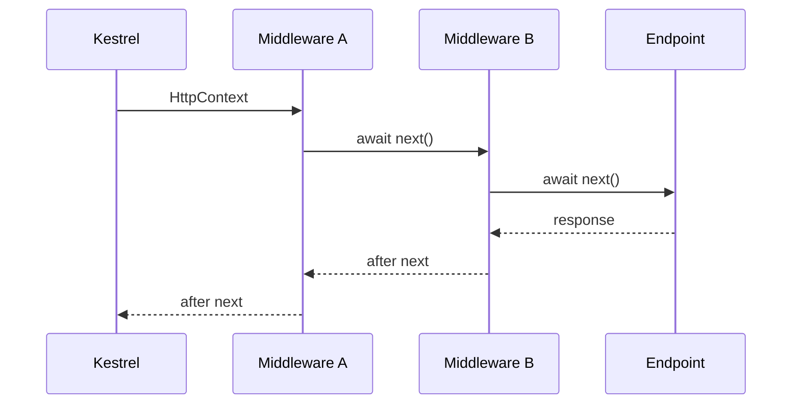

# Модуль II. ASP.NET Core Request Pipeline: от Kestrel до Endpoint

# Глава 3. Middleware Pipeline

──────────────────────────────────────────────

**МОДУЛЬ II • ASP.NET Core Request Pipeline**

**Прогресс до главы:** 25% (2 из 8 глав завершены)

**Маршрут:** Kestrel → HttpContext → Middleware → Routing → Authentication → Authorization → Endpoint → Full Pipeline
**Текущая глава:** Middleware

**Текущий вопрос:**  
Как ASP.NET Core передаёт запрос между компонентами?

──────────────────────────────────────────────

> **Не запоминай технологии. Понимай, какие проблемы они решают.**

---

## Исходная ситуация

Kestrel передал запрос в приложение, и у приложения есть [HttpContext](./02_HttpContext.md).

Теперь ASP.NET Core должен провести request через набор компонентов:

- logging;
- exception handling;
- routing;
- authentication;
- authorization;
- endpoint execution.

Эта цепочка называется middleware pipeline.

---

## Зачем нужна эта глава

Порядок middleware напрямую влияет на поведение приложения.

Он объясняет:

- почему exception handler должен быть рано;
- почему routing должен выбрать endpoint до endpoint-aware authorization;
- почему authentication обычно идёт до authorization;
- почему request может завершиться до endpoint;
- почему response проходит часть pipeline в обратном направлении.

---

## Эта глава понадобится позже

- [Routing и выбор Endpoint](./04_Routing_Endpoint_Selection.md)
- [Authentication внутри Pipeline](./05_Authentication_In_Pipeline.md)
- [Authorization внутри Pipeline](./06_Authorization_In_Pipeline.md)
- [Полный ASP.NET Core Request Pipeline](./08_Full_ASPNET_Core_Request_Pipeline.md)

---

## Короткое определение

**Middleware (промежуточный компонент — часть pipeline, которая получает `HttpContext`, может выполнить работу и передать запрос дальше)** формирует цепочку обработки запроса.

**RequestDelegate (делегат запроса — функция, которая принимает `HttpContext` и возвращает `Task`)** представляет следующий шаг обработки.

Middleware может вызвать следующий компонент через `next`, а может завершить request самостоятельно.

---

## Простая аналогия

Pipeline похож на коридор с несколькими постами проверки.

Каждый пост может:

- посмотреть документы;
- поставить отметку;
- передать человека дальше;
- остановить проход и сразу вернуть ответ.

На обратном пути ответ проходит через те посты, которые пропустили request дальше и ожидают возврата.

---

## Техническое объяснение

Минимальный middleware:

```csharp
app.Use(async (context, next) =>
{
    // код до следующего middleware
    await next(context);
    // код после следующего middleware
});
```

Код до `next` выполняется при движении request внутрь.

Код после `next` выполняется при движении response наружу.

---

## Use, Run и Map

`Use` добавляет middleware, который может вызвать следующий компонент:

```csharp
app.Use(async (context, next) =>
{
    await next(context);
});
```

`Run` регистрирует terminal delegate (завершающий делегат — обработчик, после которого pipeline дальше не идёт):

```csharp
app.Run(async context =>
{
    await context.Response.WriteAsync("Finished here");
});
```

Любой middleware фактически становится terminal, если он не вызывает `next`.

`Map` создаёт branch (ветку pipeline) по path prefix:

```csharp
app.Map("/health", healthApp =>
{
    healthApp.Run(async context =>
    {
        await context.Response.WriteAsync("Healthy");
    });
});
```

Краткое сравнение:

- `Map` ветвится по path prefix, например `/health`;
- `MapWhen` ветвится по predicate, например по header или query string;
- `UseWhen` временно отправляет request в branch и затем может вернуться в основную цепочку.

---

## Пример логирования времени

```csharp
app.Use(async (context, next) =>
{
    var startedAt = Stopwatch.GetTimestamp();

    try
    {
        await next(context);
    }
    finally
    {
        var elapsed = Stopwatch.GetElapsedTime(startedAt);
        Console.WriteLine(
            $"{context.Request.Path} took {elapsed.TotalMilliseconds} ms");
    }
});
```

Этот middleware показывает два направления:

```text
до next  -> request идёт внутрь
after next -> response возвращается наружу
```

---

## Short-circuiting

**Short-circuiting (досрочное завершение — ситуация, когда middleware формирует response и не вызывает следующий компонент)** используется для ошибок, redirects, static files, health checks и других сценариев.

Практическое правило: после начала отправки response нельзя безопасно менять status code и headers. Middleware не должен сначала записывать response, а затем бездумно вызывать `next`. Для диагностики есть `HttpResponse.HasStarted`.

Пример:

```csharp
app.Use(async (context, next) =>
{
    if (!context.Request.Headers.ContainsKey("X-Trace-Id"))
    {
        context.Response.StatusCode = StatusCodes.Status400BadRequest;
        await context.Response.WriteAsync("Missing X-Trace-Id");
        return;
    }

    await next(context);
});
```

Static files могут быть источником путаницы:

```text
UseStaticFiles
  → Static File Middleware

MapStaticAssets
  → endpoint-based static assets
```

В этой главе важно только различать middleware, которое может завершить request до routing, и endpoint-based assets, которые участвуют в endpoint routing.

Endpoint в таком сценарии не выполняется.

---

## UseMiddleware<T>

Для отдельного класса можно использовать `UseMiddleware<T>`:

```csharp
public sealed class RequestLogMiddleware
{
    private readonly RequestDelegate _next;

    public RequestLogMiddleware(RequestDelegate next)
    {
        _next = next;
    }

    public async Task InvokeAsync(HttpContext context)
    {
        Console.WriteLine($"Request: {context.Request.Path}");
        await _next(context);
    }
}

app.UseMiddleware<RequestLogMiddleware>();
```

Так удобнее выносить middleware из `Program.cs`.

---

## Схема



---

## Типичные ошибки

Ошибка: регистрировать middleware в случайном порядке.  
Почему неверно: порядок меняет поведение request pipeline.  
Как правильно: понимать, какой компонент должен видеть request раньше.

Ошибка: забыть вызвать `next`.  
Почему неверно: request завершится в текущем middleware.  
Как правильно: не вызывать `next` только когда middleware осознанно формирует response.

Ошибка: думать, что response проходит через все middleware.  
Почему неверно: response возвращается только через компоненты, которые вызвали `next`.  
Как правильно: учитывать short-circuiting и ветвление pipeline.

---

## Вопросы собеседования

### Junior: Что такое middleware?

<details>
<summary>Ответ</summary>

Middleware — это компонент ASP.NET Core pipeline, который получает `HttpContext`, может выполнить работу и передать request следующему компоненту.

</details>

---

### Middle: Что делает `next`?

<details>
<summary>Ответ</summary>

`next` вызывает следующий компонент pipeline. Код до `next` выполняется на пути request внутрь, а код после `next` — когда response возвращается наружу.

</details>

---

### Senior: Что такое short-circuiting?

<details>
<summary>Ответ</summary>

Short-circuiting — это досрочное завершение request в middleware без вызова следующего компонента. Например, middleware может вернуть `400`, redirect, static file или health check response.

</details>

---

## Ответ для собеседования

Middleware pipeline — это цепочка компонентов, через которую проходит `HttpContext`. Каждый middleware может выполнить код до следующего компонента, вызвать `next`, а затем выполнить код при возврате response. Порядок регистрации важен: routing, authentication, authorization и endpoint execution зависят от того, какие данные уже появились в context. Middleware также может завершить request досрочно, поэтому endpoint не является гарантированной точкой для любого запроса.

---

## Шпаргалка

- Middleware получает `HttpContext`.
- `RequestDelegate` представляет следующий шаг.
- `Use` может вызвать `next`.
- `Run` регистрирует terminal delegate.
- Middleware становится terminal, если не вызывает `next`.
- `Map`, `MapWhen` и `UseWhen` создают разные виды ветвления.
- Код до `next` — путь request внутрь.
- Код после `next` — путь response наружу.
- Short-circuiting завершает request раньше endpoint.
- После `Response.HasStarted` нельзя безопасно менять status code и headers.
- Порядок middleware критичен.

---

## Прогресс модуля

**Модуль II:** `ASP.NET Core Request Pipeline`  
**Прогресс после главы:** 38% (3 из 8 глав завершены).
