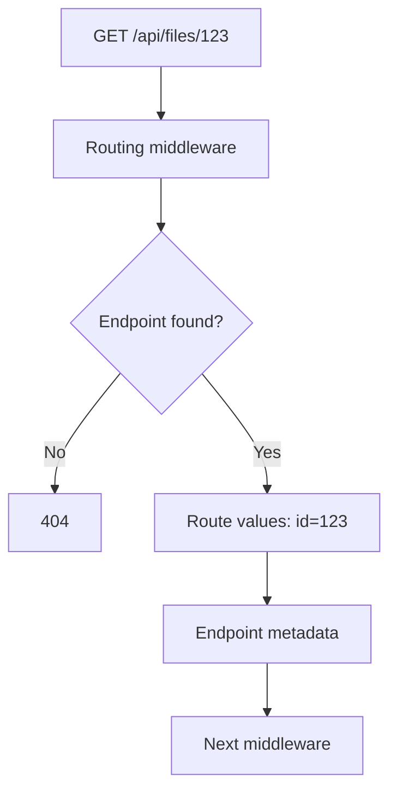

# Модуль II. ASP.NET Core Request Pipeline: от Kestrel до Endpoint

# Глава 4. Routing и выбор Endpoint

──────────────────────────────────────────────

**МОДУЛЬ II • ASP.NET Core Request Pipeline**

**Прогресс до главы:** 38% (3 из 8 глав завершены)

**Маршрут:** Kestrel → HttpContext → Middleware → Routing → Authentication → Authorization → Endpoint → Full Pipeline
**Текущая глава:** Routing

**Текущий вопрос:**  
Как ASP.NET Core определяет обработчик для method и path?

──────────────────────────────────────────────

> **Не запоминай технологии. Понимай, какие проблемы они решают.**

---

## Исходная ситуация

Запрос уже находится внутри [Middleware Pipeline](./03_Middleware_Pipeline.md).

Например:

```text
GET /api/files/123
```

Теперь ASP.NET Core должен понять:

> Какой endpoint соответствует этому HTTP method и path?

---

## Зачем нужна эта глава

Routing объясняет причины многих `404` и конфликтов маршрутов.

Он также важен для authorization: ASP.NET Core должен знать выбранный endpoint, чтобы прочитать его metadata, например `[Authorize]` или `AllowAnonymous`.

---

## Эта глава понадобится позже

- [Authentication внутри Pipeline](./05_Authentication_In_Pipeline.md)
- [Authorization внутри Pipeline](./06_Authorization_In_Pipeline.md)
- [Выполнение Endpoint](./07_Endpoint_Execution.md)
- [Полный ASP.NET Core Request Pipeline](./08_Full_ASPNET_Core_Request_Pipeline.md)

---

## Короткое определение

**Routing (маршрутизация — выбор endpoint по HTTP method, path и route template)** определяет, какой обработчик может выполнить request.

**Endpoint (конечная точка — обработчик запроса вместе с metadata)** может быть controller action, Minimal API handler, health check или другой обработчик.

Routing выбирает endpoint, но не выполняет его.

---

## Простая аналогия

Routing похож на стойку регистрации в бизнес-центре.

Посетитель говорит:

```text
Мне нужен отдел files, документ 123
```

Регистрация смотрит правила и говорит:

```text
Вам в кабинет GET /api/files/{id}
```

Но сама регистрация не выполняет работу отдела.

---

## Техническое объяснение

Route template (шаблон маршрута — правило сопоставления path с параметрами) может выглядеть так:

```text
/api/files/{id}
```

Для Minimal API:

```csharp
app.MapGet("/api/files/{id}", (string id) =>
{
    return Results.Ok(new { Id = id });
});
```

Для attribute routing обзорно:

```csharp
[ApiController]
[Route("api/files")]
public sealed class FilesController : ControllerBase
{
    [HttpGet("{id}")]
    public IActionResult Get(string id) => Ok(new { Id = id });
}
```

В обоих случаях ASP.NET Core создаёт endpoint collection (набор endpoint-ов приложения).

---

## Endpoint selection

**Endpoint selection (выбор endpoint — процесс поиска подходящего обработчика среди зарегистрированных endpoint-ов)** учитывает:

- path;
- HTTP method;
- route constraints;
- порядок и специфичность маршрутов;
- metadata endpoint-а.

Если endpoint найден, его можно получить так:

```csharp
app.Use(async (context, next) =>
{
    await next(context);

    var endpoint = context.GetEndpoint();
    Console.WriteLine(endpoint?.DisplayName);
});
```

Обычно `GetEndpoint()` полезен после routing.

---

## Route values и metadata

Route values (значения маршрута — параметры, извлечённые из route template) появляются после выбора маршрута.

Для запроса:

```text
GET /api/files/123
```

и шаблона:

```text
/api/files/{id}
```

route value:

```text
id = 123
```

Endpoint metadata хранит дополнительные сведения:

- разрешённые HTTP methods;
- `[Authorize]`;
- `AllowAnonymous`;
- filters и другие настройки;
- OpenAPI metadata.

Authorization использует metadata выбранного endpoint, чтобы понять требования доступа.

---

## Почему может быть 404

`404 Not Found` на уровне routing обычно означает, что подходящий endpoint не найден.

Причины:

- неправильный path;
- неправильный HTTP method;
- route template не совпадает;
- внешний proxy не переписал prefix;
- endpoint не зарегистрирован;
- route constraint не пропустил значение.

Если endpoint найден, но пользователь не прошёл authentication или authorization, это уже обычно `401` или `403`, а не routing `404`.

---

## Неоднозначные маршруты

Если несколько endpoint-ов одинаково подходят под request, может возникнуть ambiguous match.

Пример плохой идеи:

```csharp
app.MapGet("/api/files/{value}", (string value) => Results.Ok());
app.MapGet("/api/files/{id}", (string id) => Results.Ok());
```

Такие маршруты трудно различить, потому что оба подходят под один path.

---

## Схема



---

## Типичные ошибки

Ошибка: считать routing выполнением handler.  
Почему неверно: routing выбирает endpoint, но endpoint выполняется позже.  
Как правильно: разделять endpoint selection и endpoint execution.

Ошибка: искать `401` в routing.  
Почему неверно: `401` связан с authentication, а routing обычно отвечает за поиск endpoint.  
Как правильно: диагностировать по слоям: route найден или нет, пользователь установлен или нет, доступ разрешён или нет.

Ошибка: не учитывать HTTP method.  
Почему неверно: `GET /api/files/123` и `POST /api/files/123` могут вести себя по-разному.  
Как правильно: проверять method и path вместе.

---

## Вопросы собеседования

### Junior: Что делает routing?

<details>
<summary>Ответ</summary>

Routing выбирает endpoint по HTTP method, path и route template. Он определяет, какой обработчик подходит для запроса.

</details>

---

### Middle: Чем route values отличаются от query string?

<details>
<summary>Ответ</summary>

Route values извлекаются из route template, например `{id}` в `/api/files/{id}`. Query string — это параметры после `?`, например `?page=2`.

</details>

---

### Senior: Почему authorization зависит от routing?

<details>
<summary>Ответ</summary>

Authorization часто использует endpoint metadata: `[Authorize]`, policies, `AllowAnonymous`. Чтобы прочитать metadata, routing должен сначала выбрать endpoint.

</details>

---

## Ответ для собеседования

Routing в ASP.NET Core выбирает endpoint по method, path и route template. Endpoint может быть controller action, Minimal API handler, health check или другой обработчик. Routing не выполняет endpoint, а только выбирает его и записывает route values и metadata в `HttpContext`. Это важно для authorization, потому что требования доступа часто лежат в metadata выбранного endpoint. Если подходящий endpoint не найден, обычно результатом будет `404`.

---

## Шпаргалка

- Routing выбирает endpoint.
- Endpoint execution происходит позже.
- Method и path проверяются вместе.
- Route template может содержать параметры.
- Route values появляются после matching.
- Endpoint metadata нужна authorization.
- `404` часто означает, что endpoint не найден.
- Ambiguous routes создают конфликт выбора.

---

## Прогресс модуля

**Модуль II:** `ASP.NET Core Request Pipeline`  
**Прогресс после главы:** 50% (4 из 8 глав завершены).
