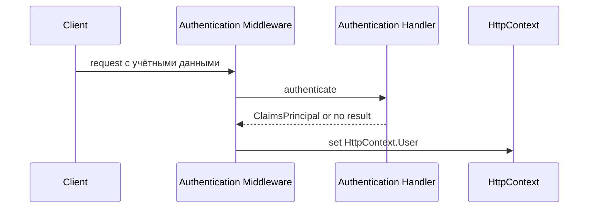

# Модуль II. ASP.NET Core Request Pipeline: от Kestrel до Endpoint

# Глава 5. Authentication внутри Pipeline

──────────────────────────────────────────────

**МОДУЛЬ II • ASP.NET Core Request Pipeline**

**Прогресс до главы:** 50% (4 из 8 глав завершены)

**Маршрут:** Kestrel → HttpContext → Middleware → Routing → Authentication → Authorization → Endpoint → Full Pipeline

**Текущая глава:** Authentication

**Текущий вопрос:**  
Как pipeline устанавливает, кто отправил запрос?

──────────────────────────────────────────────

> **Не запоминай технологии. Понимай, какие проблемы они решают.**

---

## Исходная ситуация

[Routing](./04_Routing_Endpoint_Selection.md) может выбрать endpoint.

Но перед проверкой доступа приложению нужно понять:

> Кто отправил request?

Этим занимается authentication.

---

## Зачем нужна эта глава

Authentication в pipeline объясняет:

- откуда появляется `HttpContext.User`;
- почему возможен `401 Unauthorized`;
- зачем нужен `UseAuthentication`;
- почему bearer token и cookie являются учётными данными;
- почему authentication не равна authorization.

Полное устройство JWT, refresh token, OAuth 2.0, OpenID Connect, ASP.NET Core Identity и AuthService будет в Модуле III.

---

## Эта глава понадобится позже

- [Authorization внутри Pipeline](./06_Authorization_In_Pipeline.md)
- [Выполнение выбранного Endpoint](./07_Endpoint_Execution.md)
- [Полный ASP.NET Core Request Pipeline](./08_Full_ASPNET_Core_Request_Pipeline.md)
- Аутентификация и авторизация в будущем Модуле III

---

## Короткое определение

**Authentication (аутентификация — процесс установления личности отправителя запроса)** пытается проверить учётные данные и при успешном результате заполняет `HttpContext.User`.

**Credentials (учётные данные — данные, по которым можно попытаться установить пользователя)** могут быть bearer token, cookie, API key или другие данные.

Authentication отвечает на вопрос:

```text
Кто отправил request?
```

---

## Простая аналогия

Authentication похожа на проверку паспорта.

Охрана смотрит документ и говорит:

```text
Это Иван.
```

Но сама проверка паспорта ещё не отвечает, можно ли Ивану войти в конкретную комнату. Это уже authorization.

---

## Техническое объяснение

В ASP.NET Core authentication обычно подключается так:

```csharp
builder.Services.AddAuthentication("Bearer")
    .AddJwtBearer("Bearer", options =>
    {
        options.Authority = "https://auth.example";
        options.Audience = "files-api";
    });

var app = builder.Build();

app.UseRouting();
app.UseAuthentication();
app.UseAuthorization();
```

Здесь:

- схема аутентификации определяет способ проверки;
- обработчик выполняет проверку учётных данных;
- `UseAuthentication()` пытается выполнить схему аутентификации по умолчанию;
- успешный результат записывается в `HttpContext.User`.

**Схема аутентификации (authentication scheme — именованный способ проверки учётных данных)** может быть `Bearer`, `Cookies` или другой вариант.

---

## ClaimsIdentity и ClaimsPrincipal

**ClaimsIdentity (данные о личности пользователя — установленная информация о пользователе с набором claims и признаком аутентификации)** описывает одну личность пользователя.

**ClaimsPrincipal (представление пользователя — объект, который может содержать одну или несколько личностей пользователя)** хранится в `HttpContext.User`.

Аутентифицированный пользователь — пользователь, личность которого приложение успешно установило.

Упрощённо:

```text
Bearer token / Cookie
  ↓
Обработчик аутентификации
  ↓
ClaimsPrincipal
  ↓
HttpContext.User
```

Обработчик аутентификации может вернуть:

- success — личность пользователя установлена;
- fail — учётные данные были, но проверка не прошла;
- no result — учётные данные для этой схемы не найдены.

Если учётные данные отсутствуют, это само по себе не всегда немедленно завершает request. Пользователь может остаться неаутентифицированным, а решение о защищённом endpoint обычно принимает authorization.

---

## Authenticate, challenge и 401

Authenticate (проверка учётных данных — попытка установить пользователя) выполняется обработчиком аутентификации.

Challenge (запрос к схеме аутентификации сформировать ответ клиенту — обычно просьба предоставить корректные учётные данные) отличается от authenticate:

- `Authenticate` пытается установить личность пользователя;
- `Challenge` просит клиента предоставить валидные учётные данные;
- конкретная схема определяет форму ответа.

Для типичного защищённого API endpoint последовательность выглядит так:

```text
Authentication пытается установить пользователя
  ↓
Authorization видит, что endpoint требует аутентифицированного пользователя
  ↓
Authorization инициирует Challenge
  ↓
Обработчик аутентификации формирует ответ, зависящий от выбранной схемы
```

`401 Unauthorized` обычно означает, что выбранный endpoint требует аутентифицированного пользователя, но приложение не смогло установить его личность. Поэтому система авторизации запускает challenge — сообщает используемой схеме аутентификации, что клиенту нужно предоставить корректные учётные данные.

Для JWT Bearer это обычно `401 Unauthorized`. Для Cookie-схемы поведение может отличаться и зависеть от типа приложения и версии инфраструктуры ASP.NET Core, например перенаправление на страницу входа в веб-приложении.

`403 Forbidden` означает, что личность пользователя установлена, но ему не хватает прав для выполнения этого endpoint.

Название `Unauthorized` исторически сбивает с толку: чаще оно означает именно отсутствие валидной authentication, а не отсутствие прав.

---

## Bearer token и cookie

Bearer token:

```http
Authorization: Bearer <access_token>
```

Cookie:

```http
Cookie: sessionId=abc
```

Оба варианта могут быть учётными данными.

В этой главе они нужны только как примеры данных, по которым pipeline устанавливает пользователя. Их полное устройство относится к Модулю III.

---

## Схема



---

## Типичные ошибки

Ошибка: путать authentication и authorization.  
Почему неверно: authentication устанавливает пользователя, authorization проверяет доступ.  
Как правильно: разделять вопросы `кто это` и `что ему разрешено`.

Ошибка: ждать от authentication проверки прав.  
Почему неверно: права проверяются на этапе authorization.  
Как правильно: authentication должна подготовить `HttpContext.User`.

Ошибка: раскрывать JWT полностью в pipeline-главе.  
Почему неверно: это отдельная инженерная история.  
Как правильно: здесь объяснить место bearer token в pipeline, а детали вынести в Модуль III.

---

## Вопросы собеседования

### Junior: Что делает authentication?

<details>
<summary>Ответ</summary>

Authentication пытается проверить учётные данные и при успешной проверке устанавливает пользователя в `HttpContext.User`.

</details>

---

### Middle: Что такое схема аутентификации?

<details>
<summary>Ответ</summary>

Схема аутентификации — это именованный способ аутентификации, например `Bearer` или `Cookies`. Для схемы настроен обработчик, который проверяет учётные данные.

</details>

---

### Senior: Почему `401` не равен `403`?

<details>
<summary>Ответ</summary>

`401` обычно означает, что защищённый endpoint требует аутентифицированного пользователя, но личность пользователя не установлена, поэтому authorization инициирует challenge. `403` означает, что личность пользователя установлена, но ему не хватает прав для выполнения endpoint.

</details>

---

## Ответ для собеседования

Authentication в ASP.NET Core pipeline пытается установить, кто отправил request. `UseAuthentication()` пытается выполнить схему аутентификации по умолчанию, например Bearer или Cookies, и при успехе записывает `ClaimsPrincipal` в `HttpContext.User`. Отсутствие учётных данных не всегда сразу завершает request. Если выбранный endpoint требует аутентифицированного пользователя, authorization инициирует challenge, а обработчик аутентификации формирует ответ конкретной схемы; для Bearer API это обычно `401`. Важно не смешивать это с authorization: authentication отвечает за установление пользователя, а authorization проверяет доступ. JWT, refresh token, OAuth/OIDC и AuthService — отдельная тема Модуля III.

---

## Шпаргалка

- Authentication устанавливает пользователя.
- Учётные данные могут быть token или cookie.
- Схема определяет способ проверки.
- Обработчик проверяет учётные данные.
- Обработчик может вернуть success, fail или no result.
- Результат попадает в `HttpContext.User`.
- `ClaimsPrincipal` представляет пользователя.
- `Authenticate` пытается установить личность пользователя.
- `Challenge` просит клиента пройти аутентификацию.
- `401` для Bearer API обычно появляется после authorization challenge.
- Authorization проверяет доступ позже.
- Полная auth-система разбирается в Модуле III.

---

## Прогресс модуля

**Модуль II:** `ASP.NET Core Request Pipeline`  
**Прогресс после главы:** 63% (5 из 8 глав завершены).
