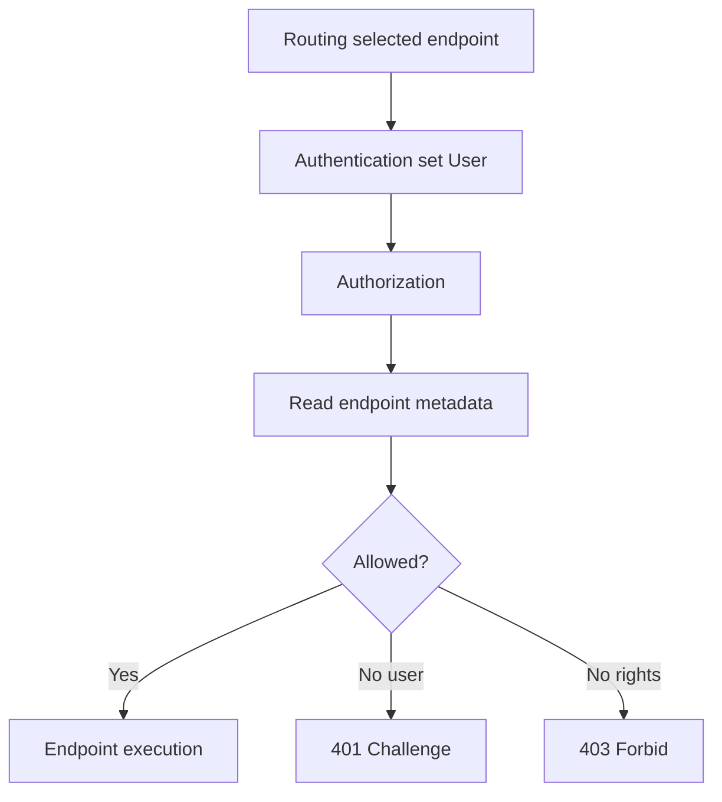

# Модуль II. ASP.NET Core Request Pipeline: от Kestrel до Endpoint

# Глава 6. Authorization внутри Pipeline

──────────────────────────────────────────────

**МОДУЛЬ II • ASP.NET Core Request Pipeline**

**Прогресс до главы:** 63% (5 из 8 глав завершены)

**Маршрут:** Kestrel → HttpContext → Middleware → Routing → Authentication → Authorization → Endpoint → Full Pipeline
**Текущая глава:** Authorization

**Текущий вопрос:**  
Как приложение решает, разрешено ли пользователю выполнить выбранный endpoint?

──────────────────────────────────────────────

> **Не запоминай технологии. Понимай, какие проблемы они решают.**

---

## Исходная ситуация

[Authentication](./05_Authentication_In_Pipeline.md) попыталась установить пользователя.

Теперь pipeline должен решить:

> Может ли этот пользователь выполнить выбранный endpoint?

Это задача authorization.

---

## Зачем нужна эта глава

Authorization объясняет:

- почему authenticated user может получить `403`;
- зачем нужен `UseAuthorization`;
- как endpoint metadata влияет на доступ;
- почему routing важен до authorization;
- что делают `[Authorize]`, `AllowAnonymous` и policies.

---

## Эта глава понадобится позже

- [Выполнение Endpoint](./07_Endpoint_Execution.md)
- [Полный ASP.NET Core Request Pipeline](./08_Full_ASPNET_Core_Request_Pipeline.md)
- Аутентификация и авторизация в будущем Модуле III

---

## Короткое определение

**Authorization (авторизация — проверка, разрешено ли пользователю выполнить действие или получить ресурс)** работает после выбора endpoint и обычно после authentication.

Она отвечает на вопрос:

```text
Что этому пользователю разрешено?
```

Если пользователь не установлен, результатом может быть challenge (`401`). Если пользователь установлен, но прав недостаточно, результатом может быть forbid (`403`).

---

## Простая аналогия

Authentication проверяет паспорт.

Authorization проверяет пропуск в конкретную комнату.

Паспорт может быть настоящим, но доступа в серверную всё равно может не быть.

---

## Техническое объяснение

Типичный порядок:

```csharp
app.UseRouting();
app.UseAuthentication();
app.UseAuthorization();

app.MapGet("/api/files/{id}", (string id) => Results.Ok())
    .RequireAuthorization();
```

`UseAuthorization` читает:

- `HttpContext.User`;
- endpoint metadata;
- policies;
- roles, claims или другие требования.

Важно: routing должен выбрать endpoint до endpoint-aware authorization, иначе middleware не узнает, какие требования применяются к конкретному endpoint.

---

## Metadata доступа

Для controller:

```csharp
[Authorize]
[HttpGet("api/files/{id}")]
public IActionResult Get(string id)
{
    return Ok();
}
```

Для Minimal API:

```csharp
app.MapGet("/api/files/{id}", (string id) => Results.Ok())
    .RequireAuthorization();
```

Анонимный доступ:

```csharp
app.MapGet("/public", () => Results.Ok())
    .AllowAnonymous();
```

`AllowAnonymous` показывает, что endpoint может быть выполнен без authenticated user.

---

## Policy, requirement и handler

**Policy (политика доступа — именованный набор требований authorization)** описывает правило доступа.

**Requirement (требование — отдельное условие внутри policy)** описывает, что нужно проверить.

**Authorization handler (обработчик авторизации — компонент, который проверяет requirement)** принимает решение на основе user, resource или других данных.

Пример обзорно:

```csharp
builder.Services.AddAuthorization(options =>
{
    options.AddPolicy("CanReadFiles", policy =>
    {
        policy.RequireClaim("permission", "files.read");
    });
});

app.MapGet("/api/files/{id}", (string id) => Results.Ok())
    .RequireAuthorization("CanReadFiles");
```

Полная permission model и resource-based authorization будут в Модуле III.

---

## Roles, claims и permissions

В доступе часто встречаются разные способы описать право:

| Способ | Пример | Смысл |
|---|---|---|
| Role | `Admin` | крупная роль пользователя |
| Claim | `department:42` | утверждение о пользователе |
| Permission | `files.read` | конкретное разрешение |

На уровне этой главы важно понять место этих данных в pipeline: authorization читает их из пользователя и правил endpoint.

---

## Challenge, forbid, 401 и 403

Challenge:

```text
пользователь не установлен или credentials невалидны
```

обычно:

```text
401 Unauthorized
```

Forbid:

```text
пользователь установлен, но доступ запрещён
```

обычно:

```text
403 Forbidden
```

---

## Схема



---

## Типичные ошибки

Ошибка: поставить `UseAuthorization` до routing.  
Почему неверно: authorization может не увидеть endpoint metadata.  
Как правильно: сначала выбрать endpoint, затем проверять требования доступа.

Ошибка: считать authenticated пользователя автоматически authorized.  
Почему неверно: пользователь может быть известен, но не иметь нужных прав.  
Как правильно: проверять policy, roles, claims или permissions.

Ошибка: путать `401` и `403`.  
Почему неверно: это разные причины отказа.  
Как правильно: `401` — нет валидной authentication, `403` — доступ запрещён установленному пользователю.

---

## Вопросы собеседования

### Junior: Чем authorization отличается от authentication?

<details>
<summary>Ответ</summary>

Authentication устанавливает пользователя. Authorization проверяет, разрешено ли этому пользователю выполнить действие или получить ресурс.

</details>

---

### Middle: Зачем authorization нужен выбранный endpoint?

<details>
<summary>Ответ</summary>

Потому что требования доступа часто находятся в endpoint metadata: `[Authorize]`, policy, `AllowAnonymous`, `RequireAuthorization`. Сначала routing выбирает endpoint, потом authorization читает его metadata.

</details>

---

### Senior: Когда будет `403`?

<details>
<summary>Ответ</summary>

`403 Forbidden` обычно возвращается, когда пользователь аутентифицирован, но не проходит требования authorization: не хватает role, claim, permission или другого requirement.

</details>

---

## Ответ для собеседования

Authorization в ASP.NET Core pipeline проверяет, разрешено ли пользователю выполнить выбранный endpoint. Обычно routing сначала выбирает endpoint, authentication устанавливает `HttpContext.User`, а `UseAuthorization` читает user и endpoint metadata: `[Authorize]`, policies, `AllowAnonymous` или `RequireAuthorization`. Если пользователь не установлен, результатом может быть `401`; если пользователь установлен, но прав недостаточно, обычно возвращается `403`. Полные модели permissions и resource-based authorization относятся к Модулю III.

---

## Шпаргалка

- Authentication устанавливает пользователя.
- Authorization проверяет доступ.
- Authorization читает endpoint metadata.
- `[Authorize]` требует проверки доступа.
- `AllowAnonymous` разрешает anonymous endpoint.
- Policy — набор требований.
- Requirement — условие доступа.
- `401` — нет валидной authentication.
- `403` — пользователь есть, но прав недостаточно.
- Полная модель доступа будет в Модуле III.

---

## Прогресс модуля

**Модуль II:** `ASP.NET Core Request Pipeline`  
**Прогресс после главы:** 75% (6 из 8 глав завершены).
