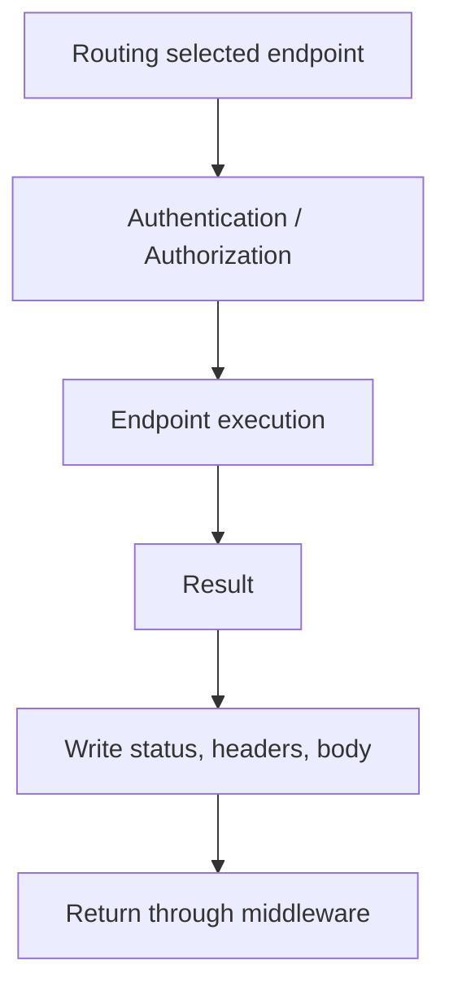

# Модуль II. ASP.NET Core Request Pipeline: от Kestrel до Endpoint

# Глава 7. Выполнение Endpoint

──────────────────────────────────────────────

**МОДУЛЬ II • ASP.NET Core Request Pipeline**

**Прогресс до главы:** 75% (6 из 8 глав завершены)

**Маршрут:** Kestrel → HttpContext → Middleware → Routing → Authentication → Authorization → Endpoint → Full Pipeline
**Текущая глава:** Endpoint

**Текущий вопрос:**  
Что происходит после выбора endpoint и успешной проверки доступа?

──────────────────────────────────────────────

> **Не запоминай технологии. Понимай, какие проблемы они решают.**

---

## Исходная ситуация

Pipeline уже прошёл важные этапы:

```text
Routing выбрал endpoint
Authentication установила пользователя
Authorization разрешила доступ
```

Теперь ASP.NET Core может выполнить выбранный endpoint.

---

## Зачем нужна эта глава

Многие объяснения ASP.NET Core сводятся к controller action.

Это неполная модель.

Endpoint может быть:

- controller action;
- Minimal API handler;
- health check;
- static file handler;
- custom endpoint.

Важно понимать: controller — частый, но не обязательный элемент ASP.NET Core.

---

## Эта глава понадобится позже

- [Полный ASP.NET Core Request Pipeline](./08_Full_ASPNET_Core_Request_Pipeline.md)
- [Authentication внутри Pipeline](./05_Authentication_In_Pipeline.md)
- [Authorization внутри Pipeline](./06_Authorization_In_Pipeline.md)
- Аутентификация и авторизация в будущем Модуле III

---

## Короткое определение

**Endpoint execution (выполнение endpoint — этап, на котором ASP.NET Core вызывает выбранный обработчик запроса)** происходит после выбора endpoint и успешных проверок доступа, если они требуются.

Endpoint delegate (делегат endpoint — функция, которая выполняет обработку выбранного endpoint) получает управление и формирует результат.

---

## Простая аналогия

Routing похож на выбор нужного кабинета.

Authentication проверяет, кто пришёл.

Authorization проверяет, можно ли войти.

Endpoint execution — это уже разговор с нужным специалистом, который выполняет работу и выдаёт результат.

---

## Техническое объяснение

Minimal API endpoint:

```csharp
app.MapGet("/api/files/{id}", (string id) =>
{
    return Results.Ok(new { Id = id });
});
```

Controller action:

```csharp
[ApiController]
[Route("api/files")]
public sealed class FilesController : ControllerBase
{
    [HttpGet("{id}")]
    public IActionResult Get(string id)
    {
        return Ok(new { Id = id });
    }
}
```

Оба варианта могут быть endpoint-ами, но механизм выполнения внутри отличается.

На уровне этой главы важно:

```text
endpoint выбран
  ↓
доступ разрешён
  ↓
handler/action выполняется
  ↓
формируется response
```

---

## DI и прикладная логика

Endpoint может получать зависимости из Dependency Injection (внедрение зависимостей — механизм передачи нужных сервисов объекту или handler-у).

Пример:

```csharp
app.MapGet("/api/files/{id}", async (
    string id,
    IFileMetadataReader reader,
    CancellationToken cancellationToken) =>
{
    var file = await reader.GetAsync(id, cancellationToken);
    return file is null ? Results.NotFound() : Results.Ok(file);
});
```

После входа в endpoint начинается прикладная логика.

Но детали MediatR, repositories, database access, validation и serialization в полной глубине относятся к следующим темам книги.

---

## Response

Endpoint формирует result.

Результат влияет на:

- status code;
- headers;
- body;
- content type.

Примеры:

```csharp
return Results.Ok(file);
return Results.NotFound();
return Results.Problem();
```

После endpoint response возвращается наружу через те middleware, которые вызвали `next`.

---

## Routing и endpoint execution

Routing и endpoint execution — разные этапы.

Routing:

```text
нашёл подходящий endpoint
```

Endpoint execution:

```text
выполнил выбранный endpoint
```

Между ними могут находиться authentication, authorization и другие middleware.

---

## Filters и middleware

Filters (фильтры — компоненты, которые выполняются внутри MVC или endpoint execution pipeline и позволяют вмешиваться около action/handler) не являются тем же самым, что middleware.

Короткое различие:

| Middleware | Filters |
|---|---|
| работают на уровне всего ASP.NET Core pipeline | работают ближе к выполнению controller action или endpoint |
| получают `HttpContext` и могут не дойти до routing/endpoint | часто имеют доступ к action context, model state или result |
| регистрируются в pipeline через `Use`, `Run`, `Map` | обычно связаны с MVC, action execution или endpoint filters |

В этой книге filters будут разобраны отдельно в ASP.NET Core темах. Здесь важно только не путать их с middleware.

---

## Схема



---

## Типичные ошибки

Ошибка: считать controller обязательным элементом ASP.NET Core.  
Почему неверно: endpoint может быть Minimal API handler, health check или другой обработчик.  
Как правильно: говорить endpoint, а controller action приводить как один из вариантов.

Ошибка: смешивать routing и execution.  
Почему неверно: routing выбирает endpoint, но не выполняет его.  
Как правильно: разделять endpoint selection и endpoint execution.

Ошибка: думать, что endpoint выполнится для любого request.  
Почему неверно: middleware может завершить request раньше, routing может не найти endpoint, authorization может запретить доступ.  
Как правильно: endpoint выполняется только если request дошёл до этого этапа.

---

## Вопросы собеседования

### Junior: Что такое endpoint?

<details>
<summary>Ответ</summary>

Endpoint — это конечный обработчик запроса. Им может быть controller action, Minimal API handler, health check или другой обработчик.

</details>

---

### Middle: Чем routing отличается от endpoint execution?

<details>
<summary>Ответ</summary>

Routing выбирает endpoint по method и path. Endpoint execution выполняет выбранный обработчик и формирует response.

</details>

---

### Middle: Чем filters отличаются от middleware?

<details>
<summary>Ответ</summary>

Middleware работает на уровне всего ASP.NET Core pipeline и получает `HttpContext`. Filter работает ближе к выполнению action или endpoint и часто имеет доступ к контексту MVC, action arguments, model state или result. Middleware может остановить request ещё до routing или endpoint, а filters обычно применяются уже внутри выбранного механизма выполнения endpoint.

</details>

---

### Senior: Почему controller не является обязательным этапом pipeline?

<details>
<summary>Ответ</summary>

ASP.NET Core работает через endpoint-ы. Controller action — один способ реализовать endpoint. Minimal API handler, health check или custom endpoint тоже могут быть endpoint-ами, поэтому корректнее объяснять pipeline через endpoint execution.

</details>

---

## Ответ для собеседования

Endpoint execution — это этап, где ASP.NET Core выполняет выбранный обработчик запроса. Routing до этого только выбирает endpoint, а execution уже вызывает controller action, Minimal API handler, health check или другой endpoint delegate. Endpoint может получить зависимости из DI, выполнить прикладную логику и сформировать result: status code, headers и body. Важно не считать controller обязательным элементом pipeline: это только один из вариантов endpoint.

---

## Шпаргалка

- Endpoint — выбранный обработчик запроса.
- Controller action — только один вариант endpoint.
- Minimal API handler тоже endpoint.
- Routing выбирает endpoint.
- Endpoint execution выполняет endpoint.
- Endpoint может вернуть `200`, `404`, `500` и другие responses.
- DI доступен на этапе endpoint execution.
- Filters ближе к action/endpoint, middleware шире и раньше.
- Endpoint может не выполниться из-за short-circuit, `404`, `401` или `403`.

---

## Прогресс модуля

**Модуль II:** `ASP.NET Core Request Pipeline`  
**Прогресс после главы:** 88% (7 из 8 глав завершены).
