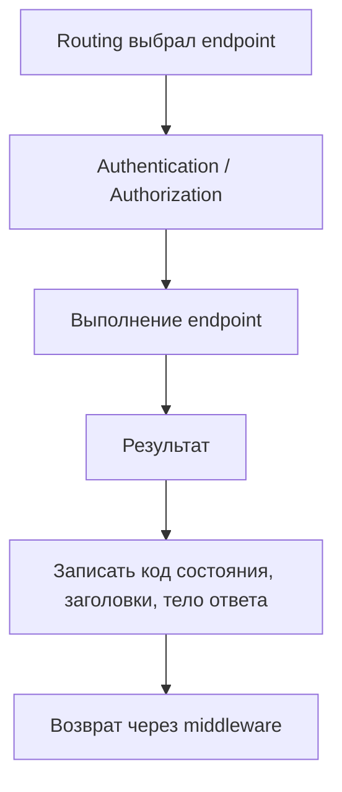

# Модуль II. ASP.NET Core Request Pipeline: от Kestrel до Endpoint

# Глава 7. Выполнение выбранного Endpoint

──────────────────────────────────────────────

**МОДУЛЬ II • ASP.NET Core Request Pipeline**

**Прогресс до главы:** 75% (6 из 8 глав завершены)

**Маршрут:** Kestrel → HttpContext → Middleware → Routing → Authentication → Authorization → Endpoint → Full Pipeline

**Текущая глава:** Endpoint

**Текущий вопрос:**  
Что происходит после выбора endpoint и успешной проверки доступа?

──────────────────────────────────────────────

> **Не запоминай технологии. Понимай, какие проблемы они решают.**

---

## Исходная ситуация

Pipeline уже прошёл важные этапы:

```text
Routing выбрал endpoint
Для этого примера Authentication успешно установила пользователя
Authorization разрешила доступ
```

Теперь ASP.NET Core может выполнить выбранный endpoint.

---

## Зачем нужна эта глава

Многие объяснения ASP.NET Core сводятся к controller action.

Это неполная модель.

Endpoint может быть:

- controller action;
- обработчик Minimal API;
- health check;
- пользовательский endpoint.

Важно понимать: controller — частый, но не обязательный элемент ASP.NET Core.

Статические файлы могут обслуживаться middleware. В современных сценариях статические ресурсы также могут обрабатываться через endpoint. В любом случае controller не является обязательным элементом pipeline.

Health check — специальный endpoint проверки состояния приложения. Он обычно быстро сообщает системе мониторинга, балансировщику или оркестратору, запущено ли приложение и готово ли оно принимать запросы. Обычно внутри него не выполняется полноценная бизнес-логика.

---

## Эта глава понадобится позже

- [Полный ASP.NET Core Request Pipeline](./08_Full_ASPNET_Core_Request_Pipeline.md)
- [Authentication внутри Pipeline](./05_Authentication_In_Pipeline.md)
- [Authorization внутри Pipeline](./06_Authorization_In_Pipeline.md)
- Аутентификация и авторизация в будущем Модуле III

---

## Короткое определение

**Выполнение выбранного endpoint (endpoint execution — этап, на котором ASP.NET Core вызывает выбранный обработчик запроса)** происходит после выбора endpoint и успешных проверок доступа, если они требуются.

**Делегат endpoint (Endpoint delegate) — функция, которая выполняет обработку выбранного endpoint.**

---

## Простая аналогия

Routing похож на выбор нужного кабинета.

Authentication проверяет, кто пришёл.

Authorization проверяет, можно ли войти.

Выполнение endpoint — это уже разговор с нужным специалистом, который выполняет работу и выдаёт результат.

---

## Техническое объяснение

Связка этапов:

```text
UseRouting
  → выбирает endpoint

Endpoint Middleware / UseEndpoints
  → выполняет RequestDelegate выбранного endpoint
```

В современном `WebApplication` middleware, выполняющий выбранный endpoint, часто добавляется инфраструктурой ASP.NET Core автоматически. `MapGet`, `MapControllers`, `MapHealthChecks` и похожие методы регистрируют endpoints. Отсутствие явного `UseEndpoints()` в `Program.cs` не означает отсутствие этапа выполнения выбранного endpoint.

Minimal API endpoint:

```csharp
app.MapGet("/api/files/{id}", (string id) =>
{
    return Results.Ok(new { Id = id });
});
```

Controller action:

```csharp
[ApiController]
[Route("api/files")]
public sealed class FilesController : ControllerBase
{
    [HttpGet("{id}")]
    public IActionResult Get(string id)
    {
        return Ok(new { Id = id });
    }
}
```

Оба варианта могут быть endpoint-ами, но механизм выполнения внутри отличается.

На уровне этой главы важно:

```text
endpoint выбран
  ↓
доступ разрешён
  ↓
обработчик или метод controller action выполняется
  ↓
формируется HTTP-ответ
```

---

## DI и прикладная логика

Endpoint может получать зависимости из Dependency Injection (внедрение зависимостей — механизм передачи нужных сервисов объекту или обработчику).

Пример:

```csharp
app.MapGet("/api/files/{id}", async (
    string id,
    IFileMetadataReader reader,
    CancellationToken cancellationToken) =>
{
    var file = await reader.GetAsync(id, cancellationToken);
    return file is null ? Results.NotFound() : Results.Ok(file);
});
```

После входа в endpoint начинается прикладная логика.

Но детали MediatR, репозиториев, доступа к базе данных, валидации и сериализации в полной глубине относятся к следующим темам книги.

---

## HTTP-ответ

Endpoint формирует результат.

Обработчик или метод controller action может вернуть результат. Затем инфраструктура ASP.NET Core или сам результат записывает:

- код состояния;
- заголовки;
- тело ответа;
- тип содержимого.

Примеры:

```csharp
return Results.Ok(file);
return Results.NotFound();
return Results.Problem();
```

После endpoint HTTP-ответ возвращается наружу через те middleware, которые вызвали `next`.

---

## Routing и выполнение endpoint

Routing и выполнение endpoint — разные этапы.

Routing:

```text
нашёл подходящий endpoint
```

Выполнение endpoint:

```text
выполнил выбранный endpoint
```

Между ними могут находиться authentication, authorization и другие middleware.

---

## Фильтры и middleware

Фильтры (Filters — компоненты, которые выполняются внутри MVC или pipeline выполнения endpoint и позволяют вмешиваться около controller action или обработчика) не являются тем же самым, что middleware.

Важно различать два вида:

- MVC-фильтры выполняются внутри механизма MVC — до или после вызова метода controller action.
- Фильтры endpoint в Minimal API выполняются вокруг обработчика Minimal API: могут обработать данные до вызова обработчика и результат после его выполнения.

Оба вида находятся ближе к выполнению endpoint, чем глобальный middleware pipeline.

Короткое различие:

| Middleware | Фильтры |
|---|---|
| работают на уровне всего ASP.NET Core pipeline | работают ближе к выполнению controller action или endpoint |
| получают `HttpContext` и могут не дойти до routing/endpoint | имеют доступ к контексту конкретного механизма выполнения endpoint |
| регистрируются в pipeline через `Use`, `Run`, `Map` | обычно связаны с MVC, выполнением controller action или endpoint filters |

В этой книге filters будут разобраны отдельно в ASP.NET Core темах. Здесь важно только не путать их с middleware.

---

## Схема



---

## Типичные ошибки

Ошибка: считать controller обязательным элементом ASP.NET Core.  
Почему неверно: endpoint может быть обработчиком Minimal API, health check или другим обработчиком.
Как правильно: говорить endpoint, а controller action приводить как один из вариантов.

Ошибка: смешивать routing и выполнение.
Почему неверно: routing выбирает endpoint, но не выполняет его.  
Как правильно: разделять выбор endpoint и выполнение endpoint.

Ошибка: думать, что endpoint выполнится для любого request.  
Почему неверно: middleware может завершить request раньше, routing может не найти endpoint, authorization может запретить доступ.  
Как правильно: endpoint выполняется только если request дошёл до этого этапа.

---

## Вопросы собеседования

### Junior: Что такое endpoint?

<details>
<summary>Ответ</summary>

Endpoint — это конечный обработчик запроса. Им может быть controller action, обработчик Minimal API, health check или другой обработчик.

</details>

---

### Middle: Чем routing отличается от выполнения endpoint?

<details>
<summary>Ответ</summary>

Routing выбирает endpoint по HTTP-методу и path. Выполнение endpoint запускает выбранный обработчик и формирует HTTP-ответ.

</details>

---

### Middle: Чем filters отличаются от middleware?

<details>
<summary>Ответ</summary>

Middleware работает на уровне всего ASP.NET Core pipeline и получает `HttpContext`. Фильтр работает ближе к выполнению action или обработчика: MVC-фильтры находятся внутри внутренней цепочки выполнения controller action, а фильтры endpoint в Minimal API — вокруг обработчика Minimal API. Middleware может остановить request ещё до routing или endpoint, а фильтры обычно применяются уже внутри выбранного механизма выполнения endpoint.

</details>

---

### Senior: Почему controller не является обязательным этапом pipeline?

<details>
<summary>Ответ</summary>

ASP.NET Core работает через endpoint-ы. Controller action — один способ реализовать endpoint. Обработчик Minimal API, health check или пользовательский endpoint тоже могут быть endpoint-ами, поэтому корректнее объяснять pipeline через выполнение endpoint.

</details>

---

## Ответ для собеседования

Выполнение endpoint — это этап, где ASP.NET Core выполняет выбранный обработчик запроса. Routing до этого только выбирает endpoint, а Endpoint Middleware / `UseEndpoints` выполняет `RequestDelegate` выбранного endpoint. В современном `WebApplication` этот этап часто добавляется инфраструктурой ASP.NET Core автоматически. Endpoint может быть controller action, обработчик Minimal API, health check или другой endpoint delegate. Обработчик или метод controller action может получить зависимости из DI, выполнить прикладную логику и вернуть результат, после чего инфраструктура ASP.NET Core или сам результат записывает код состояния, заголовки и тело ответа. Важно не считать controller обязательным элементом pipeline: это только один из вариантов endpoint.

---

## Шпаргалка

- Endpoint — выбранный обработчик запроса.
- Controller action — только один вариант endpoint.
- Обработчик Minimal API тоже endpoint.
- Routing выбирает endpoint.
- Endpoint Middleware / `UseEndpoints` выполняет выбранный endpoint.
- `MapGet`, `MapControllers`, `MapHealthChecks` регистрируют endpoints.
- Endpoint может вернуть `200`, `404`, `500` и другие HTTP-ответы.
- DI доступен на этапе выполнения endpoint.
- MVC-фильтры и фильтры endpoint в Minimal API отличаются.
- Фильтры ближе к выполнению endpoint, middleware шире и раньше.
- Endpoint может не выполниться из-за short-circuit, `404`, `401` или `403`.

---

## Прогресс модуля

**Модуль II:** `ASP.NET Core Request Pipeline`  
**Прогресс после главы:** 88% (7 из 8 глав завершены).
