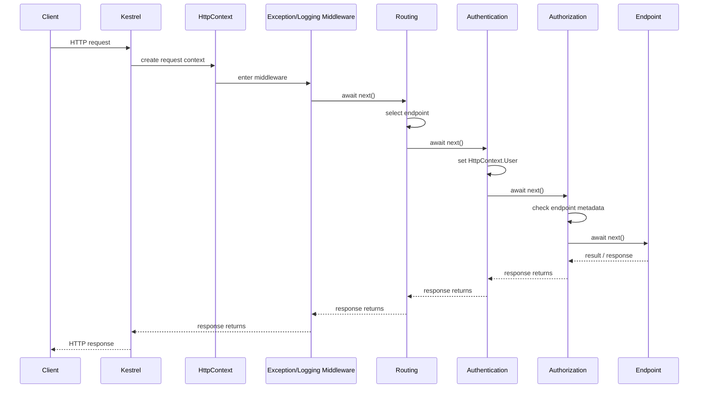

# Модуль II. ASP.NET Core Request Pipeline: от Kestrel до Endpoint

# Глава 8. Полный ASP.NET Core Request Pipeline

──────────────────────────────────────────────

**МОДУЛЬ II • ASP.NET Core Request Pipeline**

**Прогресс до главы:** 88% (7 из 8 глав завершены)

**Маршрут:** Kestrel → HttpContext → Middleware → Routing → Authentication → Authorization → Endpoint → Full Pipeline
**Текущая глава:** Full Pipeline

**Текущий вопрос:**  
Как все этапы складываются в одну реальную обработку запроса?

──────────────────────────────────────────────

> **Не запоминай технологии. Понимай, какие проблемы они решают.**

---

## Зачем нужна эта глава

Мы разобрали части ASP.NET Core request pipeline по отдельности:

- [Kestrel](./01_Kestrel_ASPNET_Core_Boundary.md);
- [HttpContext](./02_HttpContext.md);
- [Middleware](./03_Middleware_Pipeline.md);
- [Routing](./04_Routing_Endpoint_Selection.md);
- [Authentication](./05_Authentication_In_Pipeline.md);
- [Authorization](./06_Authorization_In_Pipeline.md);
- [Endpoint](./07_Endpoint_Execution.md).

Теперь нужно собрать их в одну рабочую модель.

Важно: маршрут модуля — учебная модель, а не обещание, что любой request всегда проходит каждый этап.

---

## Короткое определение

**ASP.NET Core Request Pipeline (конвейер обработки запроса — последовательность компонентов, через которые проходит `HttpContext`)** описывает путь request внутри .NET-приложения.

Pipeline может ветвиться, завершаться досрочно и выполнять разные endpoint types.

---

## Полная схема



---

## Последовательный пример

Запрос:

```text
GET /api/files/123
Authorization: Bearer <token>
```

Учебная цепочка:

```text
Kestrel
  ↓
HttpContext
  ↓
Logging middleware
  ↓
Routing
  ↓
Authentication
  ↓
Authorization
  ↓
GET /api/files/{id}
  ↓
Endpoint handler
  ↓
200 OK / 401 / 403 / 404 / 500
```

---

## Пример Program.cs

```csharp
var builder = WebApplication.CreateBuilder(args);

builder.Services.AddAuthentication("Bearer")
    .AddJwtBearer("Bearer");

builder.Services.AddAuthorization();

var app = builder.Build();

app.UseExceptionHandler("/error");

app.Use(async (context, next) =>
{
    var startedAt = Stopwatch.GetTimestamp();

    await next(context);

    var elapsed = Stopwatch.GetElapsedTime(startedAt);
    Console.WriteLine($"{context.Request.Path} -> {context.Response.StatusCode} in {elapsed.TotalMilliseconds} ms");
});

app.UseRouting();
app.UseAuthentication();
app.UseAuthorization();

app.MapGet("/api/files/{id}", (string id) =>
{
    return Results.Ok(new { Id = id });
}).RequireAuthorization();

app.MapGet("/health", () => Results.Ok("Healthy"))
    .AllowAnonymous();

app.Run();
```

Пример показывает порядок, но не означает, что каждый request обязан пройти одинаковый путь. Например, `/health` может быть anonymous endpoint, а exception middleware может обработать ошибку раньше ответа клиенту.

---

## Обратное движение response

Request идёт внутрь через middleware.

Response возвращается наружу через те middleware, которые вызвали `next`.

Если middleware завершил request досрочно и не вызвал `next`, компоненты глубже не выполняются.

Пример:

```text
Middleware A calls next
  Middleware B returns 401 without next
Middleware A receives response back
```

Endpoint в этом сценарии не выполняется.

---

## Short-circuit scenarios

Request может завершиться до endpoint:

| Сценарий | Пример результата |
|---|---|
| Static files нашли файл | `200 OK` без controller |
| Health check endpoint anonymous | `200 OK` без auth |
| Custom middleware вернул ошибку | `400 Bad Request` |
| Routing не нашёл endpoint | `404 Not Found` |
| Authentication failed | `401 Unauthorized` |
| Authorization failed | `403 Forbidden` |
| Exception handler обработал ошибку | `500` или ProblemDetails |

---

## Диагностика по слоям

| Симптом | Где смотреть сначала | Возможная причина |
|---|---|---|
| `404` | Routing | method/path не совпал, endpoint не зарегистрирован |
| `401` | Authentication | нет credentials, token/cookie невалидны |
| `403` | Authorization | user есть, но не проходит policy/role/claim |
| `500` | Middleware / Endpoint | exception в middleware, handler или прикладной логике |
| request не дошёл до приложения | Entry layer / Kestrel | неверный port, proxy, hosting, connection issue |

Инфраструктурная ошибка до Kestrel отличается от pipeline/application ошибки: если request не дошёл до ASP.NET Core, middleware и endpoint не выполнялись.

---

## Важные оговорки

Не каждый request проходит:

```text
Authentication → Authorization → Controller
```

Причины:

- middleware может завершить request досрочно;
- pipeline может ветвиться через `Map`;
- endpoint может разрешать anonymous access;
- static files и health checks могут иметь другой путь;
- controller action не является обязательным endpoint type;
- response возвращается только через middleware, которые вызвали `next`.

---

## Что происходит дальше

Теперь понятно, где authentication и authorization находятся внутри ASP.NET Core request pipeline.

Но это ещё не полная authentication-система.

Следующий модуль разбирает отдельную инженерную историю:

```text
Identity
Credentials
JWT
Access Token
Refresh Token
Claims / Roles / Permissions / Policies
OAuth 2.0
OpenID Connect
ASP.NET Core Identity
AuthService
```

То есть Модуль III посвящён аутентификации и авторизации как полноценной системе.

---

## Вопросы собеседования

### Junior: Что такое ASP.NET Core request pipeline?

<details>
<summary>Ответ</summary>

Это последовательность компонентов, через которые проходит `HttpContext`: middleware, routing, authentication, authorization и endpoint execution. Pipeline может завершить request раньше endpoint.

</details>

---

### Middle: Почему порядок middleware важен?

<details>
<summary>Ответ</summary>

Потому что каждый middleware видит context в текущем состоянии. Например, authorization должен видеть выбранный endpoint и установленного пользователя, поэтому routing и authentication обычно идут раньше.

</details>

---

### Middle: Чем filters отличаются от middleware?

<details>
<summary>Ответ</summary>

Middleware работает на уровне всего ASP.NET Core pipeline и может обработать request ещё до routing или endpoint. Filters выполняются ближе к MVC/action или endpoint execution и применяются к выбранному механизму обработки. Поэтому filters не заменяют middleware, а решают другую задачу внутри более позднего этапа.

</details>

---

### Senior: Почему endpoint может не выполниться?

<details>
<summary>Ответ</summary>

Endpoint может не выполниться, если middleware завершил request досрочно, routing не нашёл endpoint, authentication вернула `401`, authorization вернула `403` или произошла ошибка раньше endpoint execution.

</details>

---

### Architect / System Design: Как диагностировать проблему в request pipeline?

<details>
<summary>Ответ</summary>

Нужно идти по слоям: сначала понять, дошёл ли request до ASP.NET Core, затем проверить middleware, routing, authentication, authorization и endpoint execution. `404` чаще связан с routing, `401` — с authentication, `403` — с authorization, `500` — с exception в middleware или прикладной логике. Такой подход отделяет infrastructure issues от application pipeline issues.

</details>

---

## Ответ для собеседования

ASP.NET Core request pipeline — это цепочка обработки `HttpContext` после того, как request попал в приложение через Kestrel. Обычно request проходит через middleware, routing выбирает endpoint, authentication устанавливает `HttpContext.User`, authorization проверяет доступ по endpoint metadata, а затем выполняется endpoint: controller action, Minimal API handler, health check или другой обработчик. Важно помнить, что это не жёсткая обязательная цепочка для любого запроса: middleware может завершить request досрочно, pipeline может ветвиться, endpoint может быть anonymous, а controller не является обязательным элементом. Response возвращается наружу через middleware, которые вызвали `next`.

---

## Итоговая шпаргалка

- Kestrel передаёт request в ASP.NET Core.
- `HttpContext` хранит состояние текущего запроса.
- Middleware образуют pipeline.
- `next` передаёт request дальше.
- Response возвращается через middleware обратно.
- Routing выбирает endpoint.
- Authentication устанавливает пользователя.
- Authorization проверяет доступ.
- Endpoint выполняет handler/action.
- Request может завершиться до endpoint.
- `404`, `401`, `403`, `500` диагностируются по разным слоям.
- Полная auth-система будет в Модуле III.

---

## Прогресс модуля

**Модуль II:** `ASP.NET Core Request Pipeline`  
**Прогресс после главы:** 100% (8 из 8 глав завершены).
