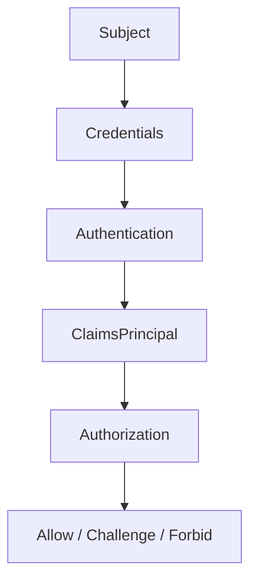

# Модуль III. Аутентификация и авторизация в ASP.NET Core: Cookies, JWT, OAuth 2.0 и OpenID Connect

# Глава 1. Кто обращается к системе: Identity, Authentication и Authorization

──────────────────────────────────────────────

**МОДУЛЬ III • Аутентификация и авторизация**

**Прогресс до главы:** 0% (0 из 17 глав завершены)

**Маршрут:** Identity → Account → Password → Auth Schemes → Cookie → Access Token → JWT → Refresh Token → Claims → Policies → OAuth 2.0 → Code + PKCE → OIDC → ASP.NET Identity → OpenIddict → AuthService → Full Journey

**Текущая глава:** Identity

**Текущий вопрос:**
Как backend-система понимает, кто к ней обращается, и почему установление личности не равно проверке доступа?

──────────────────────────────────────────────

> **Не запоминай технологии. Понимай, какие проблемы они решают.**

---

## Исходная ситуация

В [Модуле II](../02_ASPNET_Core_Request_Pipeline/05_Authentication_In_Pipeline.md) мы увидели, где authentication появляется в request pipeline. Но там вопрос был узким:

```text
как pipeline устанавливает HttpContext.User?
```

Теперь вопрос шире:

```text
кто вообще обращается к системе и как backend принимает решение о доступе?
```

Запрос может отправить человек в браузере, мобильное приложение, backend-сервис, scheduled job или внешний integration client. Система не должна угадывать, кто это. Она должна получить учётные данные, проверить их, построить представление субъекта и только потом решать, что ему разрешено.

---

## Зачем нужна эта глава

Эта глава задаёт словарь всего модуля.

Если смешать identity, account, credentials, authentication и authorization, дальше легко сделать неправильную архитектуру: считать login endpoint всей authentication-системой, воспринимать JWT как единственный способ входа или хранить права прямо в случайном поле профиля пользователя.

В этой главе важно разделить вопросы:

```text
Кто обращается?
Чем он доказывает контроль?
Как система устанавливает identity?
Что этому субъекту разрешено?
```

---

## Эта глава понадобится позже

- [Authentication внутри Pipeline](../02_ASPNET_Core_Request_Pipeline/05_Authentication_In_Pipeline.md)
- [Authorization внутри Pipeline](../02_ASPNET_Core_Request_Pipeline/06_Authorization_In_Pipeline.md)
- [Учётная запись, credentials и хранение пользователей](./02_User_Accounts_Credentials_Storage.md)
- [Модель Authentication в ASP.NET Core](./04_ASPNET_Core_Authentication_Model.md)
- [Claims, Roles и Permissions](./09_Claims_Roles_Permissions.md)
- [Policy-based и Resource-based Authorization в ASP.NET Core](./10_Policy_Resource_Authorization.md)
- [Полный путь аутентификации и авторизации](./17_Full_Authentication_Authorization_Journey.md)

---

## Короткое определение

**Subject (субъект обращения — человек, сервис или другой участник, от имени которого выполняется действие)** пытается обратиться к системе.

**Credentials (учётные данные — доказательство или способ подтвердить контроль над identity)** могут быть паролем, cookie, bearer token, внешним login provider или другим механизмом.

**Authentication (аутентификация — процесс установления identity по предъявленным credentials)** отвечает на вопрос `кто это?`.

**Authorization (авторизация — проверка, разрешено ли субъекту выполнить действие или получить ресурс)** отвечает на вопрос `что ему можно?`.

---

## Простая аналогия

Представь офис.

На ресепшене человек показывает документ. Это похоже на authentication: охрана устанавливает личность.

Но после этого охрана проверяет, можно ли этому человеку пройти в конкретную переговорную, серверную или бухгалтерию. Это уже authorization.

Паспорт не равен пропуску во все комнаты.

---

## Техническое объяснение

Базовая модель выглядит так:

```text
Subject / Account
    ↓ presents
Credentials
    ↓ verified by
Authentication
    ↓ produces
Identity / Principal
    ↓ evaluated by
Authorization
```

**Account (учётная запись — сохранённая запись системы о субъекте и его способах входа)** обычно живёт в базе данных. Account может принадлежать человеку, сервису или организации.

**Identity (установленная личность — результат успешной authentication)** не обязана быть ровно одной строкой таблицы users. Это представление того, что система смогла установить о субъекте.

**Principal (представитель субъекта — объект, от имени которого выполняется запрос)** в ASP.NET Core обычно выражается через `ClaimsPrincipal`.

В ASP.NET Core:

- `ClaimsIdentity` хранит одну identity и набор claims;
- `ClaimsPrincipal` может содержать одну или несколько identities;
- `HttpContext.User` хранит текущий principal для запроса;
- authorization читает этот principal и требования доступа.

Важно различать состояния:

| Состояние | Что значит |
|---|---|
| Anonymous | система не установила пользователя |
| Identified | система знает некоторый идентификатор, но это не всегда полноценная authentication |
| Authenticated | credentials проверены, identity установлена |

Login и registration — это сценарии приложения. Registration создаёт account или способ входа. Login предъявляет credentials и запускает authentication. Но authentication как механизм шире, чем endpoint `/login`: cookie, bearer token, client certificate или внешний provider тоже могут участвовать в установлении identity.

---

## Схема



---

## Практический сценарий

Допустим, API получает запрос:

```http
GET /api/orders/42
Authorization: Bearer <access-token>
```

Для системы это не просто строка в заголовке.

Она должна:

1. понять, какая authentication scheme отвечает за этот credential;
2. проверить credential;
3. построить `ClaimsPrincipal`;
4. положить его в `HttpContext.User`;
5. проверить, может ли этот principal читать заказ `42`.

Если credential отсутствует или невалиден, защищённый endpoint обычно приводит к challenge. Если пользователь установлен, но не имеет доступа, система обычно возвращает forbid. В [Модуле II](../02_ASPNET_Core_Request_Pipeline/06_Authorization_In_Pipeline.md) это было разобрано как часть pipeline.

---

## Мини-пример модели

```csharp
public sealed record RequestSubject(
    string SubjectId,
    bool IsAuthenticated,
    IReadOnlyCollection<string> Claims);
```

Это не замена `ClaimsPrincipal`, а учебная модель. Она показывает главную мысль: приложение работает не с паролем напрямую, а с результатом проверки credentials.

---

## Типичные ошибки

Ошибка: считать identity строкой из таблицы users.
Почему неверно: identity — это установленное представление субъекта в текущем контексте, а user row — способ хранения данных.
Как правильно: отделять account storage от runtime-представления пользователя.

Ошибка: считать login endpoint всей authentication.
Почему неверно: authentication может выполняться по cookie, bearer token, внешнему provider или другой схеме.
Как правильно: login рассматривать как один из сценариев получения credential или session.

Ошибка: смешивать authentication и authorization.
Почему неверно: установленная личность ещё не означает доступ к ресурсу.
Как правильно: сначала установить `кто это`, затем отдельно проверить `что ему разрешено`.

Ошибка: считать credentials только паролем.
Почему неверно: credential может быть cookie, access token, client secret, certificate или внешний login.
Как правильно: пароль рассматривать как один из способов подтвердить контроль.

Ошибка: думать, что `ClaimsPrincipal` всегда представляет только человека.
Почему неверно: запрос может выполняться от имени сервиса или другого программного субъекта.
Как правильно: использовать neutral-модель subject/principal.

---

## Вопросы собеседования

### Junior: Чем authentication отличается от authorization?

<details>
<summary>Ответ</summary>

Authentication устанавливает, кто обращается к системе. Authorization проверяет, разрешено ли этому субъекту выполнить действие или получить ресурс.

</details>

---

### Middle: Почему login endpoint не равен authentication?

<details>
<summary>Ответ</summary>

Login endpoint — это сценарий, где пользователь предъявляет credentials, например пароль. Authentication шире: она может происходить по cookie, bearer token, внешнему provider или другой схеме при каждом запросе.

</details>

---

### Middle: Что попадает в `HttpContext.User`?

<details>
<summary>Ответ</summary>

В `HttpContext.User` попадает `ClaimsPrincipal`: runtime-представление субъекта текущего запроса. Он содержит одну или несколько identities и claims, которые дальше использует authorization.

</details>

---

### Senior: Почему `401` и `403` нельзя объяснять как "неверный пароль" и "не залогинен"?

<details>
<summary>Ответ</summary>

`401` обычно связан с challenge: защищённый ресурс требует authentication, но подходящая identity не установлена. Причина может быть не только в пароле, но и в отсутствующей cookie, невалидном token или другой схеме. `403` обычно означает forbid: identity установлена, но доступ запрещён.

</details>

---

### Architect / System Design: Почему важно разделять account, credentials и principal?

<details>
<summary>Ответ</summary>

Account — это хранимая запись системы. Credentials — способы подтвердить контроль над account или identity. Principal — runtime-представление субъекта в конкретном запросе. Разделение позволяет поддерживать несколько способов входа, внешних providers, сервисных клиентов, отзыв credentials и разные модели authorization без смешивания всех данных в одной записи.

</details>

---

## Ответ для собеседования

В authentication-системе сначала нужно понять, кто обращается к backend: человек, сервис или другой клиент. Этот субъект предъявляет credentials — пароль, cookie, bearer token или другой способ подтвердить контроль. Authentication проверяет credentials и строит identity, которая в ASP.NET Core обычно представлена через `ClaimsPrincipal` в `HttpContext.User`. Authorization — отдельный этап: он проверяет, разрешено ли этому principal выполнить действие или получить ресурс. Поэтому login endpoint, JWT, cookie и password storage — это части общей системы, но ни одна из них не является всей authentication сама по себе.

---

## Шпаргалка

- Subject — тот, от чьего имени выполняется действие.
- Account — сохранённая запись системы.
- Credentials — способ подтвердить контроль.
- Authentication отвечает на вопрос `кто это`.
- Authorization отвечает на вопрос `что ему можно`.
- Login — сценарий, а не полное определение authentication.
- Registration создаёт account или способ входа.
- `ClaimsIdentity` хранит identity и claims.
- `ClaimsPrincipal` представляет subject текущего запроса.
- `HttpContext.User` хранит principal.
- `401` обычно связан с challenge.
- `403` обычно связан с forbid.

---

## Прогресс модуля

**Модуль III:** `Аутентификация и авторизация в ASP.NET Core`
**Прогресс после главы:** 6% (1 из 17 глав завершена).
