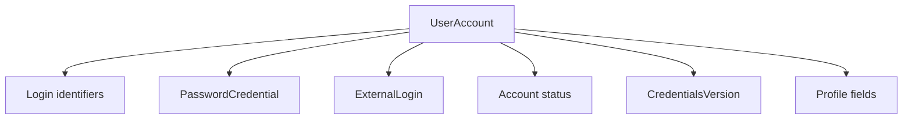

# Модуль III. Аутентификация и авторизация в ASP.NET Core: Cookies, JWT, OAuth 2.0 и OpenID Connect

# Глава 2. Учётная запись, credentials и хранение пользователей

──────────────────────────────────────────────

**МОДУЛЬ III • Аутентификация и авторизация**

**Прогресс до главы:** 6% (1 из 17 глав завершена)

**Маршрут:** Identity → Account → Password → Auth Schemes → Cookie → Access Token → JWT → Refresh Token → Claims → Policies → OAuth 2.0 → Code + PKCE → OIDC → ASP.NET Identity → OpenIddict → AuthService → Full Journey

**Текущая глава:** Account

**Текущий вопрос:**
Какие данные auth-система должна хранить, чтобы узнавать субъекта и управлять его способами входа?

──────────────────────────────────────────────

> **Не запоминай технологии. Понимай, какие проблемы они решают.**

---

## Исходная ситуация

В предыдущей главе мы отделили subject, credentials, authentication и authorization.

Теперь появляется практический вопрос:

```text
что именно хранить в базе, чтобы пользователь мог войти, сменить email, подключить внешний provider и не потерять устойчивую identity внутри системы?
```

Если хранить всё в одной записи вроде `User { Email, Password, Role }`, система быстро становится хрупкой: email меняется, пароль может быть заменён, внешний login не похож на локальный пароль, а permissions не должны жить в случайном profile field.

---

## Зачем нужна эта глава

Эта глава нужна, чтобы не строить authentication поверх случайной таблицы пользователей.

Auth-система должна хранить:

- стабильный внутренний идентификатор;
- изменяемые login identifiers;
- credentials;
- статусы account;
- признаки подтверждения email/phone;
- связи с внешними providers;
- технические версии для отзыва sessions или credentials.

Это не про полный ASP.NET Core Identity schema. Это про базовую модель данных, без которой сложно понять следующие главы.

---

## Эта глава понадобится позже

- [Кто обращается к системе: Identity, Authentication и Authorization](./01_Identity_Authentication_Authorization.md)
- [Парольная аутентификация и безопасное хранение паролей](./03_Password_Authentication_Storage.md)
- [OpenID Connect и внешние Identity Providers](./13_OpenID_Connect_External_Identity_Providers.md)
- [ASP.NET Core Identity](./14_ASPNET_Core_Identity.md)
- [Архитектура AuthService и границы distributed system](./16_AuthService_Distributed_Boundaries.md)

---

## Короткое определение

**User account (учётная запись пользователя — сохранённая запись системы, через которую backend связывает способы входа, состояние и внутреннюю identity)** не должна зависеть от одного изменяемого email или одного пароля.

**Login identifier (идентификатор входа — значение, по которому пользователь может начать вход)** может быть username, email или phone.

**Credential record (запись credential — сохранённые данные, по которым можно проверить способ входа)** должна быть логически отделена от данных профиля.

**External login (внешняя связь входа — локальное сопоставление внешнего provider subject с внутренним `UserId`)** не является credential. Это запись о том, какая внешняя identity соответствует локальному account.

---

## Простая аналогия

Учётная запись похожа на личное дело сотрудника.

Внутренний номер сотрудника стабилен. Email, телефон, пропуск, пароль от портала и внешний badge могут меняться. Если сделать email главным идентификатором всего сотрудника, любая смена email превращается в миграцию identity.

---

## Техническое объяснение

Auth-системе нужен стабильный `UserId`. Он не обязан быть видим пользователю и не должен меняться при смене email, username или phone.

Изменяемые идентификаторы входа лучше хранить отдельно или явно нормализовать:

- username;
- email;
- phone.

Email не стоит автоматически считать primary key:

- пользователь может сменить email;
- email может требовать подтверждения;
- правила нормализации зависят от системы;
- в некоторых системах один человек может иметь несколько verified identifiers;
- внешний provider может вернуть другой stable subject, не равный локальному email.

Уникальность login identifier должна защищаться не только кодом приложения, но и ограничением базы: уникальным индексом. Предварительный `SELECT` перед вставкой полезен для понятной ошибки пользователю, но не защищает от гонки параллельных запросов. Окончательное решение всё равно принимает база, а приложение должно обработать конфликт уникального индекса.

Нормализация зависит от домена и выбранных правил. Не существует одной универсальной нормализации email, которая подходит всем системам: где-то важна регистронезависимость, где-то есть правила конкретного provider, а где-то email вообще не должен быть единственным login identifier.

Account status — концептуальная модель. Реальный набор статусов зависит от требований проекта, регуляторики и операционных процессов. Часто встречаются такие состояния:

| Статус | Смысл |
|---|---|
| Active | учётная запись может использоваться |
| Disabled | вход отключён администратором или политикой |
| Locked | вход временно ограничен после риска или ошибок |
| Deleted | запись удалена или помечена как удалённая концептуально |

Email/phone confirmation — отдельное состояние. Пользователь может существовать, но email ещё не подтверждён. Это не то же самое, что account disabled.

Один account может иметь несколько способов входа и связанных auth-записей:

- password credential — проверяемое значение локального способа входа;
- passkey или другой authenticator — credential соответствующего механизма;
- external login link — локальное сопоставление внешнего subject с `UserId`, но не credential;
- API key не стоит автоматически привязывать к пользовательскому account: он может принадлежать service/client identity и зависит от архитектуры системы.

Данные профиля тоже стоит отделять от authentication data. Имя, аватар, язык интерфейса и должность — это не credentials и не permissions.

---

## Схема



---

## Практический сценарий

Пользователь зарегистрировался по email, потом:

1. подтвердил email;
2. сменил email;
3. подключил вход через внешний provider;
4. сбросил пароль;
5. получил временную блокировку после подозрительных попыток входа.

Если `UserId` стабилен, все эти операции не ломают ownership данных в домене: заказы, файлы и настройки остаются привязаны к тому же внутреннему субъекту. Меняются только способы входа и состояние account.

---

## Мини-пример модели

Это учебная модель, а не универсальная рабочая схема проекта:

```csharp
public sealed class UserAccount
{
    public Guid Id { get; init; }
    public AccountStatus Status { get; set; }
    public string CredentialsVersion { get; set; } = "";
}

public sealed class LoginIdentifier
{
    public Guid UserId { get; init; }
    public LoginIdentifierType Type { get; init; }
    public string Value { get; init; } = "";
    public string NormalizedValue { get; init; } = "";
    public bool IsConfirmed { get; init; }
}

public sealed class PasswordCredential
{
    public Guid UserId { get; init; }
    public string PasswordHash { get; set; } = "";
    public DateTimeOffset UpdatedAt { get; set; }
}

public sealed class ExternalLogin
{
    public Guid LocalUserId { get; init; }
    public string Provider { get; init; } = "";
    public string Issuer { get; init; } = "";
    public string ProviderSubject { get; init; } = "";
}

public enum LoginIdentifierType
{
    Username,
    Email,
    Phone
}
```

`CredentialsVersion` здесь показан как общая версия credentials: при смене пароля или критичных credential-событиях система может использовать похожую идею для инвалидирования старых sessions или проверки актуальности состояния. В ASP.NET Core Identity есть близкий, но конкретный для Identity термин `SecurityStamp`; детали будут позже.

Для внешнего входа важна пара `Provider/Issuer + ProviderSubject`. External subject стабилен только внутри пространства имён конкретного issuer/provider. Email, полученный от внешнего provider, нельзя считать глобальным ключом: он может измениться, быть неподтверждённым или совпасть с локальным email другого пользователя. Поэтому локальная запись `ExternalLogin` связывает внешний subject с `LocalUserId`, но сама не является credential.

---

## Типичные ошибки

Ошибка: хранить пароль в поле `Password` или `EncryptedPassword`.
Почему неверно: системе не нужен исходный пароль для проверки входа.
Как правильно: хранить password verifier, созданный password hashing scheme; подробнее это разбирается в следующей главе.

Ошибка: делать email неизменяемым primary key.
Почему неверно: email может измениться, быть неподтверждённым или прийти из внешнего provider.
Как правильно: использовать стабильный внутренний `UserId`.

Ошибка: хранить только `IsAuthenticated`.
Почему неверно: authentication — runtime-результат запроса, а не вся модель account.
Как правильно: хранить состояние account и credentials отдельно.

Ошибка: смешивать данные профиля, credentials и permissions в одну неструктурированную запись.
Почему неверно: эти данные имеют разный lifecycle и разные требования безопасности.
Как правильно: разделять authentication data, данные профиля и authorization model.

Ошибка: обеспечивать уникальность login identifier только через `SELECT`.
Почему неверно: два параллельных запроса могут пройти проверку одновременно.
Как правильно: использовать уникальный индекс в базе и обрабатывать конфликт.

---

## Вопросы собеседования

### Junior: Почему системе нужен внутренний `UserId`?

<details>
<summary>Ответ</summary>

Потому что email, username и phone могут изменяться. Внутренний `UserId` остаётся стабильной связью между account и доменными данными.

</details>

---

### Middle: Почему проверка уникальности email в коде не заменяет unique index?

<details>
<summary>Ответ</summary>

Из-за race condition. Два запроса могут одновременно увидеть, что email свободен, и оба попытаться создать account. Окончательную гарантию уникальности должна давать база данных.

</details>

---

### Middle: Чем account отличается от credential?

<details>
<summary>Ответ</summary>

Account — это устойчивая запись субъекта в системе. Credential — конкретный способ подтвердить контроль: password hash, cookie, token или другой проверяемый материал. Внешняя связь входа — это сопоставление внешнего subject с локальным account, а не credential.

</details>

---

### Senior: Зачем отделять authentication data от данных профиля?

<details>
<summary>Ответ</summary>

У них разные требования и жизненный цикл. Данные профиля можно менять без security-события, а изменения credentials могут требовать повторной authentication, отзыва sessions, audit и обновления версии credentials.

</details>

---

### Architect / System Design: Как внешний provider связан с локальным account?

<details>
<summary>Ответ</summary>

Внешний provider обычно даёт issuer/provider name и стабильный subject внутри своего пространства имён. Локальная система связывает эту пару с внутренним `UserId`. Нельзя считать внешний account тем же самым, что локальный `UserId`: это сопоставление между двумя identity spaces.

</details>

---

## Ответ для собеседования

В auth-системе я бы разделял учётную запись, login identifiers, credentials, внешние связи входа и данные профиля. У пользователя должен быть стабильный внутренний `UserId`, потому что email, phone или username могут изменяться. Credentials лучше хранить отдельно: password credential, token, certificate и другие способы проверки имеют разный lifecycle. External login хранит сопоставление `issuer/provider + subject` с локальным `UserId`, но не является credential. Email confirmation, account status, lockout и версия credentials — это отдельные состояния, а не одно поле `IsAuthenticated`. Уникальность login identifiers должна подтверждаться уникальным индексом в базе, потому что проверка только на уровне приложения не защищает от гонок.

---

## Шпаргалка

- Account — стабильная запись системы.
- `UserId` должен быть внутренним и устойчивым.
- Email не стоит автоматически делать primary key.
- Login identifiers нужно нормализовать.
- Уникальность защищает база, не только код.
- Email/phone confirmation — отдельное состояние.
- Account может иметь несколько credentials.
- Password credential и external login — разные вещи.
- Данные профиля не равны authentication data.
- Permissions не нужно прятать в profile blob.
- Версия credentials помогает отзывать старое состояние.

---

## Прогресс модуля

**Модуль III:** `Аутентификация и авторизация в ASP.NET Core`
**Прогресс после главы:** 12% (2 из 17 глав завершены).
