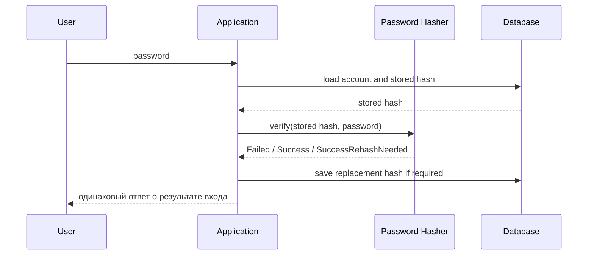

# Модуль III. Аутентификация и авторизация в ASP.NET Core: Cookies, JWT, OAuth 2.0 и OpenID Connect

# Глава 3. Парольная аутентификация и безопасное хранение паролей

──────────────────────────────────────────────

**МОДУЛЬ III • Аутентификация и авторизация**

**Прогресс до главы:** 12% (2 из 17 глав завершены)

**Маршрут:** Identity → Account → Password → Auth Schemes → Cookie → Access Token → JWT → Refresh Token → Claims → Policies → OAuth 2.0 → Code + PKCE → OIDC → ASP.NET Identity → OpenIddict → AuthService → Full Journey

**Текущая глава:** Password

**Текущий вопрос:**
Как проверить пароль, не сохраняя его в открытом или обратимо зашифрованном виде?

──────────────────────────────────────────────

> **Не запоминай технологии. Понимай, какие проблемы они решают.**

---

## Исходная ситуация

Пароль — самый знакомый credential. Пользователь вводит секрет, сервер проверяет его и устанавливает identity.

Главная проблема:

```text
сервер должен проверять пароль,
но не должен хранить сам пароль.
```

Если база утечёт, атакующий не должен получить готовый список паролей. Он получит только verifier, по которому придётся дорого угадывать пароль офлайн.

---

## Зачем нужна эта глава

Парольная authentication часто ломается не в endpoint `/login`, а в модели хранения.

Опасные ошибки выглядят просто:

- сохранить пароль как plaintext;
- сохранить обратимо зашифрованный пароль;
- сделать быстрый `SHA256(password)`;
- использовать один общий salt;
- никогда не обновлять параметры hashing;
- возвращать разные ошибки для `email не найден` и `пароль неверный`.

Эта глава объясняет, как password verification устроен концептуально и как ASP.NET Core Identity даёт стандартный abstraction для hashing.

---

## Эта глава понадобится позже

- [Учётная запись, credentials и хранение пользователей](./02_User_Accounts_Credentials_Storage.md)
- [Модель Authentication в ASP.NET Core](./04_ASPNET_Core_Authentication_Model.md)
- [ASP.NET Core Identity](./14_ASPNET_Core_Identity.md)
- [Архитектура AuthService и границы distributed system](./16_AuthService_Distributed_Boundaries.md)

---

## Короткое определение

**Password verifier (проверочное значение пароля — сохранённое значение, по которому можно проверить пароль, не храня исходный пароль)** создаётся password hashing scheme.

**Password hashing scheme (схема хеширования пароля — password-based KDF с salt, cost factor и форматом хранения параметров)** делает каждую попытку угадывания дорогой.

**Salt (уникальное случайное значение для конкретного password hash)** не является секретом и хранится вместе с hash.

---

## Простая аналогия

Система хранит не ключ от двери, а сложный слепок, по которому можно проверить, подходит ли принесённый ключ.

Если слепок украли, по нему всё ещё сложно быстро изготовить ключ. Чем дороже проверка каждой догадки, тем тяжелее массовый перебор.

---

## Техническое объяснение

Threat model для password storage:

```text
Database leak
    ↓
Attacker obtains stored verifier
    ↓
Offline password guessing
    ↓
Password hashing scheme makes every guess expensive
```

Обычный быстрый hash не подходит для хранения паролей. `SHA256(password)` рассчитан на скорость, а для password storage нужна схема, которая специально делает проверку дорогой.

Password hashing scheme обычно использует:

- password;
- уникальный salt;
- cost factor / work factor;
- формат с параметрами и версией.

Salt нужен, чтобы одинаковые пароли у разных пользователей не давали одинаковый stored verifier. Из-за уникального salt заранее подготовленные таблицы нельзя эффективно переиспользовать между разными password records, а догадки приходится проверять отдельно для каждого hash. Salt должен быть уникальным для конкретной записи password hash, но он не является секретом и не заменяет cost factor.

Cost factor нужен, чтобы увеличить цену каждой попытки угадывания. Его выбирают так, чтобы сервер выдерживал нормальную нагрузку, но offline guessing был дорогим. Со временем cost factor приходится повышать.

Формат хранения должен позволять migration. Поэтому хороший stored hash может включать:

```text
version marker
algorithm / PRF marker
cost factor
salt
subkey / verifier
```

После успешной проверки система может понять, что hash создан со старыми параметрами, и пересчитать его. В ASP.NET Core Identity для этого есть `PasswordVerificationResult.SuccessRehashNeeded`.

---

## ASP.NET Core Identity password hasher

`IPasswordHasher<TUser>` — abstraction для создания и проверки password hash.

`PasswordHasher<TUser>` — стандартная реализация Identity password hashing. Текущая реализация использует версионированный формат. Exact algorithm и iteration count являются version-dependent, поэтому не стоит превращать конкретные параметры реализации в универсальную рекомендацию для всех систем.

Argon2 можно встретить как современный password hashing algorithm, но стандартный `PasswordHasher<TUser>` не означает автоматическое использование Argon2. Выбор альтернативного hasher требует отдельного анализа библиотеки, совместимости, миграции и эксплуатации.

---

## NIST: политика паролей

Актуальная линия NIST SP 800-63B-4 для password verifier важна не только про storage, но и про UX политики. Это guidance NIST, а не универсальный закон для любой системы:

- минимальная длина password как single factor — 15 characters;
- минимальная длина password как части MFA — 8 characters;
- максимальная поддерживаемая длина должна быть не меньше 64 characters;
- проверять весь password без silent truncation;
- не выдавать composition rules вроде обязательной смеси регистра, цифр и символов как современную универсальную рекомендацию;
- не требовать периодическую смену пароля без признаков компрометации как универсальное правило;
- проверять новые passwords по blocklist известных, распространённых или скомпрометированных значений;
- разрешать password managers, autofill и paste;
- если система принимает Unicode passwords, NIST рекомендует (SHOULD) применять NFC normalization перед hashing;
- использовать rate limiting для неуспешных попыток;
- хранить passwords в форме, устойчивой к offline attacks: salted password hashing scheme с cost factor;
- хранить scheme, version и параметры, чтобы поддерживать migration;
- дополнительный keyed step/secret обсуждать как SHOULD, а не как обязательный `pepper` для каждой системы.

---

## Схема



---

## Практический сценарий

Пользователь вводит email и password. Приложение находит account по нормализованному login identifier и получает stored password hash.

Дальше приложение не сравнивает строки password. Оно передаёт введённый password и stored hash в password hasher. Если результат успешен, система может создать `ClaimsPrincipal`, cookie или token в следующих этапах. Если result требует rehash, приложение после успешной проверки обновляет stored hash новыми параметрами.

Сообщение об ошибке входа лучше делать одинаковым:

```text
Неверные учётные данные.
```

Так система меньше помогает account enumeration: атакующий не должен легко отличать `email существует, но пароль неверный` от `email не существует`. Но одинаковый текст ошибки — только одна мера. Время ответа, rate limiting, lockout, audit side effects и разные HTTP-ответы тоже могут раскрывать существование account, поэтому их нужно проектировать согласованно.

---

## Мини-пример кода

```csharp
using Microsoft.AspNetCore.Identity;

public sealed class AppUser
{
    public Guid Id { get; init; }
}

public sealed class PasswordCredentialService
{
    private readonly IPasswordHasher<AppUser> _hasher;

    public PasswordCredentialService(IPasswordHasher<AppUser> hasher)
    {
        _hasher = hasher;
    }

    public string CreateHash(AppUser user, string password)
    {
        return _hasher.HashPassword(user, password);
    }

    public PasswordCheckResult Verify(AppUser user, string storedHash, string password)
    {
        var result = _hasher.VerifyHashedPassword(user, storedHash, password);

        if (result == PasswordVerificationResult.SuccessRehashNeeded)
        {
            return new PasswordCheckResult(
                Succeeded: true,
                ReplacementHash: _hasher.HashPassword(user, password));
        }

        return new PasswordCheckResult(
            Succeeded: result == PasswordVerificationResult.Success,
            ReplacementHash: null);
    }
}

public sealed record PasswordCheckResult(
    bool Succeeded,
    string? ReplacementHash);
```

Код показывает идею: hasher только проверяет `storedHash` и может вернуть replacement hash. Загрузка account, сохранение нового hash, transaction boundaries, lockout, rate limiting, audit и password reset lifecycle остаются ответственностью приложения.

---

## Типичные ошибки

Ошибка: использовать `SHA256(password)` как password storage.
Почему неверно: быстрый hash делает offline guessing дешёвым.
Как правильно: использовать password hashing scheme / password-based KDF с salt и cost factor.

Ошибка: использовать один общий salt.
Почему неверно: одинаковые passwords будут давать одинаковые verifier patterns, а заранее подготовленные таблицы станет проще переиспользовать между записями.
Как правильно: генерировать уникальный случайный salt для каждого password hash.

Ошибка: считать salt secret.
Почему неверно: salt хранится вместе с hash и защищает не секретностью, а уникальностью.
Как правильно: secret keyed step обсуждать отдельно и не подменять им salt.

Ошибка: считать password hash encryption.
Почему неверно: hash verification не требует восстановления исходного password.
Как правильно: хранить verifier, а не обратимо восстановимый секрет.

Ошибка: думать, что сильный password hash решает online brute force.
Почему неверно: online атаки идут через application endpoint и требуют rate limiting, lockout или похожих защитных мер.
Как правильно: сочетать storage protection с rate limiting и безопасными login errors.

---

## Вопросы собеседования

### Junior: Почему нельзя хранить пароль в открытом виде?

<details>
<summary>Ответ</summary>

Если база утечёт, атакующий сразу получит реальные пароли пользователей. Вместо исходного пароля нужно хранить verifier, созданный password hashing scheme.

</details>

---

### Middle: Зачем нужен salt?

<details>
<summary>Ответ</summary>

Salt делает hash уникальным для конкретного password record. Он не является секретом и хранится вместе с hash. Его задача — предотвращать одинаковые verifier values для одинаковых passwords и мешать переиспользованию заранее подготовленных таблиц между разными записями.

</details>

---

### Middle: Что означает `SuccessRehashNeeded`?

<details>
<summary>Ответ</summary>

Это значит, что пароль проверен успешно, но stored hash создан со старыми параметрами или форматом. После успешной проверки приложение может пересчитать hash и сохранить новое значение.

</details>

---

### Senior: Почему быстрый hash не подходит для password storage?

<details>
<summary>Ответ</summary>

Быстрые hash functions специально оптимизированы на скорость. При утечке базы атакующий сможет очень быстро проверять миллионы догадок офлайн. Password hashing scheme делает каждую попытку дороже через cost factor.

</details>

---

### Architect / System Design: Какие меры нужны кроме password hashing?

<details>
<summary>Ответ</summary>

Нужны одинаковые ответы о результате входа против account enumeration, rate limiting или lockout против online guessing, blocklist распространённых или скомпрометированных passwords, безопасный reset lifecycle, audit и стратегия rehash/migration параметров. При этом нужно следить, чтобы timing, lockout и audit side effects сами не раскрывали существование account.

</details>

---

## Ответ для собеседования

Парольная authentication должна проверять password, не сохраняя исходный password. Для этого система хранит password verifier, созданный password hashing scheme: password-based KDF с уникальным salt, cost factor и форматом, который позволяет хранить параметры и версию. Salt не является secret, он хранится вместе с hash, не заменяет cost factor и не является главным источником дороговизны проверки. Cost factor делает offline guessing дороже и должен обновляться со временем. В ASP.NET Core Identity для этого есть `IPasswordHasher<TUser>` и `PasswordHasher<TUser>`, а `SuccessRehashNeeded` позволяет после успешной проверки вернуть replacement hash и сохранить его на уровне приложения. При этом password hashing не заменяет rate limiting, lockout, blocklist и безопасные одинаковые ответы о результате входа.

---

## Шпаргалка

- Исходный password не хранится.
- Обратимое хранение обычно не нужно для login.
- Быстрый hash не подходит для password storage.
- Password hashing scheme делает guessing дорогим.
- Salt уникален для каждого hash.
- Salt не является secret.
- Cost factor нужно выбирать и повышать со временем.
- Формат должен хранить параметры и version marker.
- `IPasswordHasher<TUser>` создаёт и проверяет hash.
- `SuccessRehashNeeded` помогает миграции.
- Одинаковый ответ о результате входа снижает account enumeration.
- Rate limiting нужен против online guessing.
- NIST SP 800-63B-4 не поддерживает composition rules как универсальную рекомендацию.

---

## Прогресс модуля

**Модуль III:** `Аутентификация и авторизация в ASP.NET Core`
**Прогресс после главы:** 18% (3 из 17 глав завершены).
