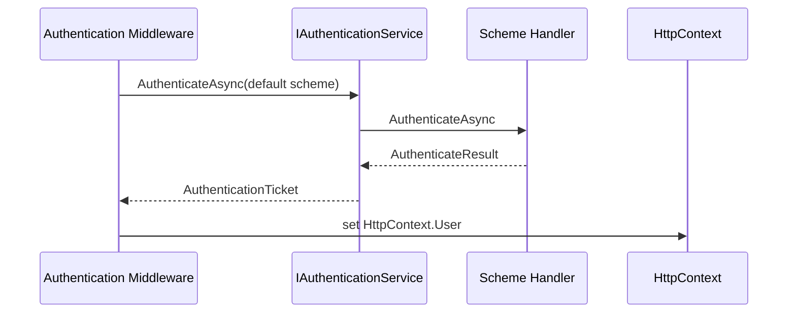

# Модуль III. Аутентификация и авторизация в ASP.NET Core: Cookies, JWT, OAuth 2.0 и OpenID Connect

# Глава 4. Модель Authentication в ASP.NET Core

──────────────────────────────────────────────

**МОДУЛЬ III • Аутентификация и авторизация**

**Прогресс до главы:** 18% (3 из 17 глав завершены)

**Маршрут:** Identity → Account → Password → Auth Schemes → Cookie → Access Token → JWT → Refresh Token → Claims → Policies → OAuth 2.0 → Code + PKCE → OIDC → ASP.NET Identity → OpenIddict → AuthService → Full Journey

**Текущая глава:** Auth Schemes

**Текущий вопрос:**
Как ASP.NET Core выбирает способ проверки credentials и получает ClaimsPrincipal?

──────────────────────────────────────────────

> **Не запоминай технологии. Понимай, какие проблемы они решают.**

---

## Исходная ситуация

Мы уже разобрали:

- что такое subject, credentials и principal;
- какие данные может хранить auth-система;
- как безопасно проверять password.

Теперь нужно понять механизм ASP.NET Core:

```text
как framework выбирает, каким способом проверять request?
```

Cookie, Bearer token, внешние providers и custom schemes не должны быть набором разрозненных if-ов в middleware. В ASP.NET Core для этого есть authentication service, schemes и handlers.

---

## Зачем нужна эта глава

Без этой модели легко сделать неверные выводы:

- `UseAuthentication()` якобы сам проверяет любой JWT;
- scheme — просто строка без поведения;
- handler — отдельный middleware;
- framework автоматически пробует все registered schemes;
- challenge всегда означает один и тот же HTTP response.

На самом деле authentication в ASP.NET Core строится вокруг registered schemes и handler-ов, а конкретное поведение зависит от выбранной scheme.

---

## Эта глава понадобится позже

- [Authentication внутри Pipeline](../02_ASPNET_Core_Request_Pipeline/05_Authentication_In_Pipeline.md)
- [Authorization внутри Pipeline](../02_ASPNET_Core_Request_Pipeline/06_Authorization_In_Pipeline.md)
- [Полный ASP.NET Core Request Pipeline](../02_ASPNET_Core_Request_Pipeline/08_Full_ASPNET_Core_Request_Pipeline.md)
- [Cookie Authentication и аутентифицированная session](./05_Cookie_Authentication_Session.md)
- [Access Token и Bearer Authentication](./06_Access_Token_Bearer_Authentication.md)
- [Policy-based и Resource-based Authorization в ASP.NET Core](./10_Policy_Resource_Authorization.md)
- [OpenID Connect и внешние Identity Providers](./13_OpenID_Connect_External_Identity_Providers.md)

---

## Короткое определение

**Authentication scheme (схема аутентификации — имя, связанное с handler и options для конкретного способа authentication)** описывает, как выполнять authenticate, challenge, forbid и другие действия.

**Authentication handler (обработчик аутентификации — компонент, реализующий поведение scheme)** проверяет request, строит `AuthenticationTicket` при успехе и формирует scheme-specific responses.

**IAuthenticationService (сервис аутентификации ASP.NET Core — abstraction, через которую middleware и framework вызывают authentication actions)** выбирает scheme и делегирует работу handler-у.

---

## Простая аналогия

Scheme — это имя стойки регистрации: `Cookies`, `Bearer`, `Google`.

Handler — сотрудник за этой стойкой, который знает конкретные правила проверки.

Authentication service — координатор, который решает, к какой стойке направить request для нужного действия.

---

## Техническое объяснение

Модель ASP.NET Core Authentication:

```text
Request
  ↓
Authentication service
  ↓ selects
Authentication scheme
  ↓ delegates to
Authentication handler
  ↓ returns
AuthenticateResult / AuthenticationTicket
  ↓
ClaimsPrincipal
  ↓
HttpContext.User
```

`AddAuthentication` регистрирует authentication services и default behavior. Конкретные extension methods вроде `AddCookie` или `AddJwtBearer` регистрируют schemes.

Scheme — это не просто строка. Она связывает:

- name;
- handler type;
- options.

`AuthenticationOptions` позволяет задать default schemes:

| Option | Для чего используется |
|---|---|
| `DefaultScheme` | общий fallback для actions |
| `DefaultAuthenticateScheme` | какая scheme используется для `AuthenticateAsync` |
| `DefaultChallengeScheme` | какая scheme отвечает на challenge |
| `DefaultForbidScheme` | какая scheme отвечает на forbid |
| `DefaultSignInScheme` | какая scheme используется для sign-in |
| `DefaultSignOutScheme` | какая scheme используется для sign-out |

Не все handlers обязаны поддерживать все действия. Cookie scheme обычно умеет sign-in/sign-out. Bearer token validation обычно проверяет token из request, но не означает, что handler выпускает token или хранит session.

`AuthenticateAsync` пытается построить identity из текущего request. Успешный результат содержит `AuthenticationTicket`: principal, properties и scheme. `AuthenticationProperties` хранит дополнительные данные authentication operation, например параметры redirect или persistence для некоторых schemes.

`ChallengeAsync` и `ForbidAsync` часто вызываются authorization. Handler сам формирует response:

- cookie handler может redirect на login или access denied page;
- bearer handler обычно возвращает HTTP status и `WWW-Authenticate` header;
- custom handler может делать другое поведение.

---

## UseAuthentication и pipeline

`UseAuthentication()` добавляет Authentication Middleware в pipeline. Middleware использует ранее зарегистрированные schemes и authentication service.

Но middleware и handler — не одно и то же:

- middleware — этап pipeline;
- handler — реализация конкретной scheme.

Если registered scheme одна, актуальная документация ASP.NET Core указывает, что она автоматически становится default scheme. Если schemes несколько и default не задан, framework не должен угадывать. Нужно явно задать default или указать scheme в authorization policy / attribute.

Важная оговорка: нет автоматического перебора всех registered schemes. Если endpoint требует конкретную схему, её нужно указать явно через policy или metadata.

Policy schemes и remote handlers существуют для более сложных сценариев. Policy scheme может выбирать target scheme по request. Remote handler используется там, где нужен внешний redirect/callback, например OAuth 2.0 или OpenID Connect. В этой главе это только мост к будущим темам.

---

## Схема



---

## Практический сценарий

Приложение может использовать cookie для browser UI и bearer token для API:

```text
/account           → Cookies
/api/orders        → Bearer
/signin-external   → remote OIDC handler
```

Это не значит, что ASP.NET Core сам переберёт все варианты. Архитектура должна явно указать default или policy, чтобы request проверялся ожидаемой scheme.

---

## Мини-пример кода

```csharp
using Microsoft.AspNetCore.Authentication.Cookies;
using Microsoft.AspNetCore.Authentication.JwtBearer;

builder.Services.AddAuthentication(options =>
{
    options.DefaultAuthenticateScheme = JwtBearerDefaults.AuthenticationScheme;
    options.DefaultChallengeScheme = JwtBearerDefaults.AuthenticationScheme;
})
.AddJwtBearer(JwtBearerDefaults.AuthenticationScheme)
.AddCookie(CookieAuthenticationDefaults.AuthenticationScheme);

builder.Services.AddAuthorization(options =>
{
    options.AddPolicy("BrowserOnly", policy =>
    {
        policy.AuthenticationSchemes.Add(CookieAuthenticationDefaults.AuthenticationScheme);
        policy.RequireAuthenticatedUser();
    });
});

app.UseAuthentication();
app.UseAuthorization();
```

Пример показывает регистрацию schemes и выбор default behavior. Он не выпускает JWT, не создаёт cookie ticket и не является production config.

---

## Типичные ошибки

Ошибка: считать, что `UseAuthentication()` самостоятельно проверяет любой JWT.
Почему неверно: middleware вызывает authentication service, а тот работает через выбранную scheme и handler.
Как правильно: зарегистрировать JWT bearer scheme и явно настроить default или policy.

Ошибка: считать scheme просто строкой.
Почему неверно: scheme name связан с handler и options.
Как правильно: воспринимать scheme как именованный способ behavior для authenticate/challenge/forbid.

Ошибка: считать handler отдельным middleware.
Почему неверно: handler вызывается authentication service, а не вставляется отдельным этапом pipeline для каждой scheme.
Как правильно: отделять Authentication Middleware от scheme handler.

Ошибка: ждать автоматического перебора всех schemes.
Почему неверно: ASP.NET Core выбирает default или явно указанную scheme.
Как правильно: указывать default schemes или AuthenticationSchemes в policy.

Ошибка: считать challenge всегда `401`, а forbid всегда `403`.
Почему неверно: response зависит от scheme. Cookie может redirect, Bearer обычно возвращает HTTP status/header.
Как правильно: говорить о challenge/forbid как о действиях scheme.

Ошибка: считать, что любой handler поддерживает sign-in/sign-out.
Почему неверно: разные handlers поддерживают разные actions.
Как правильно: проверять capabilities конкретной scheme.

---

## Вопросы собеседования

### Junior: Что такое authentication scheme?

<details>
<summary>Ответ</summary>

Это именованный способ authentication, связанный с handler и options. Например, `Cookies` и `Bearer` — разные schemes с разным поведением.

</details>

---

### Middle: Чем Authentication Middleware отличается от handler?

<details>
<summary>Ответ</summary>

Authentication Middleware — это этап ASP.NET Core pipeline, добавленный через `UseAuthentication()`. Handler — реализация конкретной scheme, которую вызывает authentication service.

</details>

---

### Middle: Что произойдёт, если зарегистрировано несколько schemes без default?

<details>
<summary>Ответ</summary>

Framework не должен автоматически пробовать все schemes. Нужно задать default scheme или указать конкретную scheme в authorization policy/attribute, иначе для некоторых actions может не быть понятно, какую scheme использовать.

</details>

---

### Senior: Почему challenge зависит от scheme?

<details>
<summary>Ответ</summary>

Challenge — это просьба выбранной scheme сформировать response для неаутентифицированного доступа к защищённому ресурсу. Cookie scheme может сделать redirect на login, а Bearer scheme обычно возвращает `401` и `WWW-Authenticate`.

</details>

---

### Architect / System Design: Как спроектировать приложение с cookie UI и bearer API?

<details>
<summary>Ответ</summary>

Нужно зарегистрировать обе schemes, явно выбрать defaults и policies. Например, API endpoints используют Bearer, browser UI использует Cookies. Нельзя полагаться на автоматический перебор всех schemes; правила выбора должны быть частью архитектуры endpoint-ов и authorization policies.

</details>

---

## Ответ для собеседования

В ASP.NET Core authentication строится вокруг schemes и handlers. Scheme — это имя, связанное с handler и options. `IAuthenticationService` выбирает scheme для действия вроде `AuthenticateAsync`, `ChallengeAsync` или `ForbidAsync` и делегирует работу handler-у. Handler проверяет request и при успехе возвращает `AuthenticationTicket` с `ClaimsPrincipal`; Authentication Middleware может положить principal в `HttpContext.User`. `UseAuthentication()` не проверяет любой token сам по себе: оно использует зарегистрированные schemes. Если schemes несколько, нужно явно настроить defaults или указать scheme в policy. Challenge и forbid тоже зависят от scheme: cookie может redirect, bearer обычно возвращает HTTP status/header.

---

## Шпаргалка

- `AddAuthentication` регистрирует authentication services.
- Scheme = name + handler + options.
- Handler реализует behavior scheme.
- `IAuthenticationService` вызывает handler.
- `AuthenticationHandler<TOptions>` — базовая abstraction для handlers.
- `AuthenticateAsync` строит identity из request.
- `AuthenticationTicket` содержит principal, properties и scheme.
- `UseAuthentication()` добавляет middleware.
- Middleware и handler — разные уровни.
- Нет автоматического перебора всех schemes.
- Одна registered scheme может стать default scheme.
- Challenge/forbid response зависит от scheme.
- Cookie и JWT будут разобраны позже как конкретные schemes.

---

## Прогресс модуля

**Модуль III:** `Аутентификация и авторизация в ASP.NET Core`
**Прогресс после главы:** 24% (4 из 17 глав завершены).
