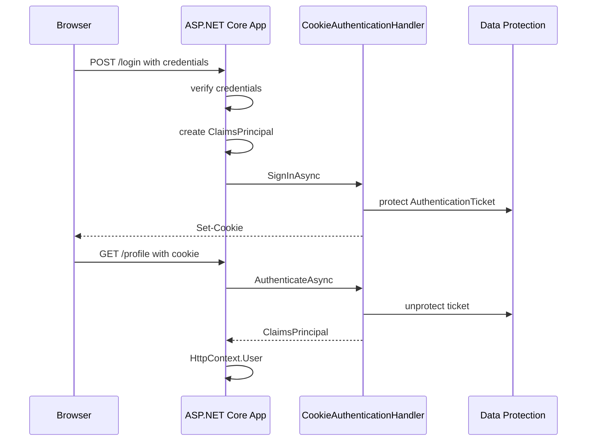

# Модуль III. Аутентификация и авторизация в ASP.NET Core: Cookies, JWT, OAuth 2.0 и OpenID Connect

# Глава 5. Cookie Authentication и аутентифицированная session

──────────────────────────────────────────────

**МОДУЛЬ III • Аутентификация и авторизация**

**Прогресс до главы:** 24% (4 из 17 глав завершены)

**Маршрут:** Identity → Account → Password → Auth Schemes → Cookie → Access Token → JWT → Refresh Token → Claims → Policies → OAuth 2.0 → Code + PKCE → OIDC → ASP.NET Identity → OpenIddict → AuthService → Full Journey

**Текущая глава:** Cookie

**Текущий вопрос:**
Пользователь ввёл пароль один раз.
HTTP не помнит прошлый request.
Как не просить пароль на каждой странице?

──────────────────────────────────────────────

> **Не запоминай технологии. Понимай, какие проблемы они решают.**

---

## Исходная ситуация

В предыдущей главе мы разобрали общую модель ASP.NET Core Authentication: scheme, handler, `AuthenticateAsync`, `SignInAsync`, `SignOutAsync` и `ClaimsPrincipal`.

Теперь смотрим на конкретную browser-oriented схему:

```text
Cookies
```

Пользователь открыл сайт, ввёл email и password, сервер проверил credentials. Но HTTP сам по себе не помнит прошлый request. Следующий запрос:

```http
GET /profile HTTP/1.1
Host: example.com
```

для сервера выглядит как отдельное сообщение.

Нужен способ сказать:

```text
это тот же пользователь, который уже прошёл вход
```

Для браузерного UI таким способом часто становится authentication cookie.

---

## Зачем нужна эта глава

Cookie Authentication нужна, чтобы понять, как ASP.NET Core сохраняет результат входа между requests в браузере.

Главная мысль:

```text
Cookie Authentication не проверяет password.
Cookie Authentication проверяет authentication cookie.
```

Password проверяется раньше: в login endpoint, application service или ASP.NET Core Identity. После успешной проверки приложение создаёт `ClaimsPrincipal` и вызывает `SignInAsync`. Только после этого cookie scheme записывает cookie.

Эта глава отделяет cookie-session модель от bearer-token модели следующей главы. Cookie удобна для browser UI, но приносит свои production-вопросы: CSRF, stale claims, revocation, Data Protection keys, размер cookie и redirect/401 behavior для API.

---

## Эта глава понадобится позже

- [Модель Authentication в ASP.NET Core](./04_ASPNET_Core_Authentication_Model.md)
- [Refresh Token и жизненный цикл token](./08_Refresh_Token_Lifecycle.md)
- [Policy-based и Resource-based Authorization в ASP.NET Core](./10_Policy_Resource_Authorization.md)
- [Authorization Code Flow и PKCE](./12_Authorization_Code_PKCE.md)
- [ASP.NET Core Identity](./14_ASPNET_Core_Identity.md)
- [Полный путь аутентификации и авторизации](./17_Full_Authentication_Authorization_Journey.md)

---

## Короткое определение

**Cookie Authentication (аутентификация по cookie — authentication scheme, которая восстанавливает `ClaimsPrincipal` из защищённой authentication cookie)** используется, чтобы браузер мог переносить состояние входа между HTTP-запросами.

**Authentication cookie (cookie аутентификации — cookie, содержащая защищённый authentication ticket или ссылку на него)** автоматически отправляется браузером при подходящих `Domain`, `Path`, `Secure` и `SameSite` условиях.

**AuthenticationTicket (ticket аутентификации — объект с `ClaimsPrincipal`, `AuthenticationProperties` и scheme)** является тем, что cookie handler сохраняет и затем восстанавливает.

---

## Простая аналогия

Пароль похож на документ, который пользователь показал при входе.

Authentication cookie похожа на пропуск, который выдали после проверки документа. На каждом турникете охрана проверяет пропуск, а не просит паспорт заново.

Но пропуск можно украсть. У него должен быть срок действия. Его нужно уметь отозвать. И иногда нужно сверять, не изменились ли права человека после выдачи пропуска.

---

## Базовый flow простыми словами

```text
Credentials verified
    ↓
ClaimsPrincipal created
    ↓
SignInAsync
    ↓
AuthenticationTicket
    ↓ protected by Data Protection
Authentication cookie
    ↓ browser sends automatically
CookieAuthenticationHandler
    ↓ restores ClaimsPrincipal
HttpContext.User
```

Разберём шаги.

`Credentials verified` — приложение проверило password или другой credential. Cookie handler этого не делает.

`ClaimsPrincipal created` — приложение создало runtime-представление пользователя: subject id, name, security version и другие минимальные claims.

`SignInAsync` — приложение просит ASP.NET Core выполнить sign-in для cookie scheme.

`AuthenticationTicket` — framework упаковывает principal, properties и scheme.

`protected by Data Protection` — ticket защищается ASP.NET Core Data Protection. Не стоит описывать cookie как просто "зашифрованный JSON": это protected framework payload с purpose, keys и форматом ticket.

`Authentication cookie` — response получает `Set-Cookie`.

`browser sends automatically` — браузер сам прикладывает cookie к следующим requests.

`CookieAuthenticationHandler` — handler читает cookie, восстанавливает ticket и возвращает successful `AuthenticateResult`.

`HttpContext.User` — Authentication Middleware кладёт `ClaimsPrincipal` в текущий request.

---

## Четыре разных понятия

Cookie Authentication часто называют session. Это опасное упрощение.

| Понятие | Где живёт | Что означает |
|---|---|---|
| Authentication cookie | Browser | Credential, по которому cookie handler восстанавливает principal |
| Browser session cookie | Browser | Cookie без persistent expiration; обычно удаляется при закрытии браузера |
| ASP.NET Core Session middleware | Server + browser key | Отдельное server-side хранилище пользовательских данных по session id |
| Server-side ticket store (`ITicketStore`) | Server | Хранение authentication ticket на сервере, а в cookie только ключ |

Authentication cookie отвечает на вопрос:

```text
кто пользователь текущего request?
```

ASP.NET Core Session middleware отвечает на другой вопрос:

```text
где временно хранить небольшие данные между requests?
```

`ITicketStore` — ещё отдельная модель. Он позволяет хранить ticket на сервере, а в cookie оставить только ключ. Это может помочь с размером cookie и отзывом, но добавляет зависимость от server storage.

---

## ASP.NET Core: регистрация cookie scheme

```csharp
using Microsoft.AspNetCore.Authentication.Cookies;

builder.Services
    .AddAuthentication(CookieAuthenticationDefaults.AuthenticationScheme)
    .AddCookie(options =>
    {
        options.LoginPath = "/login";
        options.AccessDeniedPath = "/forbidden";
        options.ExpireTimeSpan = TimeSpan.FromMinutes(30);
        options.SlidingExpiration = true;

        options.Cookie.HttpOnly = true;
        options.Cookie.SecurePolicy = CookieSecurePolicy.Always;
        options.Cookie.SameSite = SameSiteMode.Lax;
    });
```

Что настраивает разработчик:

- default scheme `Cookies`;
- paths для login и access denied;
- срок жизни ticket;
- sliding renewal;
- browser attributes cookie.

Что регистрирует framework:

- cookie authentication scheme;
- `CookieAuthenticationHandler`;
- options для этой scheme;
- связь с `IAuthenticationService`.

Что происходит при request:

- `UseAuthentication()` вызывает default authenticate scheme;
- cookie handler ищет authentication cookie;
- если ticket восстановлен и валиден, handler возвращает principal;
- Authentication Middleware устанавливает `HttpContext.User`.

Что намеренно опущено:

- проверка password;
- загрузка account;
- production `ValidatePrincipal`;
- distributed Data Protection key ring;
- полноценная политика revocation.

---

## Создание ClaimsPrincipal

После успешной проверки credentials приложение создаёт principal:

```csharp
using System.Security.Claims;
using Microsoft.AspNetCore.Authentication.Cookies;

var claims = new List<Claim>
{
    new(ClaimTypes.NameIdentifier, user.Id.ToString()),
    new(ClaimTypes.Name, user.Email),
    new("security_version", user.SecurityVersion)
};

var identity = new ClaimsIdentity(
    claims,
    CookieAuthenticationDefaults.AuthenticationScheme);

var principal = new ClaimsPrincipal(identity);
```

Разработчик выбирает, какие claims действительно нужны в request. Framework пока ничего не сохраняет: это только объект в памяти.

`ClaimsPrincipal` появляется сначала в application code, затем попадает в `AuthenticationTicket`, а на следующих requests восстанавливается из cookie.

Для production намеренно опущены роли, permissions и профиль пользователя. Их не стоит бездумно класть в cookie: cookie растёт, ходит с каждым request и может устареть.

---

## SignInAsync

```csharp
using Microsoft.AspNetCore.Authentication;
using Microsoft.AspNetCore.Authentication.Cookies;

await HttpContext.SignInAsync(
    CookieAuthenticationDefaults.AuthenticationScheme,
    principal,
    new AuthenticationProperties
    {
        IsPersistent = true,
        ExpiresUtc = DateTimeOffset.UtcNow.AddHours(8)
    });
```

`SignInAsync` не проверяет password. Он выполняет sign-in action выбранной scheme.

Cookie handler:

1. создаёт `AuthenticationTicket`;
2. кладёт в ticket `ClaimsPrincipal`, `AuthenticationProperties` и scheme;
3. защищает ticket через Data Protection;
4. добавляет `Set-Cookie` в response.

`IsPersistent = true` означает, что cookie может пережить закрытие браузера. Без persistent cookie браузерная session cookie обычно удаляется при закрытии браузера, но сервер не получает надёжное событие "браузер закрыт".

`ExpiresUtc` задаёт expiration конкретного ticket. `ExpireTimeSpan` задаёт общий срок по options. В production часто нужен ещё и absolute session lifetime, чтобы sliding expiration не продлевал session бесконечно.

---

## AuthenticateAsync и восстановление principal

На следующем request браузер отправляет cookie:

```http
Cookie: .AspNetCore.Cookies=<protected-ticket>
```

Cookie handler выполняет authenticate:

```text
Cookie received
    ↓
Ticket unprotected through Data Protection
    ↓
Expiration checked
    ↓
ValidatePrincipal event may run
    ↓
ClaimsPrincipal returned
```

Если cookie отсутствует, повреждена, создана чужими keys или expired, handler не должен принимать её как authenticated principal.

Если всё успешно, Authentication Middleware устанавливает:

```csharp
HttpContext.User = result.Principal;
```

---

## SignOutAsync

```csharp
using Microsoft.AspNetCore.Authentication;
using Microsoft.AspNetCore.Authentication.Cookies;

await HttpContext.SignOutAsync(
    CookieAuthenticationDefaults.AuthenticationScheme);
```

`SignOutAsync` просит cookie scheme выполнить sign-out. Обычно это вызывает logout endpoint.

Framework добавляет response-инструкцию удалить cookie в браузере. Но это не означает автоматический global revocation:

- украденная копия cookie может существовать отдельно;
- другой browser/device может иметь другую cookie;
- server-side session record может требовать отдельного revoke;
- уже выданный ticket может жить до expiration, если нет дополнительной проверки.

Для глобального отзыва нужен server-side state: security version, session records, ticket store или похожая модель.

---

## Lifetime, renewal и stale claims

| Настройка | Что означает | Важная оговорка |
|---|---|---|
| `ExpireTimeSpan` | срок жизни ticket от момента выдачи | не обязательно равен browser cookie lifetime |
| `ExpiresUtc` | expiration конкретного sign-in ticket | может переопределить общий срок |
| `IsPersistent` | переживает ли cookie закрытие браузера | обычно нужен явный выбор пользователя |
| `SlidingExpiration` | можно ли обновлять ticket при активности | без absolute lifetime session может растянуться слишком долго |

Sliding expiration продлевает ticket при активности пользователя. Но оно не решает stale claims:

```text
роль изменилась в базе
    ↓
cookie всё ещё содержит старый principal
```

Варианты контроля:

- короткий lifetime;
- `ValidatePrincipal`;
- `security_version` / credentials version;
- server-side ticket store;
- явный revoke sessions при security-событиях.

---

## ValidatePrincipal и revocation

`ValidatePrincipal` — event cookie handler-а, где приложение может проверить актуальность principal.

Учебный flow:

```text
Cookie restored
    ↓
Read user id and security_version claim
    ↓
Load current security_version from storage
    ↓
Versions match?
    ↓
yes: accept principal
no: RejectPrincipal + SignOutAsync
```

Если account disabled, password changed или sessions revoked, приложение может вызвать `RejectPrincipal`. Тогда request не должен продолжать как authenticated user.

Trade-off простой:

- проверять storage на каждом request точнее, но дороже;
- проверять редко быстрее, но stale access живёт дольше;
- `ITicketStore` упрощает отзыв, но делает authentication зависимой от server storage.

---

## Data Protection и несколько instances

Cookie Authentication использует ASP.NET Core Data Protection для защиты ticket.

Представим два instances:

```text
App instance A creates cookie
App instance B receives next request
```

Если у них разные key rings, instance B не сможет прочитать cookie, созданную instance A. Пользователь будет выглядеть как anonymous.

В production с несколькими instances нужны:

- общий Data Protection key ring;
- защищённое хранение keys;
- понятная rotation policy;
- backup keys.

Потеря keys часто выглядит как массовый logout: старые cookies становятся нечитаемыми. Компрометация keys хуже, потому что атакующий может работать с protected payloads в рамках соответствующих purposes.

---

## Cookie attributes

| Attribute | Что уменьшает | Чего не решает |
|---|---|---|
| `HttpOnly` | риск чтения cookie через JavaScript | не устраняет XSS; script всё ещё может выполнять действия |
| `Secure` | отправку cookie по plain HTTP | не исправляет плохой TLS/proxy setup и уязвимый endpoint |
| `SameSite` | часть CSRF-сценариев | не заменяет antiforgery protection |
| `Path` | область URL, куда browser отправляет cookie | не является authorization boundary |
| `Domain` | область host/subdomain | широкий domain увеличивает blast radius |

`HttpOnly` полезен, но XSS остаётся опасным: attacker script может отправить request от имени пользователя, даже не читая cookie.

`SameSite` полезен, но CSRF и CORS не одно и то же. CORS регулирует, может ли browser script читать response между origins. CSRF использует автоматическую отправку cookie браузером.

---

## CSRF простыми словами

CSRF (Cross-Site Request Forgery — подделка межсайтового запроса) связан с автоматической отправкой cookie.

```text
User logged in at bank.example
    ↓
User opens evil.example
    ↓
evil.example triggers POST to bank.example
    ↓
Browser attaches bank.example cookies automatically
```

Сервер видит request с валидной cookie. Если нет дополнительной защиты, он может выполнить действие.

Слои защиты:

- antiforgery token;
- `SameSite`;
- проверка `Origin` / `Referer` для state-changing requests;
- аккуратная CORS-настройка, но CORS сам по себе не является CSRF protection.

---

## ASP.NET Core 10 и redirect/401 behavior

Cookie scheme исторически часто делает redirect:

```text
не вошёл → 302 /login
нет доступа → 302 /forbidden
```

Это удобно для browser UI.

Для API redirect часто вреден: клиент ожидает `401` или `403`, а получает HTML login page.

В ASP.NET Core 10 known API endpoints при cookie authentication по умолчанию получают `401/403` вместо redirect. Browser UI может продолжать использовать redirects. Поведение настраивается через cookie events/options.

---

## Схема



---

## Практический сценарий

Пользователь входит в админку:

1. `POST /login` получает email/password.
2. Application service проверяет password.
3. Если credentials корректны, создаётся `ClaimsPrincipal`.
4. `SignInAsync("Cookies", principal, properties)` записывает authentication cookie.
5. Browser автоматически отправляет cookie на `GET /admin`.
6. Cookie handler восстанавливает principal.
7. Authorization проверяет policy для `/admin`.
8. Если password changed, `ValidatePrincipal` может отклонить старую cookie.

---

## Типичные ошибки

Ошибка: считать, что cookie handler проверяет password.
Почему неверно: password проверяется до `SignInAsync`.
Как правильно: cookie handler восстанавливает ticket из cookie.

Ошибка: говорить `Cookie Authentication = Session`.
Почему неверно: authentication cookie, browser session cookie, ASP.NET Core Session middleware и `ITicketStore` — разные механизмы.
Как правильно: уточнять, какое состояние где хранится.

Ошибка: класть слишком много claims.
Почему неверно: cookie растёт, requests становятся тяжелее, claims устаревают.
Как правильно: хранить минимальный principal.

Ошибка: полагаться только на `HttpOnly`.
Почему неверно: XSS может выполнять действия от имени пользователя.
Как правильно: защищаться от XSS системно.

Ошибка: полагаться только на `SameSite`.
Почему неверно: SameSite не заменяет antiforgery token и Origin/Referer checks.
Как правильно: строить layered CSRF protection.

Ошибка: потерять Data Protection keys.
Почему неверно: старые cookies могут стать нечитаемыми.
Как правильно: настроить общий key ring и backup.

Ошибка: включить бесконечный sliding expiration.
Почему неверно: активная session может жить слишком долго.
Как правильно: задавать absolute lifetime и revocation policy.

Ошибка: считать logout глобальным отзывом.
Почему неверно: logout обычно удаляет local cookie, но не отзывает все copies/sessions сам по себе.
Как правильно: использовать server-side state для global revocation.

Ошибка: не учесть redirect/401 behavior.
Почему неверно: API может получить redirect вместо ожидаемого status code.
Как правильно: проверить cookie behavior для UI и API endpoints.

---

## Вопросы собеседования

### Junior: Что делает Cookie Authentication?

<details>
<summary>Ответ</summary>

Cookie Authentication восстанавливает `ClaimsPrincipal` из authentication cookie. Она не проверяет password. Password проверяется раньше, а cookie создаётся через `SignInAsync` после успешного входа.

</details>

---

### Middle: Чем authentication cookie отличается от ASP.NET Core Session?

<details>
<summary>Ответ</summary>

Authentication cookie нужна, чтобы установить пользователя текущего request. ASP.NET Core Session middleware — отдельный механизм server-side хранения временных данных. Они могут использовать cookies, но решают разные задачи.

</details>

---

### Middle: Зачем нужен `ValidatePrincipal`?

<details>
<summary>Ответ</summary>

Он позволяет проверить, актуален ли principal из cookie: не отключён ли account, не сменился ли password, не изменилась ли security version. Если principal больше нельзя принимать, можно вызвать `RejectPrincipal` и выполнить sign-out.

</details>

---

### Senior: Почему SameSite не заменяет CSRF protection?

<details>
<summary>Ответ</summary>

SameSite уменьшает часть cross-site отправки cookies, но не покрывает все сценарии и может конфликтовать с внешними login flows. Для state-changing operations обычно нужен antiforgery token, а также можно использовать Origin/Referer checks.

</details>

---

### Architect / System Design: Как спроектировать cookie auth для нескольких instances?

<details>
<summary>Ответ</summary>

Нужно настроить общий Data Protection key ring, чтобы instance B мог прочитать cookie, созданную instance A. Также нужна политика rotation/backup keys, security version или ticket store для отзыва, ограниченный lifetime, CSRF protection и проверка поведения redirect/401 для UI и API endpoints.

</details>

---

## Ответ для собеседования

Cookie Authentication в ASP.NET Core — это authentication scheme для browser-сценариев. После успешной проверки credentials приложение создаёт `ClaimsPrincipal` и вызывает `SignInAsync`. Cookie handler создаёт `AuthenticationTicket`, защищает его через Data Protection и отправляет authentication cookie браузеру. На следующих requests browser автоматически прикладывает cookie, handler выполняет `AuthenticateAsync`, восстанавливает principal и Authentication Middleware кладёт его в `HttpContext.User`. Cookie Authentication не равна ASP.NET Core Session и не проверяет password. В production нужно учитывать lifetime, sliding expiration, absolute session limits, Data Protection key ring, stale claims, revocation, CSRF, cookie attributes, размер cookie и redirect/401 behavior для API.

---

## Шпаргалка

- Cookie Authentication — scheme, а не password checker.
- `SignInAsync` создаёт authentication ticket и cookie.
- `AuthenticateAsync` восстанавливает principal из cookie.
- `SignOutAsync` просит удалить cookie.
- `AuthenticationTicket` содержит principal, properties и scheme.
- Data Protection защищает ticket.
- Browser отправляет cookie автоматически.
- CSRF связан с автоматической отправкой cookie.
- `HttpOnly` не устраняет XSS.
- `SameSite` не заменяет antiforgery token.
- `SlidingExpiration` требует absolute lifetime policy.
- `ValidatePrincipal` помогает бороться со stale claims.
- `ITicketStore` переносит ticket на server side.
- Logout не всегда означает global revocation.
- ASP.NET Core 10 меняет cookie redirect behavior для known API endpoints.

---

## Прогресс модуля

**Модуль III:** `Аутентификация и авторизация в ASP.NET Core`
**Прогресс после главы:** 29% (5 из 17 глав завершены).
