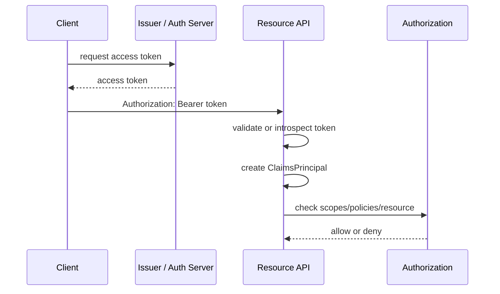

# Модуль III. Аутентификация и авторизация в ASP.NET Core: Cookies, JWT, OAuth 2.0 и OpenID Connect

# Глава 6. Access Token и Bearer Authentication

──────────────────────────────────────────────

**МОДУЛЬ III • Аутентификация и авторизация**

**Прогресс до главы:** 29% (5 из 17 глав завершены)

**Маршрут:** Identity → Account → Password → Auth Schemes → Cookie → Access Token → JWT → Refresh Token → Claims → Policies → OAuth 2.0 → Code + PKCE → OIDC → ASP.NET Identity → OpenIddict → AuthService → Full Journey

**Текущая глава:** Access Token

**Текущий вопрос:**
Как API принимает credential без browser cookie и почему Bearer Token требует особой защиты?

──────────────────────────────────────────────

> **Не запоминай технологии. Понимай, какие проблемы они решают.**

---

## Исходная ситуация

В прошлой главе browser сам отправлял authentication cookie. Это удобно для web UI, но не является универсальной моделью.

Практическая проблема:

```text
Мобильное приложение вызывает API.
Browser cookie у него нет.
Как API узнаёт, от чьего имени пришёл request?
```

Мобильное приложение, desktop client, CLI tool или backend-service обычно вызывают API так:

```http
GET /api/orders HTTP/1.1
Host: api.example.com
Authorization: Bearer <access-token>
```

Здесь credential передаётся явно в HTTP header. API должен проверить token и построить `ClaimsPrincipal`.

---

## Зачем нужна эта глава

Access Token нужен resource API, чтобы принимать request от client-а без browser cookie.

Главная мысль:

```text
Access Token — credential для resource server.
Bearer — способ предъявления token.
```

Access Token может представлять user, client или service. Он не является ID Token, не обязан быть JWT и не должен использоваться без ограничения audience, permissions/scopes и lifetime.

---

## Эта глава понадобится позже

- [Модель Authentication в ASP.NET Core](./04_ASPNET_Core_Authentication_Model.md)
- [JWT и проверка token](./07_JWT_Token_Validation.md)
- [Refresh Token и жизненный цикл token](./08_Refresh_Token_Lifecycle.md)
- [Claims, Roles и Permissions](./09_Claims_Roles_Permissions.md)
- [Policy-based и Resource-based Authorization в ASP.NET Core](./10_Policy_Resource_Authorization.md)
- [OAuth 2.0: делегирование доступа, роли и scopes](./11_OAuth2_Delegated_Access.md)
- [Полный путь аутентификации и авторизации](./17_Full_Authentication_Authorization_Journey.md)

---

## Короткое определение

**Access Token (токен доступа — credential, который client предъявляет resource server для доступа к API)** ограничивается конкретным ресурсом, правами и сроком жизни.

**Bearer Token (предъявительский token — token, владения которым обычно достаточно для предъявления)** опасен при краже: кто предъявил token, тот может получить доступ в пределах его прав и lifetime.

**Resource server (сервер ресурса — API, которое принимает request и проверяет access token)** не обязан выпускать token. Он должен проверить token или обратиться к authorization server за introspection.

---

## Простая аналогия

Access Token похож на временный пропуск в конкретное здание.

На пропуске или в системе охраны указано:

- для какого здания он выдан;
- кому или какому client-у он принадлежит;
- какие зоны доступны;
- до какого времени он действует.

Bearer-модель означает: если кто-то украл пропуск и охрана не требует дополнительного доказательства владения, его можно предъявить повторно.

---

## Базовый flow

```text
Client
    ↓ Authorization: Bearer <token>
Resource API
    ↓ validates or introspects
Access Token
    ↓
ClaimsPrincipal
    ↓
Authorization
```

Client получает token у issuer/auth server и предъявляет его API.

Resource API проверяет token локально или через introspection. Если token валиден, API строит `ClaimsPrincipal`. После этого authorization решает, можно ли выполнить конкретное действие.

---

## Роли участников

| Участник | Что делает |
|---|---|
| Client | получает и предъявляет token |
| Issuer/Auth server | выпускает token |
| Resource server/API | проверяет token |

Это разделение важно. `UseAuthentication()` и bearer handler в API не выпускают access tokens. Они проверяют предъявленный credential.

Роли resource server и authorization server логически разделены. Одна единица развертывания (deployment unit) теоретически может совмещать обе роли, например небольшой monolith с token endpoint и API. Но ответственности и границы доверия (trust boundaries) всё равно разные: выпуск token, хранение grants и проверка token — разные задачи.

---

## Bearer по RFC 6750

Bearer token удобен, потому что API не нужен browser state. Но безопасность держится на защите самого token.

По смыслу RFC 6750:

- предъявление bearer token обычно достаточно;
- украденный token можно replay;
- TLS обязателен;
- token нужно защищать при transport, storage и logging;
- bearer token не является proof-of-possession.

Proof-of-possession означает, что client должен доказать владение ключом или сертификатом, а не просто показать строку token. Bearer так не работает сам по себе.

---

## Opaque и self-contained tokens

| Модель | Простая аналогия | Как проверяется |
|---|---|---|
| Opaque token | номер пропуска | API или gateway проверяет номер в auth server |
| Self-contained token | пропуск с проверяемыми данными внутри | API проверяет подпись, issuer, audience, lifetime и claims локально |

Trade-offs:

| Вопрос | Opaque/reference | Self-contained |
|---|---|---|
| Latency | нужна introspection/cache | обычно локальная проверка |
| Revocation | проще централизовать | API может не узнать мгновенно |
| Availability | зависит от auth server/cache | зависит от keys/configuration |
| Disclosure | token не раскрывает claims сам по себе | signed JWT payload обычно читаем |
| Key management | меньше crypto на API | нужны trusted keys и rotation |

Self-contained token часто бывает JWT, но Access Token не обязан быть JWT. JWT подробно разбирается в следующей главе.

---

## Transport

Рекомендуемый для этой книги обычный способ предъявления:

```http
Authorization: Bearer <access-token>
```

RFC 6750 описывает несколько способов передачи bearer token, включая Authorization header, form-encoded body и URI query parameter. URI query method несёт высокий leakage risk: URL часто попадает в browser history, reverse proxy logs, analytics, Referer headers и monitoring traces. Поэтому для обычного API-сценария в книге используется `Authorization` header.

Token нельзя логировать как обычную строку. Даже expired token может раскрывать claims или структуру системы.

---

## Audience, scope и least privilege

**Audience (аудитория — API или resource, для которого token предназначен)** не даёт token-у из одного API случайно стать credential для другого API.

**Scope (область доступа — разрешение, определённое authorization server)** ограничивает, что client может запросить или получить в token.

**Least privilege (минимально необходимые права)** означает, что token получает только те permissions/scopes, которые нужны для сценария.

Scope может использоваться и в user-delegated сценариях, и в client/service scenarios. Но scope не заменяет resource-based authorization. Token со scope `orders.read` не означает автоматический доступ к любому заказу. API всё ещё должен проверить ownership, tenant, role, policy или resource rule.

---

## Storage by client type

Нет одного универсального storage для tokens.

| Client type | Возможное хранение | Главный риск |
|---|---|---|
| Server-side web app | server-side session/storage | logs, backups, server compromise |
| Browser app | memory или browser storage с ограничениями | XSS/exfiltration |
| Mobile/native | secure platform storage | device compromise, backup leakage |
| Machine-to-machine | secret store / workload identity | leaked secret, overbroad token |

HTTPS защищает transport, но не решает storage, XSS, logs и malware на устройстве.

---

## Error semantics

Если token отсутствует или невалиден, protected API обычно возвращает challenge:

```http
HTTP/1.1 401 Unauthorized
WWW-Authenticate: Bearer
```

Если token валиден, но прав недостаточно, возможен:

```http
HTTP/1.1 403 Forbidden
```

Конкретные детали зависят от scheme, policy и того, сколько информации API безопасно раскрывает client-у.

---

## ASP.NET Core и bearer scheme

В ASP.NET Core bearer authentication — это scheme и handler.

Handler:

- читает `Authorization: Bearer ...`;
- проверяет token;
- при успехе создаёт `ClaimsPrincipal`;
- не выпускает token;
- не обновляет token;
- не делает authorization вместо policies.

Минимальная регистрация для JWT bearer:

```csharp
builder.Services
    .AddAuthentication("Bearer")
    .AddJwtBearer("Bearer", options =>
    {
        options.Authority = "https://auth.example";
        options.Audience = "orders-api";
    });
```

Разработчик настраивает, как API доверяет issuer-у и для какой audience принимает token. Framework регистрирует bearer handler. При request handler строит principal только после validation. Production-детали keys, algorithms и claims validation раскрываются в следующей главе.

---

## HTTP request и C# client

HTTP:

```http
GET /api/orders/42 HTTP/1.1
Host: api.example.com
Authorization: Bearer <access-token>
Accept: application/json
```

C# client:

```csharp
using System.Net.Http.Headers;

using var request = new HttpRequestMessage(
    HttpMethod.Get,
    "https://api.example.com/api/orders/42");

request.Headers.Authorization =
    new AuthenticationHeaderValue("Bearer", accessToken);
```

Код показывает только предъявление token. Он не выпускает token, не хранит refresh token и не реализует homemade issuer.

---

## Схема



---

## Практический сценарий

Mobile app вызывает `orders-api`.

1. User signs in through approved auth flow.
2. Client получает access token для `orders-api`.
3. Client отправляет `Authorization: Bearer <token>`.
4. API проверяет issuer, audience, lifetime и permissions или выполняет introspection.
5. API создаёт `ClaimsPrincipal`.
6. Authorization проверяет, можно ли читать конкретный order.
7. Если token украден, attacker может replay до expiration, если нет sender-constraining или дополнительной invalidation.

---

## Типичные ошибки

Ошибка: считать, что Access Token всегда JWT.
Почему неверно: token может быть opaque/reference.
Как правильно: отделять purpose token от его format.

Ошибка: использовать ID Token для API.
Почему неверно: ID Token предназначен client-у в OIDC, а не resource API как access credential.
Как правильно: API принимает Access Token.

Ошибка: игнорировать audience.
Почему неверно: token для одного API может быть принят другим API.
Как правильно: проверять audience/resource.

Ошибка: передавать token в URL как обычный способ или логировать его.
Почему неверно: URI query method существует в RFC, но несёт высокий leakage risk; URL и logs часто распространяются шире, чем кажется.
Как правильно: использовать Authorization header и redaction.

Ошибка: считать HTTPS полной защитой.
Почему неверно: HTTPS защищает transport, но не storage, logs, XSS и device compromise.
Как правильно: защищать весь lifecycle token.

Ошибка: выдавать долгоживущий bearer без threat model.
Почему неверно: украденный token можно replay.
Как правильно: ограничивать lifetime и права.

Ошибка: считать scope окончательной authorization.
Почему неверно: scope не проверяет ownership конкретного ресурса.
Как правильно: сочетать scopes с policies/resource checks.

Ошибка: считать, что проверка bearer token автоматически включает его выпуск.
Почему неверно: bearer handler в resource-server role проверяет предъявленный credential, но не обязан выпускать token.
Как правильно: разделять ответственности issuer/authorization server и resource server, даже если они живут в одной deployment unit.

---

## Вопросы собеседования

### Junior: Что такое Access Token?

<details>
<summary>Ответ</summary>

Access Token — credential, который client предъявляет resource API для доступа к ресурсу. Он должен быть ограничен audience, permissions/scopes и сроком жизни.

</details>

---

### Middle: Почему bearer token опасен при краже?

<details>
<summary>Ответ</summary>

Потому что в bearer-модели предъявления token обычно достаточно. Если attacker получил token, он может replay до expiration или отзыва в пределах прав token.

</details>

---

### Middle: Чем opaque token отличается от self-contained token?

<details>
<summary>Ответ</summary>

Opaque token похож на номер пропуска: API должен проверить его у auth server или в introspection endpoint. Self-contained token содержит проверяемые данные внутри, поэтому API может валидировать его локально, но revocation становится сложнее.

</details>

---

### Senior: Почему scope не заменяет authorization?

<details>
<summary>Ответ</summary>

Scope показывает разрешённый тип доступа, например `orders.read`, заданный authorization server. Но scope не отвечает, можно ли читать конкретный order конкретного tenant-а или user-а. Resource API должен выполнять domain/resource authorization.

</details>

---

### Architect / System Design: Как выбирать между opaque и self-contained access tokens?

<details>
<summary>Ответ</summary>

Нужно сравнить latency, revocation, availability, disclosure и key management. Opaque проще централизованно отзывать, но API зависит от introspection/cache. Self-contained token быстрее проверять локально, но API может не узнать об отзыве мгновенно и требует надёжного key rotation.

</details>

---

## Ответ для собеседования

Access Token — это credential для resource API. Client получает его у issuer/auth server и предъявляет API обычно через `Authorization: Bearer <token>`. Bearer означает, что владения token обычно достаточно, поэтому украденный token можно replay до expiration или отзыва. Access Token может представлять user, client или service, не является ID Token и не обязан быть JWT. API должен проверить issuer, audience/resource, lifetime и права или выполнить introspection, затем создать `ClaimsPrincipal`; после этого authorization проверяет policy и конкретный resource. Token нужно ограничивать least privilege, коротким lifetime, безопасным transport, storage и logging.

---

## Шпаргалка

- Access Token — credential для resource API.
- Bearer token можно предъявить без дополнительного proof-of-possession.
- TLS обязателен, но не решает storage и logs.
- Access Token не обязан быть JWT.
- ID Token не предназначен для API authorization.
- Audience защищает границы resource server.
- Scope может относиться к user-delegated и service/client scenarios.
- Scope не заменяет resource-based authorization.
- Token не используют в URL как обычный способ передачи.
- Resource server проверяет token, но обычно не выпускает его.
- `WWW-Authenticate: Bearer` связан с challenge.
- Opaque token проще отзывать централизованно.
- Self-contained token удобен для локальной validation, но сложнее для мгновенного revocation.

---

## Прогресс модуля

**Модуль III:** `Аутентификация и авторизация в ASP.NET Core`
**Прогресс после главы:** 35% (6 из 17 глав завершены).
