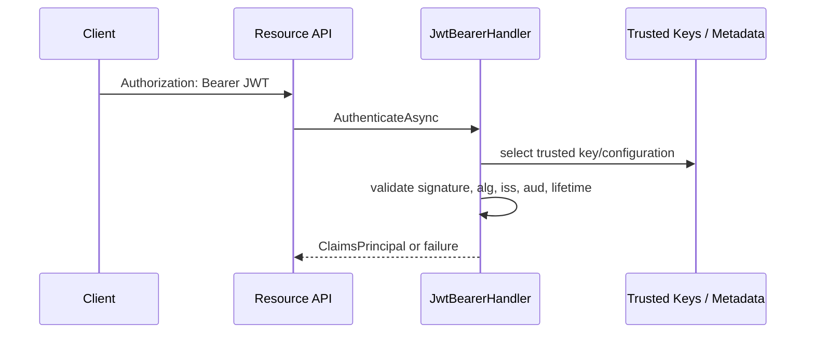

# Модуль III. Аутентификация и авторизация в ASP.NET Core: Cookies, JWT, OAuth 2.0 и OpenID Connect

# Глава 7. JWT и проверка token

──────────────────────────────────────────────

**МОДУЛЬ III • Аутентификация и авторизация**

**Прогресс до главы:** 35% (6 из 17 глав завершены)

**Маршрут:** Identity → Account → Password → Auth Schemes → Cookie → Access Token → JWT → Refresh Token → Claims → Policies → OAuth 2.0 → Code + PKCE → OIDC → ASP.NET Identity → OpenIddict → AuthService → Full Journey

**Текущая глава:** JWT

**Текущий вопрос:**
API получил JWT.
Внутри видны user id и permissions.
Можно ли сразу им доверять?

──────────────────────────────────────────────

> **Не запоминай технологии. Понимай, какие проблемы они решают.**

---

## Исходная ситуация

В предыдущей главе мы разобрали Access Token и Bearer presentation. Теперь берём частый формат self-contained token — JWT.

JWT легко открыть в debugger или на jwt.io и увидеть payload:

```json
{
  "sub": "123",
  "aud": "orders-api",
  "permission": "orders.read",
  "exp": 1893456000
}
```

Ответ на вопрос главы:

```text
Нет. Сначала нужно проверить, кто выпустил token,
для какого API он предназначен,
не был ли изменён и действует ли сейчас.
```

Главный тезис:

```text
JWT — format, а не готовая authentication или authorization system.
```

---

## Зачем нужна эта глава

JWT часто ошибочно воспринимают как всю auth-систему. На практике JWT — это контейнер claims с определённым форматом. Без validation payload является просто данными, которым нельзя доверять.

Эта глава объясняет:

- что находится внутри распространённого signed JWT;
- почему Base64url не является encryption;
- почему подписи недостаточно без issuer/audience/lifetime checks;
- как ASP.NET Core `JwtBearerHandler` превращает валидный token в `ClaimsPrincipal`.

Refresh lifecycle остаётся следующей главе.

---

## Эта глава понадобится позже

- [Access Token и Bearer Authentication](./06_Access_Token_Bearer_Authentication.md)
- [Refresh Token и жизненный цикл token](./08_Refresh_Token_Lifecycle.md)
- [Claims, Roles и Permissions](./09_Claims_Roles_Permissions.md)
- [Policy-based и Resource-based Authorization в ASP.NET Core](./10_Policy_Resource_Authorization.md)
- [OAuth 2.0: делегирование доступа, роли и scopes](./11_OAuth2_Delegated_Access.md)
- [OpenID Connect и внешние Identity Providers](./13_OpenID_Connect_External_Identity_Providers.md)
- [Полный путь аутентификации и авторизации](./17_Full_Authentication_Authorization_Journey.md)

---

## Короткое определение

**JWT (JSON Web Token — компактный формат представления claims)** описывает способ передать набор утверждений в виде JSON-based token.

**JWS (JSON Web Signature — подписанная защита JSON data)** даёт integrity и authenticity: можно проверить, что payload не изменён и подписан доверенной стороной.

**JWE (JSON Web Encryption — зашифрованная защита JSON data)** даёт confidentiality: payload скрывается от читателя без ключа.

Распространённый signed compact JWT обычно выглядит как три части:

```text
header.payload.signature
```

Но не любой JWT всегда состоит из трёх частей: JWE compact serialization имеет другую структуру. В этой главе основной фокус — signed compact JWT как Access Token.

---

## Простая аналогия

Signed JWT похож на пропуск, где данные напечатаны открыто, но есть защитная печать.

Ты можешь прочитать имя и срок действия. Но доверять пропуску можно только после проверки печати, того, кто её поставил, и того, что пропуск выдан именно для этого здания.

---

## Header, payload, signature

Упрощённо:

```text
header.payload.signature
```

`header` обычно содержит metadata вроде algorithm и key id.

`payload` содержит claims.

`signature` позволяет проверить, что header/payload не были изменены и token подписан trusted key.

Base64url — это encoding, а не encryption. Signed payload обычно читаем. Signature даёт integrity/authenticity, но не confidentiality. Если claims нельзя показывать client-у или logs, не кладите их в signed JWT как открытые данные.

---

## JWT, Access Token и ID Token

| Понятие | Что это |
|---|---|
| JWT | format |
| Access Token | credential для resource API |
| ID Token | OIDC artifact для client |

JWT может быть форматом access token, ID token или другого artifact. Поэтому validation profile должен зависеть от token type и контекста.

ID Token не нужно использовать как credential для resource API. API должен принимать Access Token.

---

## Claims

| Claim | Простое значение | Что проверяется | Типичное заблуждение |
|---|---|---|---|
| `iss` | кто выпустил token | issuer входит в trusted list | любой issuer подходит |
| `sub` | subject token | формат и контекст subject | `sub` сам по себе доказывает user |
| `aud` | для кого token | API есть в audience | audience можно не проверять |
| `exp` | когда истекает | текущее время раньше expiration | valid signature оживляет expired token |
| `nbf` | не раньше какого времени действует | token ещё можно принимать | claim всегда можно игнорировать |
| `iat` | когда выпущен | разумность времени, если нужно | `iat` заменяет expiration |
| `jti` | id token | uniqueness/denylist, если используется | `jti` автоматически отзывает token |

Claims становятся trusted input только после validation. До этого это просто текст из token.

---

## Validation flow

```text
Token received
    ↓
Expected token type/profile selected
    ↓
Trusted keys/configuration selected
    ↓
Cryptographic protection checked
    ↓
Allowed algorithm checked
    ↓
Issuer checked
    ↓
Audience checked
    ↓
Lifetime checked
    ↓
Context-specific claims checked
    ↓
ClaimsPrincipal created
```

Конкретная library может выполнять шаги в другом порядке. Важна не механическая очередность, а правило:

```text
claims можно использовать только после всех необходимых checks
```

---

## RFC 8725: практические угрозы

RFC 8725 фиксирует best current practices для JWT. Для backend-разработчика важны такие выводы:

- использовать algorithm allow-list;
- не доверять `alg` из header как решению безопасности;
- избегать algorithm confusion;
- выбирать trusted key source из конфигурации, а не из произвольного token header;
- проверять issuer и audience;
- использовать explicit token typing, где это применимо;
- иметь разные validation profiles для разных JWT types;
- защищаться от cross-JWT confusion, например ID Token вместо Access Token;
- не принимать arbitrary `jku`, `x5u` или `kid` как право скачать ключ откуда угодно;
- не принимать unsecured JWT;
- не считать signature-only validation достаточной.

`kid` помогает выбрать ключ из уже доверенного набора. Он не должен превращаться в возможность подсунуть произвольный key URL.

---

## Keys и rotation

Простая модель:

```text
Issuer signs.
API validates with a trusted key.
```

Keys бывают symmetric и asymmetric.

При symmetric key issuer и validator знают общий secret. При asymmetric issuer подписывает private key, а API проверяет public key.

В production часто используется JWKS/metadata от trusted authority. `kid` помогает выбрать key. Rotation требует overlap:

```text
old key still validates old tokens
new key signs new tokens
cache refreshes trusted keys
old key removed after tokens expire
```

Нельзя доверять произвольному key URL из token. Key lifecycle — operational responsibility: хранение, rotation, emergency revoke, cache refresh и мониторинг ошибок validation.

---

## Lifetime и revocation

`exp` ограничивает срок жизни token. `nbf` может запретить принимать token до определённого времени. Clock skew учитывает небольшое расхождение часов, но не должен превращаться в бесконечный lifetime.

Важное правило:

```text
Self-contained JWT можно проверить локально.
Поэтому API может не узнать об отзыве мгновенно.
```

Варианты снижения риска:

- short lifetime;
- introspection/reference token;
- denylist для критичных случаев;
- security version;
- sender-constrained token.

Refresh Token lifecycle разбирается в следующей главе. Здесь важно понять: valid signature не делает expired token действительным.

---

## ASP.NET Core JwtBearer

Минимальная настройка:

```csharp
using Microsoft.AspNetCore.Authentication.JwtBearer;

builder.Services
    .AddAuthentication(JwtBearerDefaults.AuthenticationScheme)
    .AddJwtBearer(options =>
    {
        options.Authority = "https://auth.example";
        options.Audience = "orders-api";
    });
```

`AddAuthentication` задаёт default scheme.

`AddJwtBearer` регистрирует JWT bearer handler.

`Authority` указывает trusted issuer/metadata location. Handler использует metadata, чтобы получить configuration и signing keys.

`Audience` указывает resource API, для которого token должен быть предназначен.

Во время request handler читает `Authorization: Bearer ...`, выполняет validation и только после этого создаёт `ClaimsPrincipal`.

Если нужны дополнительные проверки, используют `TokenValidationParameters`, но не отключают issuer, audience, lifetime или signature validation:

```csharp
options.TokenValidationParameters.ValidIssuer = "https://auth.example";
options.TokenValidationParameters.ValidAudience = "orders-api";
```

Claim mapping может менять имена claims при переносе в .NET principal. Детали claims model будут в главе 9.

---

## Практический сценарий validation

Один token, разные результаты:

| Случай | Что произойдёт |
|---|---|
| Valid | signature, issuer, audience, lifetime и context checks успешны; principal создан |
| Wrong audience | token не для этого API; reject |
| Expired | срок истёк; reject, даже если signature валидна |
| Unknown issuer | issuer не trusted; reject |
| Invalid signature | token изменён или подписан не тем key; reject |

---

## Схема



---

## Типичные ошибки

Ошибка: считать JWT authentication-системой.
Почему неверно: JWT — format, а system включает issuer, validation, lifetime, revocation и authorization.
Как правильно: отделять token format от auth architecture.

Ошибка: думать, что payload зашифрован.
Почему неверно: Base64url — encoding; signed JWT обычно читаем.
Как правильно: не класть secrets в signed payload.

Ошибка: считать signature достаточной.
Почему неверно: token может быть подписан trusted issuer-ом, но для другого audience или уже expired.
Как правильно: проверять issuer, audience, lifetime и context claims.

Ошибка: доверять `alg` из header.
Почему неверно: это входные данные attacker-controlled token.
Как правильно: использовать allow-list algorithms.

Ошибка: принимать любой issuer.
Почему неверно: API начнёт доверять чужим tokens.
Как правильно: задавать trusted issuers.

Ошибка: выключать lifetime validation.
Почему неверно: expired tokens будут приниматься.
Как правильно: оставлять lifetime validation и контролировать clock skew.

Ошибка: использовать ID Token для API.
Почему неверно: ID Token предназначен client-у.
Как правильно: API принимает Access Token.

Ошибка: доверять arbitrary `jku/x5u`.
Почему неверно: attacker может подсунуть key source.
Как правильно: keys брать из trusted configuration.

Ошибка: хранить signing secret в repo.
Почему неверно: secret становится доступен всем, кто видит repo/history.
Как правильно: использовать secret management.

Ошибка: логировать JWT.
Почему неверно: token может быть credential и раскрывать claims.
Как правильно: redaction.

Ошибка: считать `jti` автоматическим отзывом.
Почему неверно: `jti` работает только если система проверяет denylist/state.
Как правильно: проектировать revocation отдельно.

Ошибка: удалить old key без overlap.
Почему неверно: ещё действующие tokens перестанут валидироваться.
Как правильно: rotation делать с overlap.

---

## Вопросы собеседования

### Junior: Что такое JWT?

<details>
<summary>Ответ</summary>

JWT — это compact format для передачи claims. Сам по себе JWT не является authentication-системой и не гарантирует доверие к payload без validation.

</details>

---

### Middle: Почему Base64url не является encryption?

<details>
<summary>Ответ</summary>

Base64url — это encoding. Payload signed JWT обычно можно прочитать. Signature защищает от изменения и подтверждает trusted issuer, но не скрывает данные.

</details>

---

### Middle: Что должен проверить API кроме подписи?

<details>
<summary>Ответ</summary>

API должен проверить allowed algorithm, trusted issuer, audience/resource, lifetime, trusted key source и context-specific claims. Подпись сама по себе недостаточна.

</details>

---

### Senior: Что такое cross-JWT confusion?

<details>
<summary>Ответ</summary>

Это ситуация, когда token одного типа принимают в другом контексте, например ID Token используют как Access Token для API. Защита — явные validation profiles, issuer/audience checks и token typing там, где применимо.

</details>

---

### Architect / System Design: Как организовать key rotation для JWT?

<details>
<summary>Ответ</summary>

Issuer начинает подписывать новые tokens новым key, но API ещё держит old key для проверки старых tokens до их expiration. Metadata/JWKS cache должен обновляться, а удаление old key делается после overlap. Нельзя выбирать keys из arbitrary URLs внутри token.

</details>

---

## Ответ для собеседования

JWT — это формат, а не готовая auth-система. Распространённый signed compact JWT состоит из header, payload и signature; payload обычно читаем, потому что Base64url не является encryption. Доверять claims можно только после validation: trusted key/configuration, allowed algorithm, signature, issuer, audience, lifetime и context-specific claims. Подпись даёт integrity и authenticity, но не confidentiality и не заменяет проверку audience или expiration. В ASP.NET Core `AddJwtBearer` регистрирует bearer handler: он читает token из `Authorization` header, валидирует его и только после этого создаёт `ClaimsPrincipal`. Revocation self-contained JWT не всегда мгновенный, поэтому нужны short lifetime, introspection/reference tokens, denylist, security version или sender-constrained tokens по threat model.

---

## Шпаргалка

- JWT — format.
- Access Token — credential для API.
- ID Token — OIDC artifact для client.
- Signed JWT payload обычно читаем.
- Base64url не encryption.
- Signature не заменяет issuer/audience/lifetime checks.
- Используй algorithm allow-list.
- Keys берутся из trusted configuration/JWKS.
- `kid` выбирает key, но не задаёт trust сам по себе.
- Expired token не становится valid из-за подписи.
- Self-contained JWT не узнаёт об отзыве мгновенно.
- `JwtBearerHandler` создаёт principal только после validation.

---

## Прогресс модуля

**Модуль III:** `Аутентификация и авторизация в ASP.NET Core`
**Прогресс после главы:** 41% (7 из 17 глав завершены).
