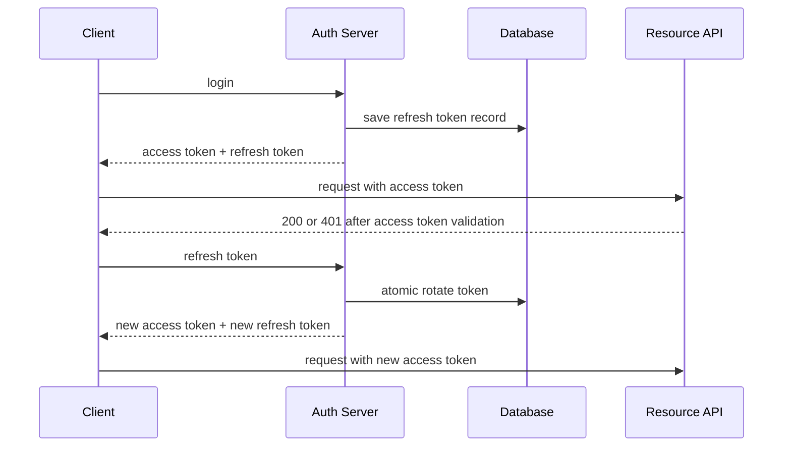

# Модуль III. Аутентификация и авторизация в ASP.NET Core: Cookies, JWT, OAuth 2.0 и OpenID Connect

# Глава 8. Refresh Token и жизненный цикл token

──────────────────────────────────────────────

**МОДУЛЬ III • Аутентификация и авторизация**

**Прогресс до главы:** 41% (7 из 17 глав завершены)

**Маршрут:** Identity → Account → Password → Auth Schemes → Cookie → Access Token → JWT → Refresh Token → Claims → Policies → OAuth 2.0 → Code + PKCE → OIDC → ASP.NET Identity → OpenIddict → AuthService → Full Journey

**Текущая глава:** Refresh Token

**Текущий вопрос:**
Access Token истёк.
Пользователь продолжает работать.
Нужно ли снова просить пароль?

──────────────────────────────────────────────

> **Не запоминай технологии. Понимай, какие проблемы они решают.**

---

## Исходная ситуация

В главах 6 и 7 мы разобрали Access Token и JWT validation. Access Token лучше делать короткоживущим: если его украдут, окно replay будет ограничено.

Но пользователь не должен вводить password каждые пять минут.

Для этого используется Refresh Token:

```text
Access Token короткоживущий.
Refresh Token позволяет получить новый Access Token.
```

Refresh Token отправляется auth/authorization server. Resource API не принимает Refresh Token как credential бизнес-запроса.

---

## Зачем нужна эта глава

Refresh Token — более чувствительный credential, чем Access Token, потому что через него можно получать новые access tokens.

Эта глава объясняет:

- зачем нужен Refresh Token;
- почему он часто opaque random secret;
- почему JWT refresh token не устраняет state/revocation;
- как работает rotation;
- зачем нужна token family и reuse detection;
- почему logout не всегда мгновенно отзывает уже выданные self-contained Access Tokens.

---

## Эта глава понадобится позже

- [Cookie Authentication и аутентифицированная session](./05_Cookie_Authentication_Session.md)
- [Access Token и Bearer Authentication](./06_Access_Token_Bearer_Authentication.md)
- [JWT и проверка token](./07_JWT_Token_Validation.md)
- [OAuth 2.0: делегирование доступа, роли и scopes](./11_OAuth2_Delegated_Access.md)
- [Authorization Code Flow и PKCE](./12_Authorization_Code_PKCE.md)
- [OpenID Connect и внешние Identity Providers](./13_OpenID_Connect_External_Identity_Providers.md)
- [Архитектура AuthService и границы distributed system](./16_AuthService_Distributed_Boundaries.md)
- [Полный путь аутентификации и авторизации](./17_Full_Authentication_Authorization_Journey.md)

---

## Короткое определение

**Refresh Token (токен обновления — credential, который client предъявляет authorization server, чтобы получить новый Access Token)** обычно живёт дольше access token и требует более строгого хранения.

Refresh Token может представлять session или grant. Он не обязан быть JWT. Часто это opaque random secret, а сервер хранит запись о нём и его состоянии.

---

## Простая аналогия

Access Token похож на короткий пропуск на сегодня.

Refresh Token похож на право получать новые дневные пропуска без повторного собеседования на ресепшене.

Если украли дневной пропуск, риск ограничен сроком дня. Если украли право получать новые пропуска, риск намного больше.

---

## Базовый flow

```text
Access Token expired
    ↓
Client sends Refresh Token to auth server
    ↓
Server checks token, client and session
    ↓
Old Refresh Token is rotated or rejected
    ↓
New Access Token
+ optionally new Refresh Token
```

Client замечает, что access token истёк или скоро истечёт.

Client отправляет refresh token не в resource API, а в auth server.

Server проверяет token, client, session/grant, expiry и revocation.

При rotation старый refresh token становится использованным, а client получает новый refresh token.

---

## Purpose и format

Refresh Token нужен только для получения нового Access Token. Он не отправляется resource API для чтения заказов, файлов или профиля.

Refresh Token:

- более чувствительный;
- часто долгоживущий;
- может представлять session/grant;
- не обязан быть JWT;
- часто является opaque random secret;
- требует server-side state для revocation/reuse detection.

JWT refresh token не устраняет необходимость state. Если нужно уметь отзывать refresh token, обнаруживать reuse и связывать token с client/session, server-side record всё равно нужен.

Не стоит объявлять JWT default best practice для refresh tokens.

---

## Server-side record

Учебная модель:

```text
RefreshTokenRecord
- Id
- TokenHash
- SubjectId
- ClientId
- SessionId
- FamilyId
- IssuedAt
- ExpiresAt
- RevokedAt
- ReplacedById
- UsedAt
```

Поля простыми словами:

| Поле | Смысл |
|---|---|
| `Id` | внутренний id записи |
| `TokenHash` | verifier/hash refresh token, а не raw secret |
| `SubjectId` | user/service subject |
| `ClientId` | client, которому token выдан |
| `SessionId` | session или login instance |
| `FamilyId` | цепочка rotated tokens |
| `IssuedAt` | когда выдан |
| `ExpiresAt` | absolute expiration |
| `RevokedAt` | когда отозван |
| `ReplacedById` | какой token заменил текущий |
| `UsedAt` | когда token использовали |

Это учебная schema, не универсальный стандарт. Raw token хранить не обязательно: часто хранят verifier/hash. Random token не равен user password, поэтому password KDF нельзя механически применять без анализа. Custom crypto писать не нужно.

---

## Rotation

Rotation flow:

1. принять current refresh token;
2. проверить token/client/session/expiry/revocation;
3. пометить old token использованным;
4. создать new refresh token;
5. сохранить изменения атомарно;
6. вернуть новую пару.

Атомарность значит: нельзя успешно создать новый token и забыть пометить старый использованным. И нельзя двум параллельным refresh requests одновременно выдать две независимые ветки без понятной policy.

На практике нужны transaction, optimistic concurrency или другой механизм контроля гонок.

---

## Family и reuse detection

Сценарий:

```text
legitimate client used token A and received token B
    ↓
attacker later presents token A
    ↓
server sees reused old token
    ↓
family/session is revoked
```

Family позволяет понять, что token A уже заменён token B. Повторное предъявление A может означать compromise.

Но есть нюансы:

- client retry может повторить request после timeout;
- mobile network может создать гонку;
- grace period уменьшает false positives, но увеличивает replay window;
- rotation снижает риск, но не устраняет compromise.

Policy должна быть явной: что делать при reuse, когда отзывать family, как логировать событие и какой response возвращать.

---

## RFC 9700

Для public clients современная OAuth security guidance требует sender-constrained refresh tokens или refresh token rotation для обнаружения replay.

Sender-constraining связывает token с доказательством владения: например DPoP или mTLS. Это не обязательно для любой системы, но важно понимать направление защиты.

Практический смысл:

- token связывается с client/session/grant;
- public client не может надёжно хранить secret как backend;
- rotation помогает обнаружить replay;
- expiration и revocation зависят от risk model.

---

## Expiration и revocation

Нужно развести несколько сроков:

| Срок | Что ограничивает |
|---|---|
| Access Token lifetime | сколько живёт доступ к resource API |
| Refresh Token absolute lifetime | максимальная жизнь refresh token/family |
| Idle/inactivity expiration | сколько можно не использовать refresh |
| Maximum session lifetime | верхняя граница login session |

Rotation не обязана продлевать login бесконечно.

События revocation:

- logout;
- password/credential change;
- compromise;
- device removal;
- admin/user action;
- client/grant removal;
- disabled account.

Главный вывод:

```text
Отзыв Refresh Token прекращает дальнейшее обновление.
Уже выданный self-contained Access Token может жить до expiration.
```

RFC 7009 описывает token revocation endpoint как способ сообщить authorization server, что token больше не нужен или должен быть отозван. Это не магия мгновенного удаления уже принятых self-contained access tokens во всех APIs.

---

## Storage by client type

| Client type | Возможное место хранения | Основной threat | Что не является полной защитой |
|---|---|---|---|
| Confidential server-side client | server database/secret storage | logs, backups, server compromise | только HTTPS |
| Browser application | HttpOnly cookie или memory/storage по архитектуре | CSRF при cookie, XSS при JS storage | HttpOnly или SameSite по отдельности |
| Native/mobile application | platform secure storage | device compromise, backup leakage | secure storage без device security |
| BFF | server-side storage + browser cookie | server compromise, CSRF | cookie attributes без antiforgery |

HttpOnly cookie уменьшает риск чтения token JavaScript-ом, но создаёт CSRF considerations. JS storage удобен, но XSS может привести к exfiltration. Mobile secure storage полезен, но device compromise остаётся риском. Server storage защищает browser, но требует контроля logs/backups.

Token не должен попадать в URL/logs.

---

## Client binding и logout

Refresh Token должен проверяться вместе с client context.

Важно:

- `ClientId` связывает token с client-ом;
- session/grant binding ограничивает перенос token;
- confidential client может проходить client authentication;
- public client имеет ограничения;
- token нельзя принимать от другого client.

Logout состоит из разных уровней:

1. удалить local client state;
2. revoke refresh/session на auth server;
3. понимать, что Access Token может жить до expiration или дополнительной invalidation;
4. provider/global logout — отдельный сценарий.

---

## Diagnostics

Логировать нужно события, а не raw tokens:

- issued;
- rotated;
- reused;
- revoked;
- expired;
- client/session mismatch;
- family revoked;
- suspicious retry.

На reuse стоит alert. Error response должен быть безопасным: не раскрывать, существует ли token, какой именно check провалился и можно ли подобрать token.

---

## Mermaid



Resource API не принимает Refresh Token. Оно принимает Access Token.

---

## Учебный код: record

```csharp
public sealed class RefreshTokenRecord
{
    public Guid Id { get; init; }
    public string TokenHash { get; init; } = "";
    public string SubjectId { get; init; } = "";
    public string ClientId { get; init; } = "";
    public string SessionId { get; init; } = "";
    public Guid FamilyId { get; init; }
    public DateTimeOffset IssuedAt { get; init; }
    public DateTimeOffset ExpiresAt { get; init; }
    public DateTimeOffset? RevokedAt { get; set; }
    public Guid? ReplacedById { get; set; }
    public DateTimeOffset? UsedAt { get; set; }
}
```

Код показывает data model, а не готовую production schema. `TokenHash` — verifier, чтобы не хранить raw token. `FamilyId` нужен для reuse detection. `ClientId` и `SessionId` не дают использовать token вне своего context.

---

## Учебный код: RotateAsync

```csharp
public enum RefreshResultType
{
    Succeeded,
    Invalid,
    Expired,
    Reused,
    ClientMismatch
}

public sealed record RefreshResult(
    RefreshResultType Type,
    string? AccessToken,
    string? RefreshToken);

public async Task<RefreshResult> RotateAsync(
    string refreshToken,
    string clientId,
    CancellationToken cancellationToken)
{
    await using var transaction =
        await db.Database.BeginTransactionAsync(cancellationToken);

    var tokenHash = tokenHasher.Hash(refreshToken);
    var record = await db.RefreshTokens
        .SingleOrDefaultAsync(x => x.TokenHash == tokenHash, cancellationToken);

    if (record is null)
    {
        return new RefreshResult(RefreshResultType.Invalid, null, null);
    }

    if (record.ClientId != clientId)
    {
        return new RefreshResult(RefreshResultType.ClientMismatch, null, null);
    }

    if (record.RevokedAt is not null || record.UsedAt is not null)
    {
        await RevokeFamilyAsync(record.FamilyId, cancellationToken);
        await transaction.CommitAsync(cancellationToken);
        return new RefreshResult(RefreshResultType.Reused, null, null);
    }

    if (record.ExpiresAt <= clock.UtcNow)
    {
        return new RefreshResult(RefreshResultType.Expired, null, null);
    }

    var nextRefreshToken = tokenGenerator.CreateRefreshToken();
    var nextRecord = CreateReplacementRecord(record, nextRefreshToken);

    record.UsedAt = clock.UtcNow;
    record.ReplacedById = nextRecord.Id;
    db.RefreshTokens.Add(nextRecord);

    await db.SaveChangesAsync(cancellationToken);
    await transaction.CommitAsync(cancellationToken);

    var accessToken = accessTokenIssuer.Create(record.SubjectId, record.ClientId);

    return new RefreshResult(
        RefreshResultType.Succeeded,
        accessToken,
        nextRefreshToken);
}
```

Что настраивает разработчик:

- checks для token, client, expiry и reuse;
- transaction boundary;
- explicit result types;
- family revocation policy.

Что делает framework:

- EF transaction сохраняет изменения атомарно;
- database constraints/concurrency должны дополнительно защищать от гонок.

Что происходит при refresh:

- старый token помечается used;
- новый token создаётся и сохраняется;
- client получает новый access token и новый refresh token.

Что намеренно опущено:

- полноценный token generator;
- детали `RandomNumberGenerator`;
- hashing/verifier strategy;
- optimistic concurrency;
- audit и rate limiting;
- DPoP/mTLS.

---

## Практический сценарий

1. login → access + refresh;
2. access expires;
3. client sends refresh request to auth server;
4. server performs atomic rotation;
5. client receives new access + refresh;
6. old refresh token is reused;
7. reuse detected;
8. family revoked;
9. existing self-contained access token may live until expiration.

---

## Типичные ошибки

Ошибка: отправлять Refresh Token в resource API.
Почему неверно: resource API принимает Access Token; refresh выполняет auth server.
Как правильно: разделять token endpoint и business API.

Ошибка: считать Refresh Token обязательно JWT.
Почему неверно: часто refresh token — opaque random secret.
Как правильно: выбирать format по lifecycle/revocation model.

Ошибка: логировать raw token.
Почему неверно: это credential.
Как правильно: логировать события и ids без raw secret.

Ошибка: делать rotation без atomic update.
Почему неверно: гонки могут создать две действительные ветки.
Как правильно: использовать transaction/concurrency control.

Ошибка: оставлять old token действительным.
Почему неверно: reuse не обнаруживается.
Как правильно: помечать old token used/replaced.

Ошибка: игнорировать reuse.
Почему неверно: это признак compromise или гонки, требующий policy.
Как правильно: revoke family/session или применять согласованную grace policy.

Ошибка: считать family revoke мгновенным отзывом Access Token.
Почему неверно: self-contained access token может жить до `exp`.
Как правильно: учитывать access lifetime или дополнительную invalidation.

Ошибка: делать unlimited session.
Почему неверно: compromise window растёт бесконечно.
Как правильно: задавать absolute и idle limits.

Ошибка: давать один storage recipe всем clients.
Почему неверно: browser, mobile, server и BFF имеют разные threats.
Как правильно: выбирать storage по client type.

Ошибка: считать logout одной универсальной семантикой.
Почему неверно: local logout, revoke session и provider logout разные.
Как правильно: явно описывать уровни logout.

Ошибка: механически применять password hashing к random token.
Почему неверно: threat model и entropy отличаются.
Как правильно: хранить verifier/hash по продуманной стратегии без custom crypto.

---

## Вопросы собеседования

### Junior: Зачем нужен Refresh Token?

<details>
<summary>Ответ</summary>

Он позволяет client-у получить новый Access Token без повторного ввода password. Refresh Token отправляется auth server, а не resource API.

</details>

---

### Middle: Что такое refresh token rotation?

<details>
<summary>Ответ</summary>

Это подход, при котором при каждом refresh старый refresh token помечается использованным, а client получает новый. Повторное предъявление старого token считается reuse и может привести к отзыву family/session.

</details>

---

### Middle: Почему Refresh Token часто opaque?

<details>
<summary>Ответ</summary>

Потому что серверу всё равно нужно хранить state для expiry, revocation, rotation и reuse detection. Opaque random secret не раскрывает claims client-у и работает как ключ к server-side record.

</details>

---

### Senior: Почему rotation требует transaction/concurrency control?

<details>
<summary>Ответ</summary>

Иначе два параллельных refresh requests могут одновременно считать token действительным и выдать две новые ветки. Нужно атомарно пометить old token used и создать replacement.

</details>

---

### Architect / System Design: Что происходит при reuse старого refresh token?

<details>
<summary>Ответ</summary>

Сервер видит, что token уже использован или заменён. Это может означать compromise или спорный retry. Policy должна решить: revoke family/session, применить grace period или выполнить другой response. Обычно событие логируется и может поднимать alert. Уже выданные self-contained access tokens могут жить до expiration.

</details>

---

## Ответ для собеседования

Refresh Token нужен, чтобы получать новые Access Tokens без постоянного повторного ввода credentials. Он отправляется auth server, а не resource API, и обычно является более чувствительным credential. Частая production-модель — opaque random token плюс server-side record с subject, client, session, family, expiry, revocation и replacement fields. При rotation старый refresh token атомарно помечается использованным, создаётся новый, а повторное предъявление старого token считается reuse. Для public clients современная OAuth guidance требует sender-constrained refresh tokens или rotation для обнаружения replay. Отзыв refresh token прекращает будущие обновления, но уже выданный self-contained access token может жить до expiration.

---

## Шпаргалка

- Refresh Token получает новый Access Token.
- Resource API не принимает Refresh Token.
- Refresh Token не обязан быть JWT.
- Opaque random secret часто проще для lifecycle.
- Server-side record нужен для revocation/reuse.
- Raw token не логируют.
- Rotation заменяет old token на new token.
- Atomic update обязателен.
- Family нужна для reuse detection.
- Grace period — trade-off.
- RFC 9700 требует rotation или sender-constraining для public clients.
- Logout имеет несколько уровней.
- Revoked refresh не всегда мгновенно отзывает self-contained access token.

---

## Прогресс модуля

**Модуль III:** `Аутентификация и авторизация в ASP.NET Core`
**Прогресс после главы:** 47% (8 из 17 глав завершены).
